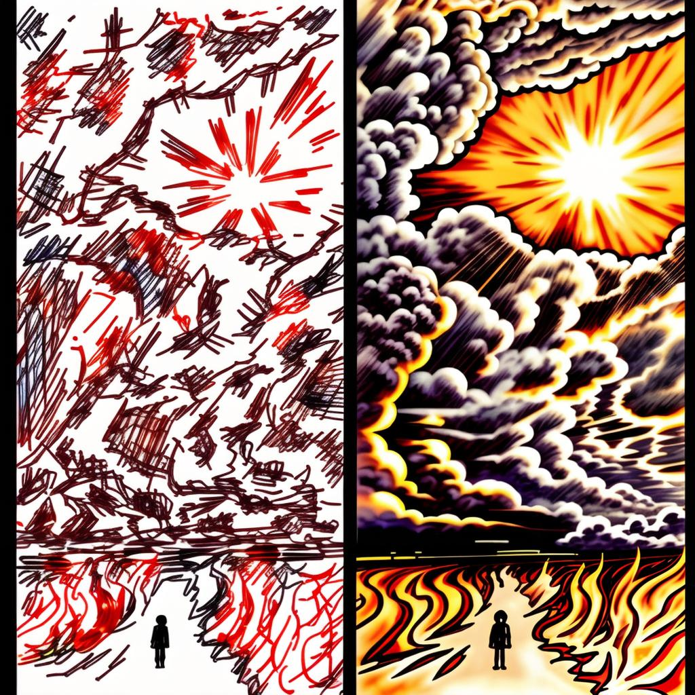

  

IntraPaint is a free and open source image editor with integrated AI image generation support, for Linux, Windows, and macOS.

## Goals:
- Combine standard image editing and digital painting tools with AI image generation and inpainting tools. Make it
  easier for established artists to integrate AI into their workflow, and for AI enthusiasts to adopt more traditional
  image editing tools and gain finer control over the images they create.

## Features:

### AI image generation features:
- Uses Stable-Diffusion, either running on the same machine or remotely over a network connection, via the --api option
  in either [Forge WebUI](https://github.com/lllyasviel/stable-diffusion-webui-forge) or the [Automatic1111 WebUI](https://github.com/AUTOMATIC1111/stable-diffusion-webui).
- All AI features areSupports either completely new image generation (text to image), generating variant images (image to image), or 
  precise detail editing (inpainting), guided by natural-language descriptive prompts and various configurable
  parameters.
- Use ControlNet modules for more advanced AI guidance features (depth mapping, recoloring, pose duplication, etc.)
- Support for AI upscaling using stable-diffusion + ControlNet or through a bunch of different alternate models.
- Image interrogation to generate a prompt to describe any image.


### Standard raster editing features:
- All AI features are optional, IntraPaint still functions like standard image editing software when AI is disabled.
- Full-featured layer stack, with support for all the usual features: layer transformations, layer groups, advanced
  composition and blending modes, etc.
- Digital painting using the [libmypaint](https://github.com/mypaint/libmypaint) brush engine, full support for drawing
  tablets.
- All the usual tools you'd expect: selection, text editing, paint bucket, filters, etc.

### What can you do with this combination?
Benefit from partial automation: you draw the parts that you want to draw, let image generation take care of the parts
that you don't want to do. Quickly explore alternatives.

|                                                                                                                                                                                       |                                                                                                                                                                          |                                                                                                                |
|---------------------------------------------------------------------------------------------------------------------------------------------------------------------------------------|--------------------------------------------------------------------------------------------------------------------------------------------------------------------------|----------------------------------------------------------------------------------------------------------------|
| "organic sprawling colorful city, ultra dense, gigantic twisted textured detailed realistic climbing vines, pareidolia, stained glass, blue sky, billowing clouds, runes and symbols" | "A small figure walking down a road under a massive cloudy sky, billowing clouds, sunset, fiery fields, god rays, sun"                                                   | "Stanford bunny, \[text in image frame below\]"                                                                 |
|                                      |  |  |
| Generate complex backgrounds and render fine details.                                                                                                                                 | Quickly refine sketches.                                                                                                                                                 | Experiment with alternate styles.                                                                              |

Control image generation visually. No complex prompts needed, scribble in rough art, describe it briefly, and let Stable-Diffusion figure out the details you want from visual cues.

Prompt: "on the left, a red lizard with a yellow hat standing on a green pillar in an orange desert under a blue sky, looking at a silver robot in a cowboy hat on the right "

|                                                                                                                              |                                                                                                                                                                      |                                                                                                                          |
|------------------------------------------------------------------------------------------------------------------------------|----------------------------------------------------------------------------------------------------------------------------------------------------------------------|--------------------------------------------------------------------------------------------------------------------------|
|  |  |  |
| AI does okay with details, but struggles with combining them correctly in complex arrangements.                              | A human artist can easily get the composition right, but similar details require lots of time and practice.                                                          | IntraPaint drawing plus AI inpainting gives you the best of both with minimal hassle.                                    |

Generate images with levels of detail and precision far higher than unguided image generation allows.

|                                                                            |                                                  |                                                |
|----------------------------------------------------------------------------|--------------------------------------------------|------------------------------------------------|
| IMG: Huge empty canvas, partial landscape over tiles                       | GIF: refining details, selecting generated items | GIF: Sweep from low to high detail             |
| Generate images piece by piece to avoid image generation size restrictions | Use guided inpainting to refine small details    | Final results are dramatically higher quality. |


### More examples:
All the images below were created using IntraPaint:
<table>
    <tr>
        <td colspan="1" rowspan="1">
          <a href="https://centuryglass.us/img/IntraPaint/ASCII-lair.jpg">
            
          </a>
        </td>
        <td colspan="2" rowspan="2">
          <a href="https://centuryglass.us/img/IntraPaint/isolibrary.jpg">
            
          </a>
        </td>
        <td colspan="1" rowspan="1">
          <a href="https://centuryglass.us/img/IntraPaint/interstate.jpg">
            
          </a>
        </td>
    </tr>
        <td colspan="1" rowspan="1">
          <a href="https://centuryglass.us/img/IntraPaint/jungle-grid.jpg">
            
          </a>
        </td>
        <td colspan="1" rowspan="1">
          <a href="https://centuryglass.us/img/IntraPaint/lifebulb.jpg">
            
          </a>
        </td>
    <tr>
        <td colspan="1" rowspan="2">
          <a href="https://centuryglass.us/img/IntraPaint/catseye.jpg">
            
          </a>
        </td>
        <td colspan="2" rowspan="2">
          <a href="https://centuryglass.us/img/IntraPaint/moonlighter.jpg">
            
          </a>
        </td>
        <td colspan="1" rowspan="2">
          <a href="https://centuryglass.us/img/IntraPaint/glitch alley.jpg">
            
          </a>
        </td>
    </tr>
    <tr></tr>
    <tr>
        <td colspan="3" rowspan="2">
          <a href="https://centuryglass.us/img/IntraPaint/fungiwood.jpg">
            
          </a>
        </td>
        <td colspan="1" rowspan="2">
          <a href="https://centuryglass.us/img/IntraPaint/radian.jpg">
            
          </a>
        </td>
    </tr>
</table>


### Setup and install:

#### Pre-packaged builds:
Windows and Linux users (x86_64) can download a pre-packaged version of IntraPaint from the releases page:
- Windows: https://github.com/centuryglass/IntraPaint/releases/download/v0.2.0-alpha/IntraPaint.exe
- Linux: https://github.com/centuryglass/IntraPaint/releases/download/v0.2.0-alpha/IntraPaint-linux

This version requires no setup or installation in order to use non-AI features, just run it directly.

#### Install from GitHub:
On other systems, you will need to use git and python to install IntraPaint.  Make sure you have git, python 3.9 or
greater, and pip installed and added to your system's PATH variable.  On some systems, you might need to change
"python" to "python3" and "pip" to "pip3" in the commands below. Using a Python virtual environment is also
recommended, but not required.  Run the following commands to install and start IntraPaint:

```
git clone https://github.com/centuryglass/IntraPaint
cd IntraPaint
pip install -r requirements.txt
python IntraPaint.py
```


#### Stable-Diffusion setup:
For AI image generation features, you will need to install a Stable-Diffusion client (either [Forge WebUI](https://github.com/lllyasviel/stable-diffusion-webui-forge) or the
[Automatic1111 WebUI](https://github.com/AUTOMATIC1111/stable-diffusion-webui)), and run it with the `--api` flag.  The easiest way to do this is to install [Stability Matrix](https://github.com/LykosAI/StabilityMatrix).

1. Install the appropriate version of Stability Matrix for your system:
   * [Windows 10, 11](https://github.com/LykosAI/StabilityMatrix/releases/latest/download/StabilityMatrix-win-x64.zip)
   * [Linux AppImage](https://github.com/LykosAI/StabilityMatrix/releases/latest/download/StabilityMatrix-linux-x64.zip)
   * [Arch Linux AUR](https://aur.archlinux.org/packages/stabilitymatrix)
   * [macOS, Apple Silicon](https://github.com/LykosAI/StabilityMatrix/releases/latest/download/StabilityMatrix-macos-arm64.dmg)
2. Open Stability Matrix, click "Add Package", select "Stable Diffusion WebUI Forge", and wait for it to install.
3. Once the installation finishes, click the gear icon next to Forge on the package screen to open launch options. Scroll to the bottom of the launch options, add `--api` to "Extra Launch Arguments", and click "Save"
4. Click "Launch", and wait for the WebUI to finish starting up.
5. Open IntraPaint, and it should automatically connect to the Forge API. If IntraPaint is already running, open "Select image generator" under the Tools menu, select "Stable-Diffusion WebUI API", and click "Activate".


### Guides and tutorials

### IntraPaint-specific:
- [Tools](./doc/tools.md): A brief overview of IntraPaint's image editing tools.
- [Stable-Diffusion Controls](./doc/stable-diffusion.md): Descriptions of all Stable-Diffusion controls available in IntraPaint.

### Stable-Diffusion, ControlNet:
I didn't create any of these resources.

- [The Ultimate Guide to ControlNet](https://education.civitai.com/civitai-guide-to-controlnet/#what-do-the-models-do): An extremely useful overview of ControlNet's vast capabilities.
- [Stable Diffusion Samplers: A Comprehensive Guide](https://stable-diffusion-art.com/samplers/): Explains what the difference between Euler A/DPM++/UniPC/etc. is, and why you might want to choose any particular option.
- [Automatic1111 WebUI Features](https://github.com/AUTOMATIC1111/stable-diffusion-webui/wiki/Features): All prompt-related features listed here will work within IntraPaint. 

### Help and Troubleshooting:

#### Q: Why can't I see the brush tool?

On systems other than 64-bit Linux and Windows, the brush tool may not work, because you will need a system-specific
build of the libmypaint brush engine library.  If pre-packaged libmypaint versions can't be used, IntraPaint will try
to load libmypaint libraries from another directory, configurable in IntraPaint's settings under the "system" category.
If you need help locating libmypaint files for a particular system, open a GitHub issue, and I'll try to help.

#### Q: Where are the ControlNet options?

The ControlNet panel only appears if the WebUI backend has a working ControlNet extension installed with API support.
Unfortunately, this requires some extra configuration in both Forge and Automatic1111 right now.

*If using WebUI Forge*:  The most recent version of the Forge WebUI (as of 8/30/24) does not have a working ControlNet
API. Use Git to revert to commit `bfee03d8`, or install the [v0.0.17 release](https://github.com/lllyasviel/stable-diffusion-webui-forge/releases/download/previous/webui_forge_cu121_torch21_f0017.7z).

*If using the Automatic1111 WebUI*: The ControlNet panel only appears after you've installed the sd-webui-controlnet 
extension.  Installation instructions and links to required ControlNet model files can be found [here](https://github.com/Mikubill/sd-webui-controlnet).

#### Q: How do I use alternate Stable-Diffusion models?

Any Stable-Diffusion model supported by the WebUI will work with IntraPaint.  If you drag and drop a Stable-Diffusion
model file into the WebUI's Stable-Diffusion model directory, you will be able to load it in the IntraPaint settings

### Alternatives:
- The [Krita AI Plugin](https://github.com/Acly/krita-ai-diffusion) has almost the same set of goals as this project, and accomplishes them admirably. If you already use [Krita](https://krita-artists.org/) or [ComfyUI](https://github.com/comfyanonymous/ComfyUI), this might be a better fit for you.  This is the only item on this list that I've personally tested.
- Several plugins exist for [GIMP](https://www.gimp.org/) with similar functionality:
  * [Stable-Gimpfusion](https://github.com/ArtBIT/stable-gimpfusion)
  * [gimp-stable-diffusion](https://github.com/blueturtleai/gimp-stable-diffusion)
  * [Stable Boy](https://github.com/thndrbrrr/gimp-stable-boy)

If you know of any other projects with similar goals that you think are worth mentioning, let me know, and I'll add them to the list.