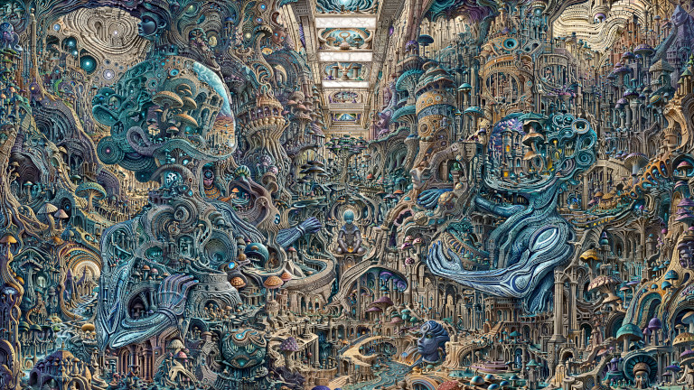

  

**IntraPaint** is a free and open-source image editor for desktop PCs. It combines standard digital painting
and image editing tools with advanced AI-based features, including image generation and inpainting. IntraPaint bridges
the gap between traditional digital editing and AI-driven workflows, combining the precision of manual techniques with
the efficiency of AI tools for a more seamless creative process. IntraPaint is available for Windows and Linux. macOS
support is possible with manual setup and compilation.

---
# Table of Contents:
1. [Getting Started](#getting-started-with-intrapaint)
2. [Key Features](#key-features)
3. [Use Cases](#why-combine-ai-and-traditional-tools)
4. [Examples](#more-examples)
5. [Installation](#installation-and-setup)
6. [AI Setup (Stable-Diffusion)](#ai-setup-stable-diffusion)
7. [Guides and Tutorials](#guides-and-tutorials)
   - [IntraPaint tool overview](./doc/tool_guide.md)
   - [Stable-Diffusion Controls](./doc/stable-diffusion.md)
   - [Guide to AI Inpainting](./doc/inpainting_guide.md)
8. [FAQ](#faq)
9. [Alternatives](#alternatives)
---

## Getting Started with IntraPaint:


|                |             | 
|:--------------------------------------------------------:|:-----------------------------------------------------:| 
|       *1. Draw and paint with conventional tools*        | *2. Select areas for AI editing and provide a prompt* |


|  |  | 
|:------------------------------------------:|:------------------------------------------:| 
|     *3. Choose from generated options*     |     *4. Refine and repeat as needed.*      |


## Key Features:

### AI image generation features:
- Integrates with Stable-Diffusion, running locally or remotely (via API) using [Forge WebUI](https://github.com/lllyasviel/stable-diffusion-webui-forge) or [Automatic1111 WebUI](https://github.com/AUTOMATIC1111/stable-diffusion-webui).
- Supports **text-to-image**, **image-to-image**, and **inpainting**, allowing users to generate new images, refine existing ones, or apply specific edits using natural language prompts.
- Advanced AI guidance through **ControlNet modules**, enabling features like depth mapping, recoloring, pose replication, and more.
- **AI upscaling** via Stable-Diffusion + ControlNet or other specialized models.


### Traditional Image Editing Tools:
- Full-featured layer stack with advanced blending modes, layer groups, and transformations.
- Digital painting capabilities powered by the [libmypaint](https://github.com/mypaint/libmypaint) brush engine, with full support for pressure-sensitive drawing tablets.
- Standard tools such as selection, text editing, paint bucket, filters, and more are available even when AI features are disabled.

## Why Combine AI and Traditional Tools?
- Automate repetitive tasks: Focus on drawing what matters to you, and let the AI handle the rest.
- Explore creative alternatives: Quickly iterate on multiple ideas without manually creating each variation.
- Complete control in one package: Use familiar editing tools without needing to export files to another application.

|                                                                          Quickly refine sketches                                                                           |                                                                                  Clean up and color line art                                                                                  |                                       Experiment with different styles.                                        |
|:--------------------------------------------------------------------------------------------------------------------------------------------------------------------------:|:---------------------------------------------------------------------------------------------------------------------------------------------------------------------------------------------:|:--------------------------------------------------------------------------------------------------------------:|
|    |                                              |  |
|                       Prompt: "A small figure walking down a road under a massive cloudy sky, billowing clouds, sunset, fiery fields, god rays, sun"                       | Prompt: "organic sprawling colorful city, ultra dense, gigantic twisted textured detailed realistic climbing vines, pareidolia, stained glass, blue sky, billowing clouds, runes and symbols" |                            Prompt: "Stanford bunny, \[text in image frame above\]"                             |

Control image generation visually by providing rough sketches and brief descriptions, letting Stable-Diffusion handle the rest.

Prompt: "on the left, a red lizard with a yellow hat standing on a green pillar in an orange desert under a blue sky, looking at a silver robot in a cowboy hat on the right "

|                                                |  |  |
|:---------------------------------------------------------------------------------------------------------------------------------------------------------------------------|:---------------------------------------------------------------------------------------------------------------------------------------------------------------------|:-------------------------------------------------------------------------------------------------------------------------|
| AI-generated image showcasing polished details but with spatial confusion between the lizard and the robot, blending traits and causing visual confusion between subjects. | A manually drawn scene, offering clear and precise subject placement with no confusion, but lacking the fine detail and polish of the AI-generated version.          | A hybrid approach, combining manual precision with AI enhancements for detailed, coherent subjects and a balanced result |

Generate images with greater detail and precision by using guided inpainting to enhance specific areas.

|                                                 Avoid size restrictions by generating images in segments                                                 |                                                            Refine small details with guided inpainting                                                             |                                                  Final results are dramatically higher quality.                                                  |
|:--------------------------------------------------------------------------------------------------------------------------------------------------------:|:------------------------------------------------------------------------------------------------------------------------------------------------------------------:|:------------------------------------------------------------------------------------------------------------------------------------------------:|
|  |  |  |

---

### More examples:
All images below were created using IntraPaint:
<table>
    <tr>
        <td colspan="1" rowspan="1">
          <a href="https://centuryglass.us/img/IntraPaint/ASCII-lair.jpg">
            
          </a>
        </td>
        <td colspan="2" rowspan="2">
          <a href="https://centuryglass.us/img/IntraPaint/isolibrary.jpg">
            
          </a>
        </td>
        <td colspan="1" rowspan="1">
          <a href="https://centuryglass.us/img/IntraPaint/interstate.jpg">
            
          </a>
        </td>
    </tr>
        <td colspan="1" rowspan="1">
          <a href="https://centuryglass.us/img/IntraPaint/jungle-grid.jpg">
            
          </a>
        </td>
        <td colspan="1" rowspan="1">
          <a href="https://centuryglass.us/img/IntraPaint/lifebulb.jpg">
            
          </a>
        </td>
    <tr>
        <td colspan="1" rowspan="2">
          <a href="https://centuryglass.us/img/IntraPaint/catseye.jpg">
            
          </a>
        </td>
        <td colspan="2" rowspan="2">
          <a href="https://centuryglass.us/img/IntraPaint/moonlighter.jpg">
            
          </a>
        </td>
        <td colspan="1" rowspan="2">
          <a href="https://centuryglass.us/img/IntraPaint/glitch alley.jpg">
            
          </a>
        </td>
    </tr>
    <tr></tr>
    <tr>
        <td colspan="3" rowspan="2">
          <a href="https://centuryglass.us/img/IntraPaint/fungiwood.jpg">
            
          </a>
        </td>
        <td colspan="1" rowspan="2">
          <a href="https://centuryglass.us/img/IntraPaint/radian.jpg">
            
          </a>
        </td>
    </tr>
</table>
---

## Installation and Setup:

### Pre-packaged builds:
Pre-compiled versions for x86_64 Linux and Windows are available on the [releases page](https://github.com/centuryglass/IntraPaint/releases).
- Windows: [IntraPaint.exe](https://github.com/centuryglass/IntraPaint/releases/download/v0.2.0-alpha/IntraPaint.exe)
- Linux: [IntraPaint-linux](https://github.com/centuryglass/IntraPaint/releases/download/v0.2.0-alpha/IntraPaint-linux)

No installation is required to use non-AI features. Just run the executable directly.

### Install from GitHub:
On other systems, you will need to use git and python to install IntraPaint.  Make sure you have git, python 3.9 or
greater, and pip installed and added to your system's PATH variable.  On some systems, you might need to change
"python" to "python3" and "pip" to "pip3" in the commands below. Using a Python virtual environment is also
recommended, but not required.  Run the following commands to install and start IntraPaint:

```
git clone https://github.com/centuryglass/IntraPaint
cd IntraPaint
pip install -r requirements.txt
python IntraPaint.py
```


## AI Setup (Stable-Diffusion):
To use AI features, you'll need a running Stable-Diffusion client (either [Forge WebUI](https://github.com/lllyasviel/stable-diffusion-webui-forge) or the
[Automatic1111 WebUI](https://github.com/AUTOMATIC1111/stable-diffusion-webui)) with API access enabled.  The simplest method for getting this is through. [Stability Matrix](https://github.com/LykosAI/StabilityMatrix).

1. Download and install Stability Matrix for your system:
   * [Windows 10, 11](https://github.com/LykosAI/StabilityMatrix/releases/latest/download/StabilityMatrix-win-x64.zip)
   * [Linux AppImage](https://github.com/LykosAI/StabilityMatrix/releases/latest/download/StabilityMatrix-linux-x64.zip)
   * [Arch Linux AUR](https://aur.archlinux.org/packages/stabilitymatrix)
   * [macOS, Apple Silicon](https://github.com/LykosAI/StabilityMatrix/releases/latest/download/StabilityMatrix-macos-arm64.dmg)
2. Open Stability Matrix, click "Add Package", select "Stable Diffusion WebUI Forge", and wait for it to install.
3. Once the installation finishes, click the gear icon next to Forge on the package screen to open launch options. Scroll to the bottom of the launch options, add `--api` to "Extra Launch Arguments", and click "Save"
4. Click "Launch", and wait for the WebUI to finish starting up.
5. Open IntraPaint, and it should automatically connect to the Forge API. If IntraPaint is already running, open "Select image generator" under the Image menu, select "Stable-Diffusion WebUI API", and click "Activate".


### Guides and tutorials

### IntraPaint Documentation:
- [IntraPaint Controls](./doc/controls.md): An overview of the main application interface.
- [IntraPaint Tools](./doc/tool_guide.md): Guides to each of IntraPaint's image editing tools.
- [Main Menu Options](./doc/menu_options.md): Detailed guide to all main menu options.
- [Stable-Diffusion Controls](./doc/stable-diffusion.md): In-depth descriptions of all Stable-Diffusion image generation options.
- [Guide to AI Inpainting](./doc/inpainting_guide.md): Tips and tricks for effective AI inpainting.

### Related Resources
These are third-party resources that I've found useful, I did not create or contribute to them.

- [The Ultimate Guide to ControlNet](https://education.civitai.com/civitai-guide-to-controlnet/#what-do-the-models-do): An in-depth overview of ControlNet's capabilities.
- [Stable Diffusion Samplers: A Comprehensive Guide](https://stable-diffusion-art.com/samplers/): Explains what the difference between Euler A/DPM++/UniPC/etc. is, and why you might want to choose any particular option.
- [Automatic1111 WebUI Features](https://github.com/AUTOMATIC1111/stable-diffusion-webui/wiki/Features): All prompt-related features listed here will work within IntraPaint. 

### FAQ:

#### Q: Why isn't the brush tool visible?

On systems other than 64-bit Linux and Windows, the brush tool may not work, because you will need a system-specific
build of the libmypaint brush engine library.  If pre-packaged libmypaint versions can't be used, IntraPaint will try
to load libmypaint libraries from another directory, configurable in IntraPaint's settings under the "system" category.
If you need help locating libmypaint files for a particular system, open a GitHub issue, and I'll try to help.

#### Q: Where are the ControlNet options?

The ControlNet panel only appears if the WebUI backend has a working ControlNet extension installed with API support.

*If using WebUI Forge*:  The most recent version of the Forge WebUI (as of 8/30/24) does not have a working ControlNet
API. Use Git to revert to commit `bfee03d8`, or install the [v0.0.17 release](https://github.com/lllyasviel/stable-diffusion-webui-forge/releases/download/previous/webui_forge_cu121_torch21_f0017.7z).

*If using the Automatic1111 WebUI*: The ControlNet panel only appears after you've installed the sd-webui-controlnet 
extension.  Installation instructions and links to required ControlNet model files can be found [here](https://github.com/Mikubill/sd-webui-controlnet).

#### Q: Wasn't there something else here before?

Version 0.1.0 of IntraPaint, released July 2022, was a much simpler program that used the old [GLID-3-XL](https://github.com/Jack000/glid-3-xl) AI image generation model for inpainting. You can still access that version at https://github.com/centuryglass/IntraPaint/tree/0.1-release

### Alternatives:
- The [Krita AI Plugin](https://github.com/Acly/krita-ai-diffusion) shares many of the same goals as IntraPaint and executes them very well. If you already use [Krita](https://krita-artists.org/) or [ComfyUI](https://github.com/comfyanonymous/ComfyUI), this could be a great option for you.  This is the only item on this list that I've personally tested.
- Several plugins exist for [GIMP](https://www.gimp.org/) with similar functionality:
  * [Stable-Gimpfusion](https://github.com/ArtBIT/stable-gimpfusion)
  * [gimp-stable-diffusion](https://github.com/blueturtleai/gimp-stable-diffusion)
  * [Stable Boy](https://github.com/thndrbrrr/gimp-stable-boy)
