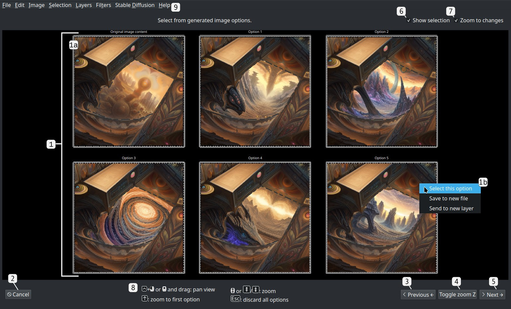

# IntraPaint Controls

## Main View

1. **Main menu**: See the [menu option guide](./menu_options.md) for descriptions of all menu options.
2. **Tool panel**: The main control panel for manual image editing.
    - 2a. **Tool buttons**: The full set of available tools. Click one to activate it, or press the key shown in the bottom right corner of the tool button icon.
    - 2b. **Active tool control panel**: This panel changes depending on what tool is selected. Refer to the [IntraPaint tool guide](./tool_guide.md) for an in-depth overview of all tools and tool panels.
    - 2c. **Extra control tabs**: Provides smaller versions of the [layer window](./menu_options.md#show-layer-window-f7), [color picker control panel](./tool_guide.md#user-interface-color-component-tab), and [navigation window](./menu_options.md#show-navigation-window-ctrlaltw). See [layer menu options](./menu_options.md#layers-menu) for more information on IntraPaint's layer system.
3. **Image Generation panel**: The main control panel for AI image editing. This panel is only available after you've installed and configured Stable Diffusion, [click here](../README.md#ai-setup-stable-diffusion) for details.
    - 3a. **Stable Diffusion AI settings**:  See the [Stable Diffusion control guide](./stable-diffusion.md) for detailed descriptions of these controls.
    - 3b. **"Interrogate" button**:  Use AI image analysis to automatically generate a description of the edited image.
    - 3c. **"Generate" button**:  Click to trigger AI image generation, creating or altering image content to insert into the [image generation area](./inpainting_guide.md#generation-area). Clicking this will switch IntraPaint to the [generated image selection view](#generated-image-selection-view).
4. **Image viewport**: View and interact with the edited image.
    - 4a. **Selected content**: The dashed lines and red tint show areas specifically marked for editing. See the [selection tool guide](./tool_guide.md#selection-tools) for more information on the way IntraPaint uses selection.
    - 4b. **Image generation area**:  This rectangle marks the area used for AI image generation, placed using the [Generation area tool](./tool_guide.md#-image-generation-area-tool-g).
    - 4c. **Inpaint padding bounds**: The reduced image generation area used when the image generation editing mode is set to "inpaint" and "Inpaint Full Resolution" is checked. See the [inpainting guide](./inpainting_guide.md#inpaint-full-resolution-checkbox) for more details.
    - 4d. **Brush cursor**: When over the image viewport, the mouse cursor will change based on the current active tool.
5. **Tab bars**: The main control panels can be rearranged by dragging tabs between these bar. You can also right-click a tab bar and select "Move all tabs here" to move every tab at once.  Empty tab bars shrink to a reduced size. When a tab bar is not empty, click the arrow icon at the start of the tab bar to show or hide its control panel.
6. **Control tabs**:  Drag these between tab bars to rearrange controls, or right-click for tab placement options. Click an inactive tab or press the key printed on its bottom-right corner to activate it. If the tab bar's control panel is minimized, this will expand it.  Double-clicking an open active tab or pressing its keyboard key will minimize the control panel.
    - 6a. **Tool tab**: Controls the placement of the tool panel. This tab will always be visible.
    - 6b. **Image Generation tab**:  Controls the placement of the image generation panel. This tab is only visible when AI image generation is configured.
    - 6c. **ControlNet tab**:  Controls the placement of the [ControlNet panel](./stable-diffusion.md#controlnet-panel). Because this tab is on the same bar as the image generation tab, the ControlNet panel is currently hidden.  Clicking it will hide the image generation panel and show the ControlNet panel.
7. **Tool control hints**:  Lists controls for the current active tool. Right-clicking this spot opens a menu where you can show or hide these tips.
8. **Image zoom controls**: Directly sets how zoomed-in the image viewport is.  At 1.0, the image is shown at actual size.
9. **Image zoom toggle button**:  Click to reset the image to its default position and scale, centering and showing the entire image. If the image generator is configured and the view is already at the default, button text will change to "Zoom In", and clicking it will center the image generation area.

---
## Generated Image Selection View

When AI image generation is triggered, the usual process is to create several variations at once, then choose the best one. This view is where you make that selection.  The generated image selection view can only be accessed when AI image generation is configured.  It is automatically shown when you press the "generate" button, or select "generate" from the Image menu.  IntraPaint will return to the main view once you select an option, or choose to reject all of them.

1. **Generated image options**: The available options created by a single image generation operation, arranged in a grid. When you left-click an option, it gets inserted directly into the active image layer at the image generation area, and the selection view closes.
    - 1a. **Original image content**:  The original unedited image content is always shown in the first spot for comparison.  Left-clicking this option will close the selection view without making any changes. 
    - 1b. **Image option context menu**:  Right-clicking any image option brings up a menu with additional options.
       * **"Select this option"**: This choice behaves the same as left-clicking the image option.
       * **"Save to new file"**:  Open a file dialog to save the selected option as a new file. This does not close the selection view.
       * **"Send to new layer"**: Creates a new image layer from the selected option, without closing the selection view. This is useful if you want to save pieces from multiple options.
2. **Cancel button**:  Close the selection view, and return to normal editing.  If AI image generation is still in-progress, this will cancel it.
3. **"Zoom Previous" button**:  From the zoomed-out view, this zooms in on the last image option. If already zoomed in, this switches the view to the previous option in the list.
4. **"Toggle" Zoom button**: Toggle between the zoomed-out view displaying all options, and the zoomed-in view for inspecting a single option in detail.
5. **"Zoom Next" button**: From the zoomed-out view, this zooms in on the first image option. If already zoomed in, this switches the view to the next option in the list.
6. **"Show selection" checkbox**:  When in "inpaint" mode, this checkbox controls whether the selected area is outlined in each image option. 
7. **"Zoom to changes" checkbox**:  When in "inpaint" mode, entering the zoomed-in view while this option is checked will zoom in even further to focus on the updated area within the previewed option.
8. **Control hints**:  Shows additional controls.  Most of the controls for panning and zooming within the image viewport also work within the selection view.
9. **Main menu**:  Most menu options are disabled when in the selection view, but options for saving the image and creating new layers will still be available.