# AI Inpainting with IntraPaint
I’ve spent the last two years experimenting with AI-driven image editing, and I’ve collected some useful tricks to get
the best results with inpainting.  This guide will help you get the results you want with minimal hassle.

If you don't have any previous experience with AI image editing with Stable Diffusion, you may want to review
the [Stable Diffusion guide](./stable-diffusion.md) first.
---
## Table of Contents
1. [Key Terms](#key-terms)
   - [Generation Area](#generation-area)
   - [Generation resolution](#generation-resolution)
   - ["Inpaint Full Resolution" checkbox](#inpaint-full-resolution-checkbox)
   - ["Inpaint Full Res. Padding"](#inpaint-full-res-padding)
2. [AI Model selection](#ai-model-selection)
   - [Base model selection](#base-model-selection)
   - [Other notable base models](#other-notable-base-models)
   - [Community Models](#community-models)
3. [Inpainting strategies](#inpainting-strategies)
   - [Selecting generation resolution](#selecting-generation-resolution)
   - [Generation area control](#generation-area-control)
   - [Selecting areas for inpainting](#selecting-areas-for-inpainting)
   - [Visually guiding image generation](#visually-guiding-image-generation)
   - [Prompt adjusting](#prompt-adjusting)
   - [Effective ControlNet use](#effective-controlnet-use)
   - [Other tips and tricks](#other-tips-and-tricks)
---

## Key Terms
These concepts and controls are specific to AI inpainting, understanding them will help you get the most out of IntraPaint.

## Generation Area
The section of an image where the AI can make changes. In IntraPaint, the Generation Area is shown as a dotted
rectangle within the image, and you can use the [Generation Area tool](./tool_guide.md#-image-generation-area-tool-g) to
change its size and placement.

The way the generation area is used varies depending on the image editing mode:
- Text-to-Image: The original content in the generation area is erased and replaced.
- Image-to-Image: The AI modifies the generation area while ignoring areas outside of it, which can cause visible seams.
- Inpainting: Only selected content within the generation area is modified, but the AI can still “see” the entire generation area (unless "inpaint full resolution" is enabled).

### Generation resolution
The dimensions of the generated content. If the generation resolution doesn't match the generation area, the output
will be scaled accordingly. This may result in quality loss or detail artifacts, so in most cases it's best to not use
a generation resolution that's larger than the generation area.  In IntraPaint, you can set this within the 
Image Generation tab, or at the bottom of the Generation Area tool panel.

### "Inpaint Full Resolution" Checkbox
When enabled, the image generator uses a reduced portion of the generation area, focusing only on the selected
inpainting areas. This gives higher detail at the cost of overall image awareness. This option is only valid when 
inpainting.  It can be found in the Image Generation tab, and in the tool panel for each selection tool.

### “Inpaint Full Res. Padding”
When "Inpaint Full Resolution" is checked, padding is added around the inpaint selection to prevent seams. You can
control the padding size with this option, though it will be cropped if it exceeds the generation area. Controls for
this option are located beneath the "Inpaint Full Resolution" checkbox.  When active, the padding rectangle will be 
drawn within the generation area around selected content.

---

# AI Model selection
Choosing the right model is crucial for achieving the best results.  To install new Stable Diffusion model files, follow [these steps](./stable-diffusion.md#installing-new-ai-model-files). Here are some tips for model selection:

## Base model selection
Most Stable Diffusion models are variants of two different base model types, each with its own strengths and weaknesses.
- Stable Diffusion 1.5 (SD1.5): More efficient for inpainting tasks. Variants usually perform poorly at resolutions above 512x512, but can still deliver great results on small areas.
- Stable Diffusion XL (SDXL): Best for whole-image generation. Slower, but works well for larger compositions.

### Other notable base models
- [CommonCanvas](https://huggingface.co/papers/2310.16825): Uses the same architecture as Stable Diffusion, trained from scratch on a dataset that uses only Creative-Commons licensed images.
- Stable Diffusion 2.1: An intermediate model with capabilities roughly between Stable Diffusion 1.5 and Stable Diffusion XL, not frequently used.
- Stable Diffusion 3: Exceeds the capabilities of SDXL in many respects, but notoriously poor at reliably generating humans and animals without serious errors.
- Flux: Not a Stable Diffusion model, but many Stable Diffusion clients support it. Its capabilities dramatically surpass SDXL, but it's even slower and more resource-intensive.

### Community Models
It's rarely recommended to use the base models directly, as they are usually surpassed by fine-tuned model variants and mixes released by hobbyists and enthusiasts on platforms like [HuggingFace](https://huggingface.co/) and [Civitai](https://civitai.com/). Some models specialize in specific artistic styles, while others have more general improvements. There's no one best option, it really depends on what you're trying to do. Keep experimenting since new models are released frequently.

#### Some examples:

|                        Stable Diffusion 1.5 (base model)                        |       [Photon](https://civitai.com/models/84728/photon)        |   [Arthemy Comics](https://civitai.com/models/54073?modelVersionId=830649)    | [Oil painting](https://civitai.com/models/20184/oil-painting?modelVersionId=23979) |
|:-------------------------------------------------------------------------------:|:--------------------------------------------------------------:|:-----------------------------------------------------------------------------:|:----------------------------------------------------------------------------------:|
| 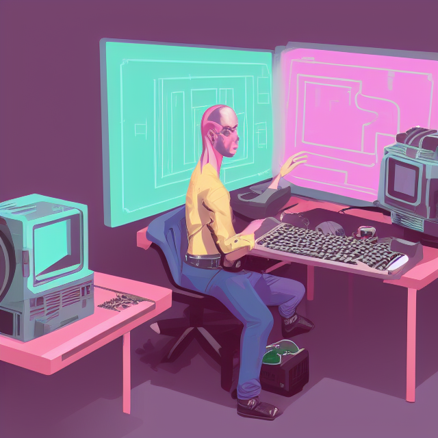 | 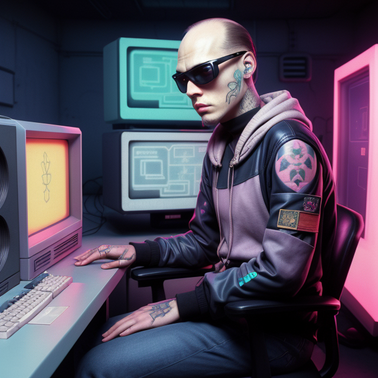 | 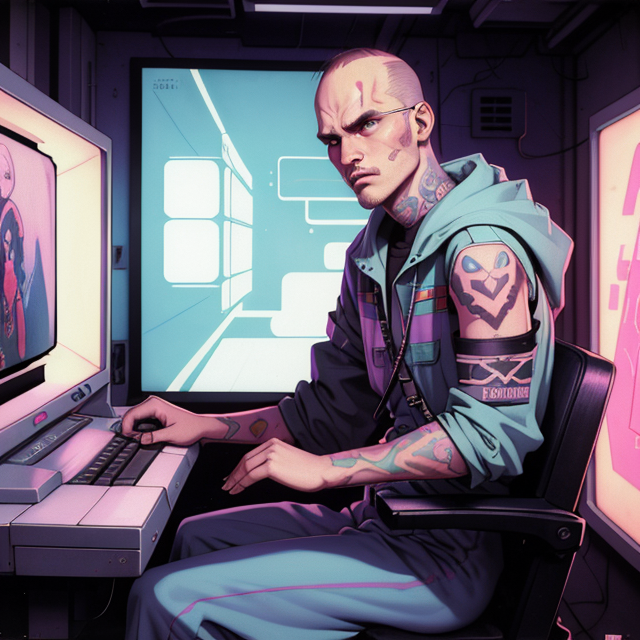 |           |

Each of those images were generated at 640x640 with the exact same parameters:
- **Prompt**: Cinematic, photoshoot, Legendary hacker outlaw, 90's fashion, pastel colors, creative anachronism, weird tattoos, balding, realistic hologram, Soviet art, tapestry, sitting at retro computer, many CRTs
- **Negative prompt**: poor quality, worst quality
- **Sampling steps**: 30
- **Guidance scale**: 8.0
- **Sampling method**: Euler a
- **Seed**: 3915102715

In each case the only difference is the AI model chosen. All models used are variants of Stable Diffusion 1.5.

---
# Inpainting strategies

## Selecting generation resolution

**Know Your Model’s Capabilities**: Models based on SD1.5 work best at 512x512, but fine-tuned models based on SD1.5 can often perform well at 640x640 or higher. SDXL models work best at 1024x1024.

|                                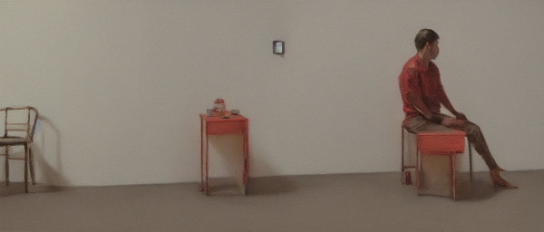                                |                                                                                       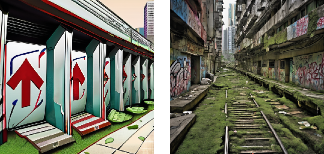                                                                                       |                                                                                    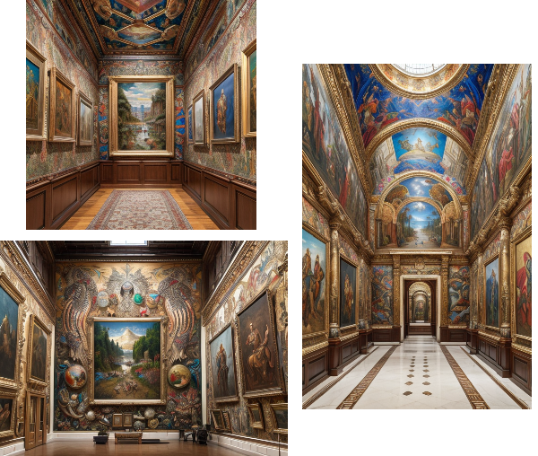                                                                                    |
|:--------------------------------------------------------------------------------------------------------------------------------------------------------:|:---------------------------------------------------------------------------------------------------------------------------------------------------------------------------------------------------------------------------------------------------------------------:|:------------------------------------------------------------------------------------------------------------------------------------------------------------------------------------------------------------------------------------------------------:|
| Base Stable Diffusion 1.5, original size 1200x512. Although possible, pushing resolution beyond normal levels creates worse images with far more errors. | Stable Diffusion XL, generated at 512x512 directly on the left, downscaled from 1024x1024 on the right, all other settings unchanged. Reducing image resolution too much also creates worse images, it's often better to generate larger than you need and downscale. | [CyberRealistic model](https://civitai.com/models/15003/cyberrealistic) (SD 1.5-based) at 512x512, 640x480, and 512x768, all other settings unchanged. If not too extreme, going slightly outside of normal bounds can still produce decent results. |

**Use Downscaling for Detail Work**: Set your generation resolution higher than your generation area size to allow for error correction during downscaling.  This provides the same effect as the "inpaint full resolution" option.

| 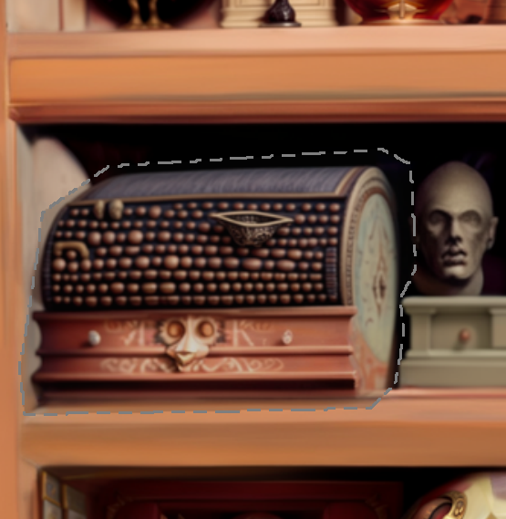 |         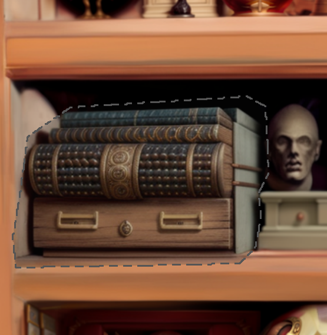         | 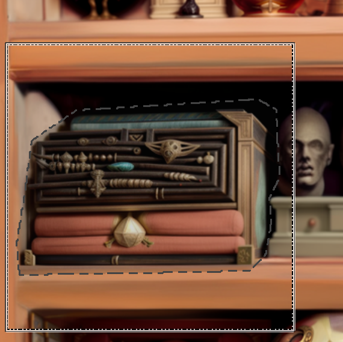 |
|:-----------------------------------------------------------------------------:|:-------------------------------------------------------------------------------------------------:|:------------------------------------------------------------------------------------------:|
|                 The original image selection, before editing                  | Inpainted at 640x640, best option of eight chosen. With zero scaling, adjusted details are fuzzy. |              Generating at 640x640 within a 280x280 area for sharper results.              |

---

## Generation Area control
Balancing fine detail with scene awareness is key.
- *Fine Detail*: For maximum focus and accuracy, select small areas and enable "inpaint full resolution" with low padding.
- *Scene Awareness*: To help the image generator recognize patterns or maintain composition, increase padding or generation area size. You can extend padding by right-clicking with the selection brush to add a single pixel outside the selection—this extends the padding without affecting content.

|                             Original, before inpainting                              | Full resolution inpainting disabled                                                              | Full resolution inpainting enabled, padding set to 2px                            | Full resolution inpainting enabled, padding set to 70px                            |
|:------------------------------------------------------------------------------------:|:-------------------------------------------------------------------------------------------------|:----------------------------------------------------------------------------------|:-----------------------------------------------------------------------------------|
| 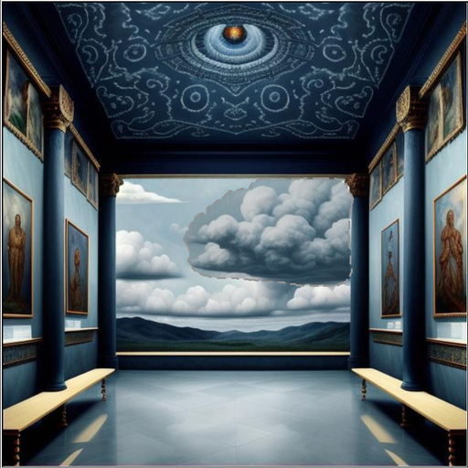 | 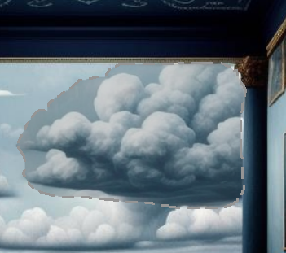   | 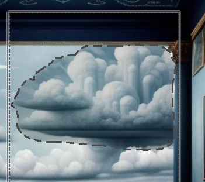            | 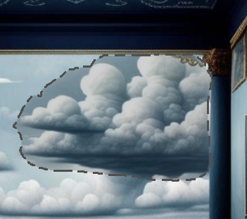             |
|             The full image, where I've selected a cloud for inpainting.              | Without full resolution inpainting there's some improvement in the results, but we can do better | Results are much more detailed, but they look out of place within the full image. | Getting the padding just right provides a compromise between detail and awareness. |

---

## Selecting areas for inpainting
Small changes are good: The less that the AI has to do in a single operation, the less likely it'll be to get something critically wrong, and small changes generate faster.  Padding and denoising strength can be adjusted at every step as necessary for maximum control.

|  |                   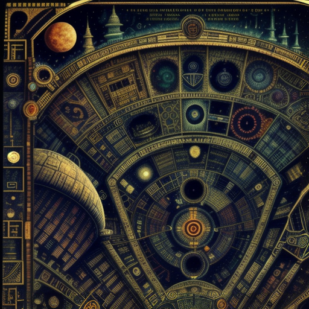                   |     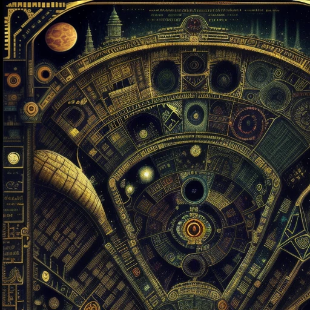      | 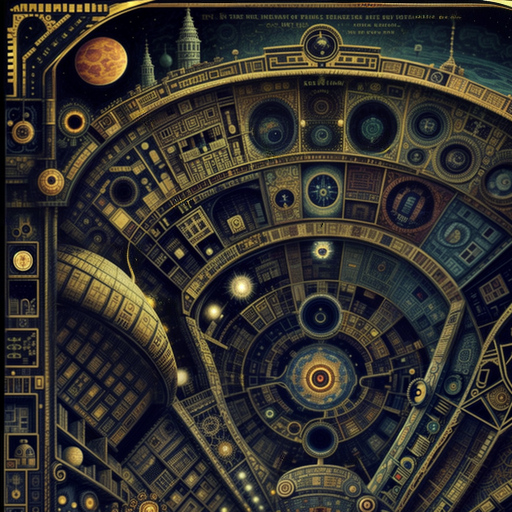 |
|:--------------------------------------------------------:|:----------------------------------------------------------------------------------------------:|:----------------------------------------------------------------------------------:|:--------------------------------------------------------:|
|   Starting with a rough AI-generated image, zoomed-in.   | A large area edited in one step. It's only slightly improved, and changes are hard to control. | In-progress, editing in many small steps. This allows for more deliberate changes. | Final result: the same area edited in 20 small sections. |

## Visually guiding image generation
It's much easier to get the AI to do exactly what you want if you can manually start the process.  It's easier to roughly sketch a scene and let the AI clean it up than it is to get the AI to make that same exact scene using only prompting.

|                                                                                                                      |                    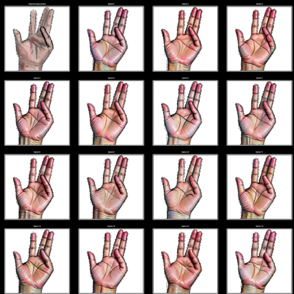                     |                   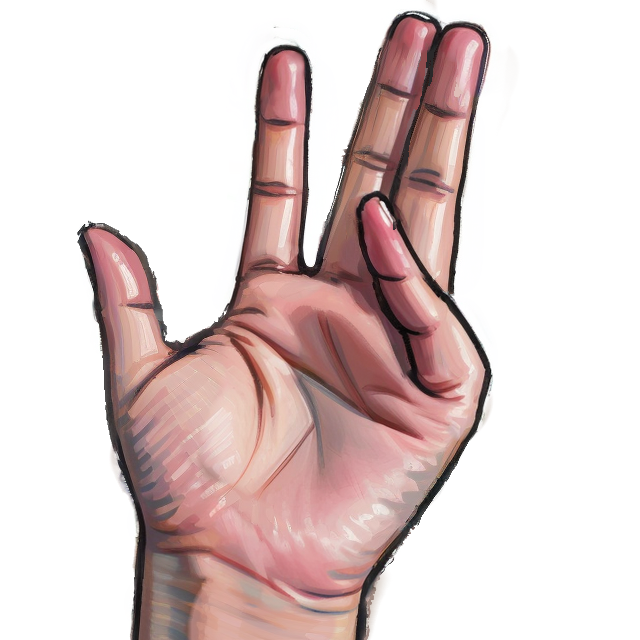                    |
|:---------------------------------------------------------------------------------------------------------------------------------------------------------------------------------------:|:-----------------------------------------------------------------------------------------------------------------------------------:|:------------------------------------------------------------------------------------------------------:|
| AI still struggles to get hands right, especially in unusual positions. Given fifteen chances, not once did Stable Diffusion get the pinky finger right, even with ControlNet guidance. | After I added darker lines to emphasize the missing finger, the next fifteen attempts all completely avoid making the same mistake. | Repeating the process for other details that don't look right eventually leads to much better results. |

## Prompt adjusting
- Since the AI only sees the image generation area, leaving anything in the prompt that's outside the generation area is likely to result in duplicate content, especially at higher denoising strength. Consider temporarily removing parts, or adding more text related to the specific spot you're editing.
- At lower denoising strengths (< 30% or so), image context often matters more than prompt context, so you often won't need to change the prompt much.

|                                      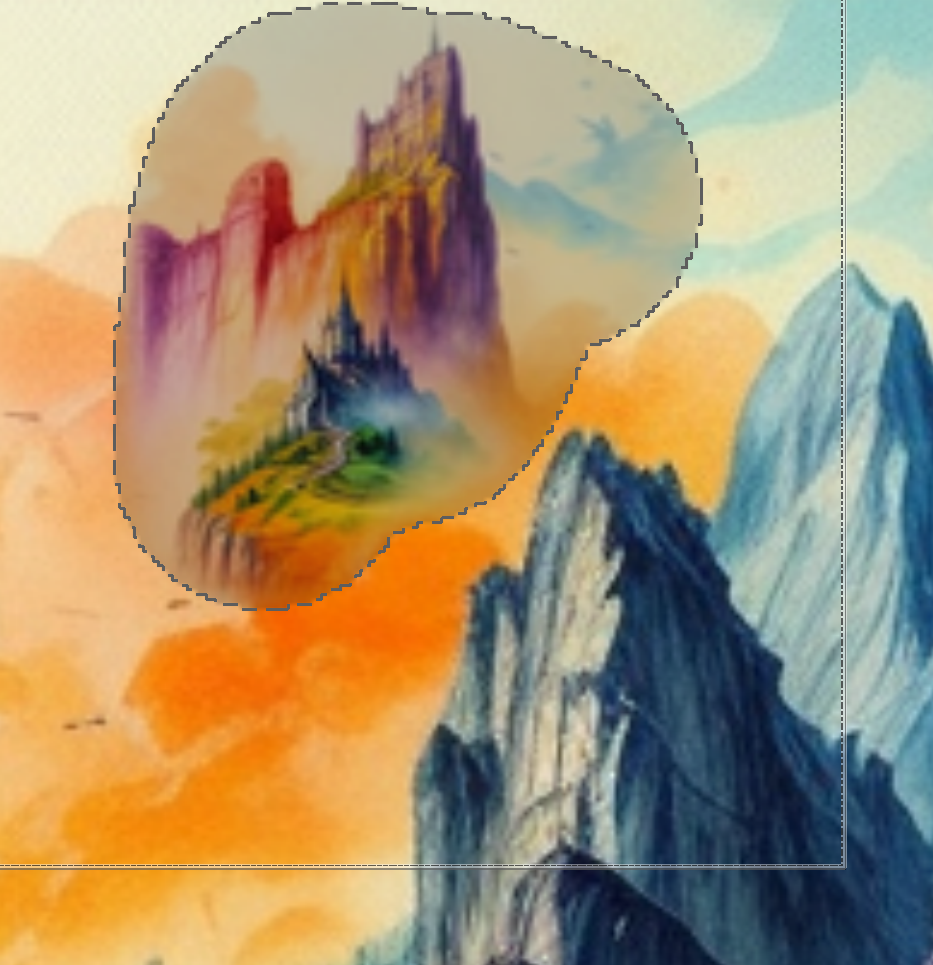                                       | 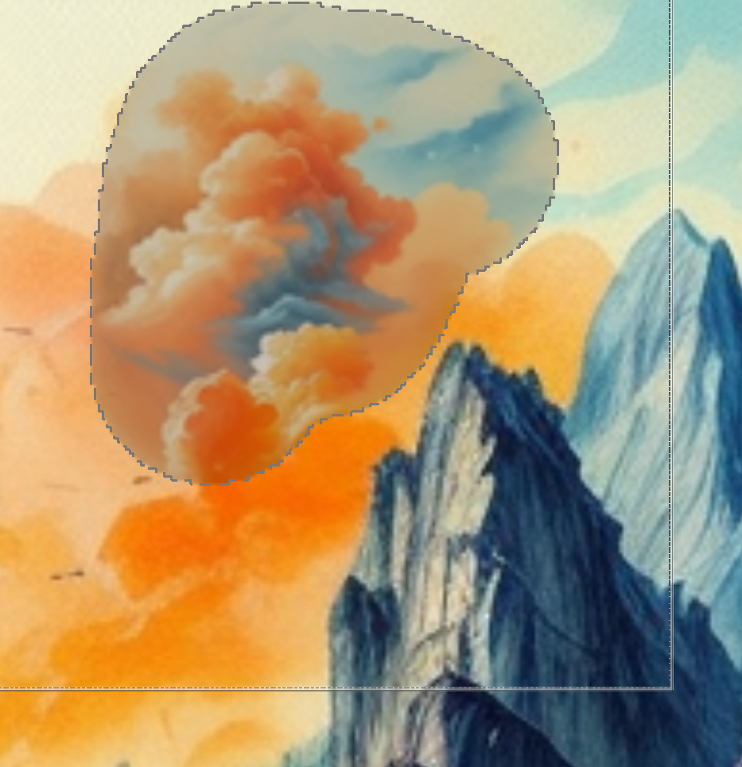  |   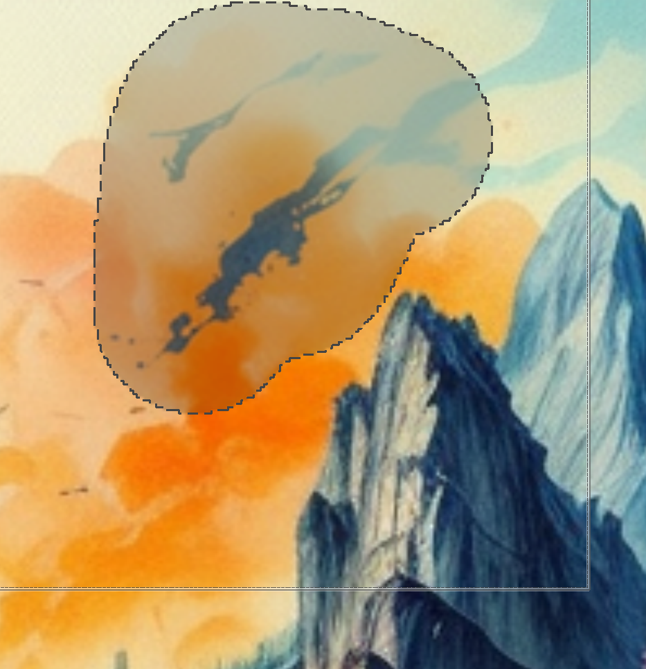    |
|:------------------------------------------------------------------------------------------------------------------------------------------------------------:|:----------------------------------------------------------------------------:|:----------------------------------------------------------------------------------------------:|
| prompt: "Detailed painting of an outlandish colorful fantasy marketplace at the top of a mountain, filled with strange creatures and beautiful architecture" |            prompt: "Detailed painting of billowing orange clouds"            |                   prompt: "photograph of an abandoned rusty car in a ditch"                    |
|                                  0.6 denoising strength, Stable Diffusion tries to apply the whole prompt to a small area.                                   | With the prompt adjusted, high denoising strength no longer causes problems. | With denoising strength reduced to 0.2, even a completely incorrect prompt can sometimes work. |

## Effective ControlNet use
- When inpainting with ControlNet, you can increase the denoising strength much higher, even up to 100%, and ControlNet will make sure the appropriate content is still preserved.
- For this to work well, it's important to have selected an accurate prompt and a model trained to understand the type of image you're making, or it will struggle to get good results.
- Many of the available ControlNet models are extremely similar. For example, the Canny, Lineart, scribble, and MLSD models all provide slightly different methods of preserving initial lines. None of them are objectively best, you'll need to try out several to find which one you prefer.
   * For coloring line art, I personally prefer the Canny model (control-canny-fp16). Canny is particularly strict about preserving original lines, making it a good choice when you don't want to alter those at all.
   * For cleaning up rough sketches, I've gotten best results from the Scribble model (control-scribble-fp16), using the scribble_xdog preprocessor.
- If you want to clean up fine details and textures but change almost nothing about the overall composition, use the tile ControlNet module. It ensures that individual multi-pixel blocks within the image stay around the same average color.

Example prompt: "infinite cityscapes across recursive realities, maximalist variation, fractal pilgrims, tesseract soul, symbol as reality, infinite information density"

| 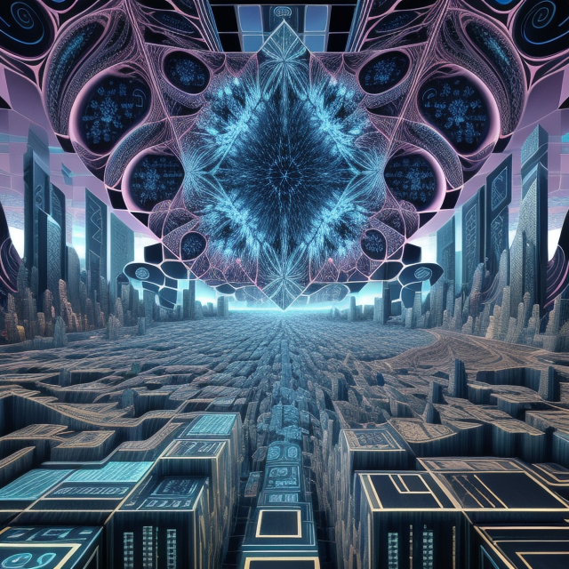 |    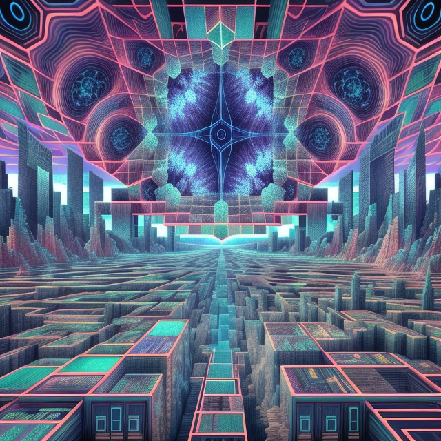     | 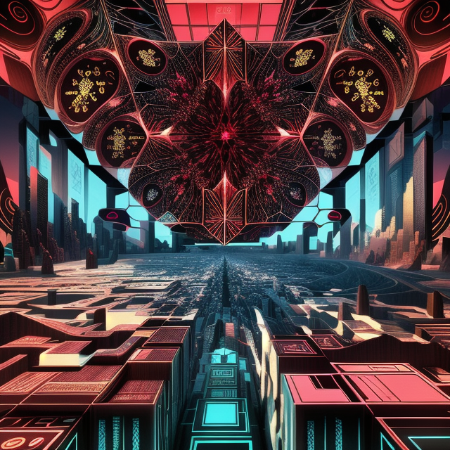 | 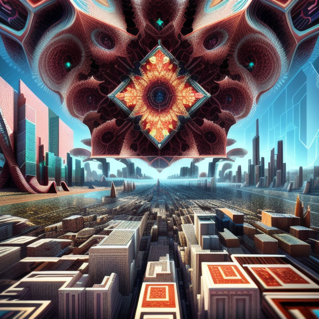 |
|:-----------------------------------------------------------------------------------:|:-----------------------------------------------------------------------------:|:------------------------------------------------------------------------:|:------------------------------------------------------------------------------:|
|                                   Original image                                    | Denoising strength 1.0, "(abstract illusionism)" added to the original prompt |    Denoising strength 1.0, "(ruby red)" added to the original prompt     |   Denoising strength 1.0, "(macro photography)" added to the original prompt   | 

## Other tips and tricks
- If a particular inpainting result is excellent in most ways, but gets one area wrong:
  * Right-click the image option in the selection screen, click "send to new layer", exit the selection screen
  * Select the new layer, erase the part that you don't like, select "merge down" to manually add the rest of the change to the edited layer.
- Sometimes models will have issues matching colors across gradients, especially older models.  Use the smudge tool to smooth out visible seams and inpaint again at a lower denoising strength to fix these issues.
- AI upscaling is extremely effective, but it's much easier to fix large-scale image issues when the image is lower-resolution.  Sometimes it's even worthwhile to scale down an image to make large-scale changes go more smoothly, then upscale it again once the issues are resolved. See [Stable Diffusion upscaling](./stable-diffusion.md#ai-upscaling-with-intrapaint) for more tips for effective upscaling.
- AI is excellent at cleaning up rough edges. You can copy/paste whole blocks of content, roughly scale and transform image regions, or drop in mismatched sketches, and a quick inpainting pass will clean it up easily.

|                         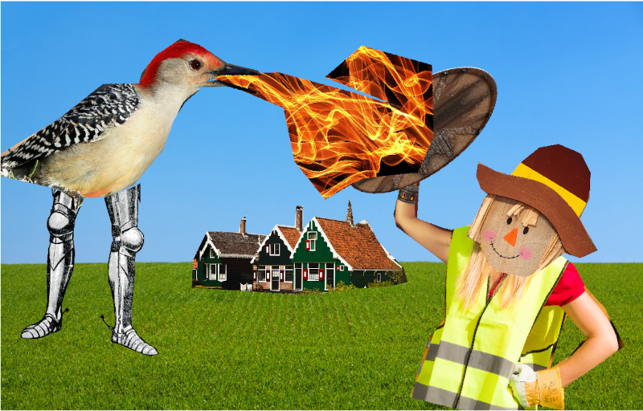                         |           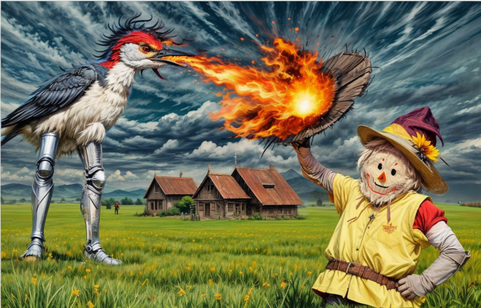            |
|:------------------------------------------------------------------------------------------------------------------------------:|:---------------------------------------------------------------------------------------------------------:|
| Initial image, roughly assembled in IntraPaint from random CC0-licensed images using selection and layer transformation tools. | It only took about an hour of editing and inpainting to get from the previous image to this final result. |
