# Main menu options
This guide explains all of IntraPaint's menu options. All menu option shortcuts are configurable

---
## Table of Contents
1. [File menu](#file-menu)
   - [New image](#new-image-ctrln)
       * [New image window](#new-image-window)
   - [Save](#save-ctrls)
   - [Save as](#save-as-ctrlalts)
   - [Load image](#load-image-ctrlo)
   - [Open as layers](#open-as-layers-ctrlshifto)
   - [Reload](#reload-f5)
   - [Quit](#quit-ctrlq)
2. [Edit menu](#edit-menu)
   - [Undo](#undo-ctrlz)
   - [Redo](#redo-ctrlshiftz)
   - [Cut](#cut-ctrlx)
   - [Copy](#copy-ctrlc)
   - [Paste](#paste-ctrlv)
   - [Clear](#clear-delete)
   - [Settings](#settings-f9)
       * [Settings window](#settings-window)
3. [Image menu](#image-menu)
   - [Show navigation window](#show-navigation-window-ctrlaltw)
       * [Navigation window](#navigation-window)
   - [Resize canvas](#resize-canvas-f2)
       * [Resize image canvas window](#resize-image-canvas-window)
   - [Scale image](#scale-image-f3)
       * [Scale image window](#scale-image-window)
   - [Crop image to selection](#crop-image-to-selection-ctrlaltc)
   - [Resize image to content](#resize-image-to-content-ctrlaltr)
   - [Update metadata](#update-metadata-ctrlaltd)
   - [Select image generator](#select-image-generator-f11)
       * [Image generator selection window](#image-generator-selection-window)
   - [Generate](#generate-f4)
4. [Selection menu](#selection-menu)
   - [Select all](#select-all-ctrla)
   - [Deselect all](#deselect-all-ctrld)
   - [Invert selection](#invert-selection-ctrli)
   - [Select layer content](#select-layer-content-ctrlshifta)
   - [Expand selection](#expand-selection-ctrl)
   - [Shrink selection](#shrink-selection-ctrl-)
5. [Layers menu](#layers-menu)
   - [Show layer window](#show-layer-window-f7)
      * [Layer window](#layer-window)
   - [Select](#select)
      * [Select previous layer](#select-previous-layer-ctrlpgup)
      * [Select next layer](#select-next-layer-ctrlpgdown)
   - [Move](#move)
      * [Move layer up](#move-layer-up-ctrlhome)
      * [Move layer down](#move-layer-down-ctrlend)
      * [Move layer to top](#move-layer-to-top-ctrlshifthome)
   - [Transform](#transform)
      * [Mirror layer horizontally](#mirror-layer-horizontally-ctrlshifth)
      * [Mirror layer vertically](#mirror-layer-vertically-ctrlshiftv)
      * [Rotate layer 90° CW](#rotate-layer-90-cw-ctrlshiftr)
      * [Rotate layer 90° CCW](#rotate-layer-90-ccw-ctrlshiftl)
   - [New layer](#new-layer-ctrlshiftn)
   - [New layer group](#new-layer-group-ctrlshiftg)
   - [Copy layer](#copy-layer-ctrlshiftc)
   - [Delete layer](#delete-layer-ctrlshiftd)
   - [Flatten layer](#flatten-layer-ctrlshiftf)
   - [Merge layer down](#merge-layer-down-ctrlshiftm)
   - [Crop layer to selection](#crop-layer-to-selection-ctrlshifte)
   - [Crop layer to contents](#crop-layer-to-contents-ctrlshiftp)
6. [Filters menu](#filters-menu)
   - [RGBA color balance](#rgba-color-balance-ctrl1)
   - [Brightness/contrast](#brightnesscontrast-ctrl2)
   - [Blur](#blur-ctrl3)
   - [Sharpen](#sharpen-ctrl4)
   - [Posterize](#posterize-ctrl5)
7. [Stable-Diffusion menu](#stable-diffusion-menu)
   - [View saved prompt styles](#view-saved-prompt-styles-ctrlalt1)
   - [View LORA models](#view-lora-models-ctrlalt2)
   - [LCM mode](#lcm-mode-f10)
---

## File menu

### New image (Ctrl+N)

Opens a window where you can create a new image with a single layer, discarding all unsaved old image data.

#### New image window

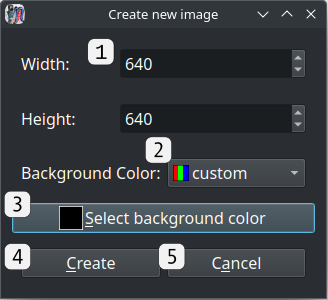

1. **Width and height controls**: Sets the new image's initial resolution. The default value is configurable, found in [settings](#settings-f9) under the **"Editing"** category as **"Default image size"**.
2. **Background color dropdown**:  The initial color of the new image's starting layer. Options are **white**, **black**, **transparent**, and **custom**.
3. **Custom background color button**:  Only visible when the background color dropdown is set to **custom**, clicking this button will open a color picker where you can select any color.
4. **Create button**:  When clicked, all previous image data is removed, and a new image is opened with the chosen settings.  This can be reversed using [undo](#undo-ctrlz).
5. **Cancel button**  Close the new image window without changing anything.

### Save (Ctrl+S)

If the image was loaded from a file or already saved, choosing this option will immediately update the same file. If the image hasn't been saved before, it will open a file picker dialog, as if **Save as** was selected.

### Save as (Ctrl+Alt+S)

Open a file picker dialog to select where to save the current image and which format to use. IntraPaint supports most common image formats.  The recommended format for saving files you intend to keep editing is **.ora/OpenRaster**. This is the only format that will save individual layers separately.

### Load image (Ctrl+O)

Open a file picker dialog to select an existing image for editing.  Loading a new image will discard the current image, but this can be reversed with [undo](#undo-ctrlz).

### Open as layers (Ctrl+Shift+O)

Open a file picker dialog to load one or more images for editing as new layers.  Unlike "Load image", this option does not clear image layers that were already open.

### Reload (F5)

Reload the current image from its file, discarding all changes made since the last save.  This can be reversed with [undo](#undo-ctrlz).

### Quit (Ctrl+Q)

Exit IntraPaint, discarding unsaved changes.

---
## Edit menu

The main options in the edit menu (undo, redo, cut, copy, paste, clear), all behave differently if text is selected for editing.  If currently editing text, IntraPaint will try and apply the action to the text first.  If it can't, it will instead apply the action to the image as usual.

### Undo (Ctrl+Z)

Reverses the last change made to the image (or active text).  IntraPaint allows most actions to be reversed with undo, with a few notable exceptions:

- Undo will not change saved image files.
- Undo will not affect most changes that affect the UI only, like switching tools or moving tabs.
- Undo will not affect changes to settings.

IntraPaint will try to combine saved actions when possible, merging actions that occur within a 0.2 second interval.  This value is configurable in [settings](#settings-f9) under **Editing/Undo merge interval(seconds)**.  The maximum number of previous actions to save for undo is also configurable, under **Editing/Maximum undo count**.

### Redo (Ctrl+Shift+Z)

Restore an action that was previously reversed using undo.

### Cut (Ctrl+X)

When an unlocked, visible [layer](#show-layer-window-f7) is active, and part of that layer is [selected](./tool_guide.md#selection-tools), choosing cut will replace the selected areas with transparency, and cache the removed image data for [pasting](#paste-ctrlv) until something else gets cut or copied.

When text is selected and focused, this will instead clear the selected text and place it in the system clipboard.

### Copy (Ctrl+C)

When a visible [layer](#show-layer-window-f7) is active, and part of that layer is [selected](./tool_guide.md#selection-tools), choosing copy will cache the selected areas so that they can be duplicated using [paste](#paste-ctrlv).  Copy and cut only act on the active layer, and will not affect other layers.  If you want to copy across all visible layers, select the main layer group (the top item) in the layer panel.

When text is selected and focused, this will instead copy that text into the system clipboard.

### Paste (Ctrl+V)

Creates a new image layer from selected image content.  The new layer will be placed above the current active layer, or at the top of the group if the active layer is an unlocked group.  It can then be moved using the [layer transformation tool](./tool_guide.md#-transform-layer-tool-t), or merged into another layer with the [merge down option](#merge-layer-down-ctrlshiftm).

If a text field is focused and the system clipboard is not empty, this will instead paste that text into the text field.

### Clear (Delete)

Behaves identically to [cut](#cut-ctrlx), except that cut image data can't be pasted, and cut text isn't saved in the system clipboard.

### Settings (F9)

Opens a window where you can edit IntraPaint's saved settings. Hold your mouse over any item in settings to see a tooltip describing what it does. The location where settings files are saved is automatically selected and varies depending on your OS, but you can view that location under the "Files" tab.

#### Settings window

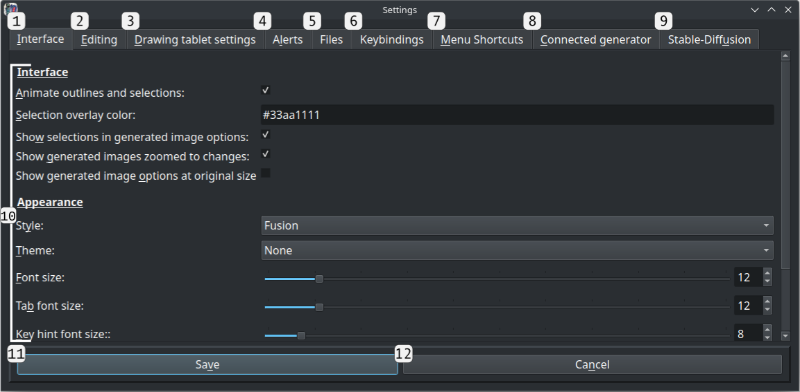

1. **"Interface" tab**:  Contains various settings related to IntraPaint's appearance and the ways it displays data.
2. **"Editing" tab**:  Contains settings related to undo/redo behavior and image sizes.
3. **"Drawing tablet settings" tab**:  Provides controls you can use to adjust the sensitivity of a pressure-sensitive drawing tablet.
4. **"Alerts" tab**:  Enable or disable various warnings that IntraPaint will occasionally show you.  If a popup window has a "don't show this again" or "remember my choice" option, picking that option will change one of the entries in this category.
5. **"Files" tab**:  Sets the directories IntraPaint will search for extra fonts, MyPaint brush files, or (if necessary) MyPaint library files.  This section also shows you where settings are saved as files, although those values can't be changed.
6. **"Keybindings" tab**:  Sets editing control keys, navigation keys, and tool shortcuts. You'll need to type in the key's name to set it, e.g. typing "PgDown" instead of pressing the page down key.  You can bind multiple keys to the same action by separating the key names with commas, e.g. "PgDown,D" to bind both page down and D.
7. **"Menu Shortcuts" tab**:  Sets keyboard shortcuts for all menu options.
8. **"Connected Generator" tab**:  Visible only when the Stable-Diffusion WebUI generator is active, these settings are sent directly to the image generator instead of being saved to a file. See [Stable-Diffusion generator settings](./stable-diffusion.md#connected-generator-settings) for more details.
9. **"Stable-Diffusion" tab**:  Visible only when the Stable-Diffusion WebUI generator is active, this tab provides access to infrequently-needed image generation settings. See [Stable-Diffusion settings](./stable-diffusion.md#stable-diffusion-settings) for details.
10. **Current category settings**:  Settings for the current selected tab, replaced when a new tab is selected. Hold the mouse over the control for any of these (*not* the label) to see a tooltip describing it.
11. **Save button**:  Close the settings window, saving changes made across all tabs.  Most changes will be applied immediately, but you may need to restart IntraPaint before some of them take effect.
12. **Cancel button**:  Close the settings window, discarding all changes.

---

## Image menu

### Show navigation window (Ctrl+Alt+W)
Opens another window with a view of the entire edited image. This can be used to adjust the image viewport within the main window, and to move the image generation area.  The Navigation tab on the tool panel behaves identically to this window.

### Basic controls
The navigation window uses the same basic mouse controls as the main window:

- **Middle-click and drag, or Ctrl + left-click and drag**: Pan image content.
- **Mouse scroll wheel**: Zoom in or zoom out.

Additional controls vary depending on which option is active: "Move gen. area" or "Move view".  If AI image generation is inactive, only the "**Move view"** mode will be available:
 
- **Left-click**: Move the main window viewport so that its upper-left corner is at the clicked spot.
- **Right-click and drag**: Draw a rectangle that covers where the main window viewport should be.  When the mouse button is released, the viewport will update to match the window.

When **"Move gen. area"** is active, mouse controls match the image generation area tool:
 
- **Left-click**: Move the image generation area, without changing its size.
- **Right-click**: Resize the image generation area, without changing its position.

#### Navigation window

1. **Image scale slider**: Set the scale the image is drawn within the navigation window.
2. **"Reset View" button**: Resets the navigation window to the default view, centering image content.
3. **Mode toggle: "Move gen. area"**: Switches to generation area tool mode, where clicking within the navigation window adjusts the image generation area.
4. **Mode toggle: "Move view"**: Switches to move view mode, where clicking within the navigation window adjusts the main window image viewport.
5. **Main window viewport outline**: The solid rectangle outlines the portion of the image currently visible within the main window.
6. **Image generation area outline**: The dotted rectangle shows the area within the image selected for AI image generation.  This won't be shown if AI image generation is inactive.
7. **"Inpaint full resolution" outline**: This inner rectangle shows the reduced area within the image generation area that will be used for inpainting if "inpaint full resolution" is selected.  This won't be visible if nothing is selected, if "inpaint full resolution" is unchecked, or if AI image generation is unavailable.
8. **Selected image content**: All selected areas are also visible within the navigation window.

### Resize canvas (F2)

#### Resize image canvas window

Opens a window that lets you change the image size without scaling image content.

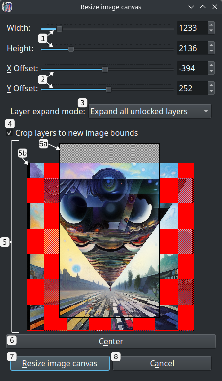

1. **Width and height controls**: Sets the new image resolution.
2. **Horizontal and vertical offset**:  Sets the offset applied to existing image content within the new image bounds.
3. **Layer expansion mode**:  Sets which layers, if any, should be resized to fill the updated image bounds. Regardless of which option is chosen, locked layers and layers in locked groups will never be expanded. Available options:
   - **Expand all unlocked layers**: All unlocked layers are expanded to fill the image bounds.
   - **Only expand full-image layers**: Layers will only be expanded if their initial bounds exactly matched the previous image bounds.
   - **Do not expand layers**: Layers will not be expanded.
4. **"Crop layers to new image bounds" checkbox**: If checked, any layer content outside the new image bounds will be cropped. If any locked layers or layers in locked groups are outside the new image bounds, the image will not change.
5. **Preview image**:  Shows a preview of the image with the new size and offset applied.
    - 5a. **New image bounds**:  This rectangle shows where the new image bounds will be. Once resized, if the image is saved in any format other than .ora, the content outside of this rectangle will not be saved.
    - 5b. **Cropped/excluded image content**:  Original image content that lies outside the new bounds is highlighted.  If "crop layers to new image bounds" is selected, it's highlighted in red to indicate that the those are the areas that will be cropped.
6. **Center button**:  Adjusts the offset to center the new image bounds over the old image bounds.
7. **"Resize image canvas" button**:  Closes the window, resizes the image, and crops and/or expands layers as necessary.
8. **Cancel button**:  Closes the window, making no changes to the image.

### Scale image (F3)

#### Scale image window

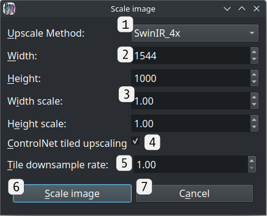

1. **Upscale method selection**:
2. **New resolution (pixels)**:
3. **New resolution (scale)**:
4. **ControlNet tiled upscaling**:
5. **ControlNet tile downsample rate**:
6. **"Scale image" button**:
7. **Cancel button**:

### Crop image to selection (Ctrl+Alt+C)

### Resize image to content (Ctrl+Alt+R)

### Update metadata (Ctrl+Alt+D)

### Select image generator (F11)
Opens a window where you can enable or disable AI image generation, or select alternate AI image generators.  IntraPaint still provides limited support for the obsolete GLID-3-XL image generator, but in most cases you'll probably want to use the Stable-Diffusion image generator instead.  Support for other AI image generators may become available in the future.

#### Image Generator Selection window

1. The list of available image generation modes. The active mode will be underlined.  Click any option to show more information on the right.
   - 1a. **Stable-Diffusion WebUI API**: The primary AI image generation mode.
   - 1b. **GLID-3-XL image generation**: Runs the outdated GLID-3-XL image generator directly within IntraPaint.  This option is not available when running the pre-bundled version of IntraPaint, and it requires significant additional setup.
   - 1c. **GLID-3-XL image generation server**: Use GLID-3-XL image generation over a network.
   - 1d. **No image generator**: Use IntraPaint without any AI image generation.
2. **Generator description**: A brief overview of the capabilities and limitations of the selected generator.
3. **Setup and installation instructions**: Instructions for installing the selected image generator and getting it working with IntraPaint.
4. **Status window**: Lists any issues detected that would prevent the generator from being used.
5. **"Activate" button**:  Click to try and activate the selected generator.

### Generate (F4)

---

## Selection menu

### Select all (Ctrl+A)

### Deselect all (Ctrl+D)

### Invert selection (Ctrl+I)

### Select layer content (Ctrl+Shift+A)

### Expand selection (Ctrl+=)

### Shrink selection (Ctrl+-)

---

## Layers menu

### Show layer window (F7)

This opens a window you can use to manage image layers.  Layer controls are also available as one of the options on the tool tab under the tool control panel.

#### Layer window

Click and drag any layer to move it within the list.  Right-click a layer to show more options for editing that layer.

1. **Opacity slider**: Controls the opacity of the active layer.
2. **Layer mode**:  Sets the blending/compositing mode of the active layer, controlling how its content is rendered into the image.  See the [W3 Compositing and Blending Standard](https://www.w3.org/TR/compositing-1/) for in-depth descriptions and example images of the available modes.
3. **Main layer group**:  The group that contains all layers in the image.  Unlike other layer groups, this one cannot be locked, deleted, or moved.
4. **Open layer group**: A layer group containing several inner layers. Clicking the arrow icon shows and hides the inner layers. 
5. **Active layer**:  The active layer, a text layer.  Active layer status is indicated by the outline and highlighting.  Only one layer can be active at a time, and most tools and layer menu options are applied to the active layer only.
6. **Image layers**: Several image layers, shown in the order that they're stacked within the image. All drawing and painting tools work by editing an active image layer.
7. **Closed layer group**: Another layer group below all other image content, hidden so that its contents are preserved but not seen.
8. **Layer name**:  Each layer has a name, used for organizational purposes only.  Double-click a layer's name to edit it.
9. **Isolate button**: Available only on layer groups, activating isolation makes it so the blending mode of layers within the group will never blend with layers outside the group.
10. **Alpha lock button**:  Available only on image layers, alpha locking prevents all changes to layer opacity. When the alpha lock is set, drawing within the layer will only affect non-transparent areas, and the eraser tool will do nothing.
11. **Lock button**: When locked, layers cannot be moved or edited in any way.  When a layer group is locked, the same restriction applies to all layers within it.
12. **Visibility button**: Click to hide the layer within the image, or to reveal it if it was previously hidden.  Most changes to hidden layer content will also be prevented.
13. **New layer button**: Click to create a new layer. If an unlocked layer group is the active layer the new layer will be created at the top of that group, otherwise it will be created above the active layer.
14. **New layer group button**: Click to create a new layer group.  New layer groups are always empty, but existing layers can be dragged into them.
15. **Delete layer button**: Click to delete the active layer.
16. **Move up button**: Click to move the active layer up within the layer stack. This can move layers into and out of unlocked groups.
17. **Move up button**: Click to move the active layer down within the layer stack.
18. **Merge down button**: Click to merge the active layer with the one beneath it.  This will only work when both layers are visible and unlocked.

### Select:

#### Select previous layer (Ctrl+PgUp)

#### Select next layer (Ctrl+PgDown)

### Move:

#### Move layer up (Ctrl+Home)

#### Move layer down (Ctrl+End)

#### Move layer to top (Ctrl+Shift+Home)

### Transform:

#### Mirror layer horizontally (Ctrl+Shift+H)

#### Mirror layer vertically (Ctrl+Shift+V)

#### Rotate layer 90° CW (Ctrl+Shift+R)

#### Rotate layer 90° CCW (Ctrl+Shift+L)

### New layer (Ctrl+Shift+N)

### New layer group (Ctrl+Shift+G)

### Copy layer (Ctrl+Shift+C)

### Delete layer (Ctrl+Shift+D)

### Flatten layer (Ctrl+Shift+F)

### Merge layer down (Ctrl+Shift+M)

### Crop layer to selection (Ctrl+Shift+E)

### Crop layer to contents (Ctrl+Shift+P)

---

## Filters menu

### RGBA color balance (Ctrl+1)

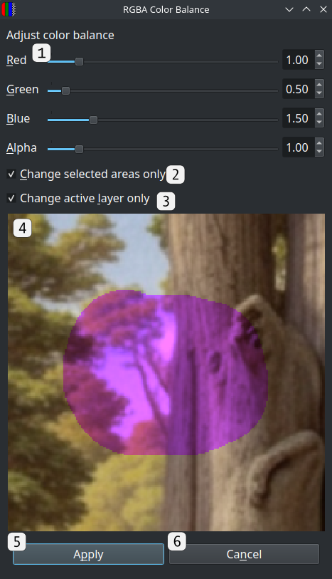

1. **Color component sliders**:
2. **"Change selected areas only" checkbox**:  If checked, the filter will only be applied to [selected](./tool_guide.md#selection-tools) areas in the image.
3. **"Change active layer only" checkbox**:  If checked, the filter will only be applied to the current active layer.
4. **Filter preview**: Shows a preview of the filter with the current settings applied.
5. **Apply button**: Closes the window and applies the filter to the image.
6. **Cancel button**: Closes the window without changing the image.

### Brightness/contrast (Ctrl+2)

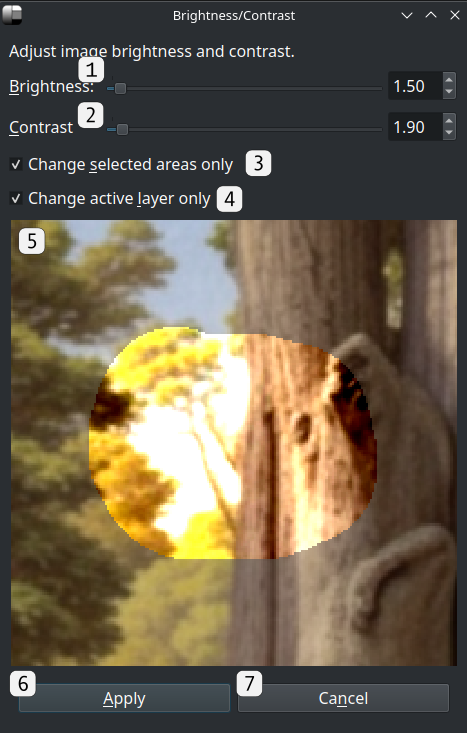

1. **Brightness slider**:
2. **Contrast slider**:
3. **"Change selected areas only" checkbox**:  If checked, the filter will only be applied to [selected](./tool_guide.md#selection-tools) areas in the image.
4. **"Change active layer only" checkbox**:  If checked, the filter will only be applied to the current active layer.
5. **Filter preview**: Shows a preview of the filter with the current settings applied.
6. **Apply button**: Closes the window and applies the filter to the image.
7. **Cancel button**: Closes the window without changing the image.

### Blur (Ctrl+3)

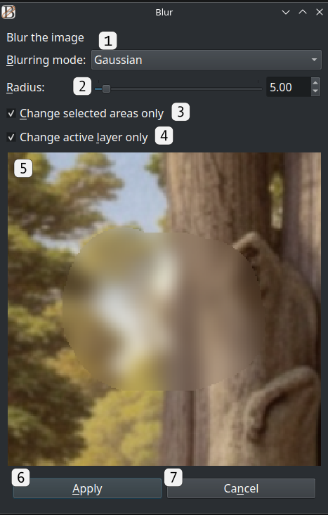

1. **Blurring algorithm**:
2. **Radius slider**:
3. **"Change selected areas only" checkbox**:  If checked, the filter will only be applied to [selected](./tool_guide.md#selection-tools) areas in the image.
4. **"Change active layer only" checkbox**:  If checked, the filter will only be applied to the current active layer.
5. **Filter preview**: Shows a preview of the filter with the current settings applied.
6. **Apply button**: Closes the window and applies the filter to the image.
7. **Cancel button**: Closes the window without changing the image.

### Sharpen (Ctrl+4)

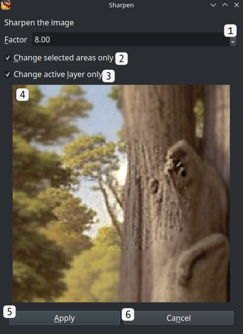

1. **Sharpness factor**:
2. **"Change selected areas only" checkbox**:  If checked, the filter will only be applied to [selected](./tool_guide.md#selection-tools) areas in the image.
3. **"Change active layer only" checkbox**:  If checked, the filter will only be applied to the current active layer.
4. **Filter preview**: Shows a preview of the filter with the current settings applied.
5. **Apply button**: Closes the window and applies the filter to the image.
6. **Cancel button**: Closes the window without changing the image.

### Posterize (Ctrl+5)

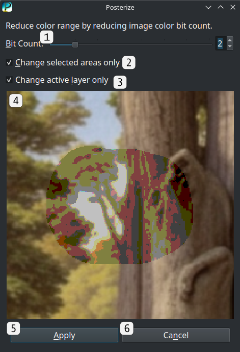

1. **Color bit count**:
2. **"Change selected areas only" checkbox**:  If checked, the filter will only be applied to [selected](./tool_guide.md#selection-tools) areas in the image.
3. **"Change active layer only" checkbox**:  If checked, the filter will only be applied to the current active layer.
4. **Filter preview**: Shows a preview of the filter with the current settings applied.
5. **Apply button**: Closes the window and applies the filter to the image.
6. **Cancel button**: Closes the window without changing the image.

---

## Stable-Diffusion menu

### View saved prompt styles (Ctrl+Alt+1)

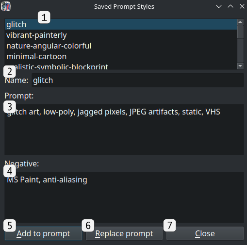

1. **Prompt style list**:
2. **Prompt style name**:
3. **Prompt text**:
4. **Negative prompt text**:
5. **"Add to prompt" button**:
6. **"Replace prompt" button**:
7. **Close button**:

### View LORA models (Ctrl+Alt+2)

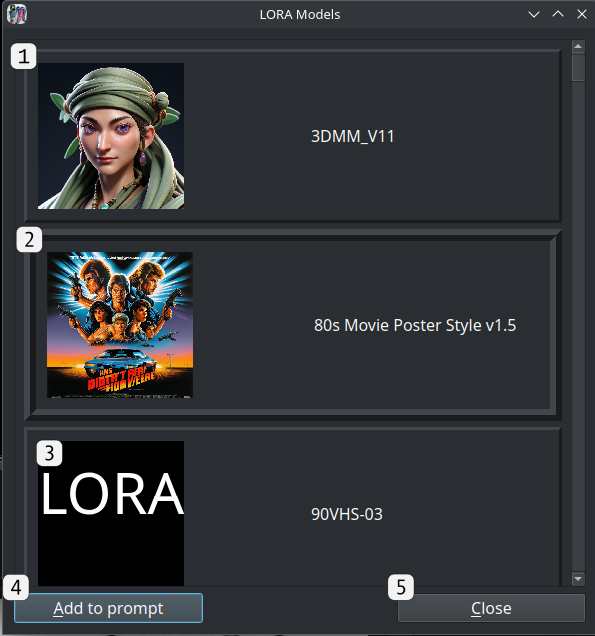

1. **LORA model option, not selected**:
2. **Selected LORA model option**:
3. **LORA model option, no preview**:
4. **"Add to prompt"/"Remove from prompt" button:**:
5. **Close button**:

### LCM Mode [F10]
This option is only visible when using Stable-Diffusion, when the LCM LORA model and support for the LCM sampler are detected.  LCM mode dramatically decreases image generation time, and gives more predictable but less creative results. Selecting this option adjusts image generation parameters to match the settings needed by LCM models:

- The image sampling mode is set to LCM
- The activation text for the LCM LORA is inserted into the prompt, if not already there.
- The prompt guidance scale is set to 1.5 (1.5 - 2.0 is the recommended range for LCM).
- The number of image generation steps is set to 8 (5 - 10 is the recommended range for LCM).
