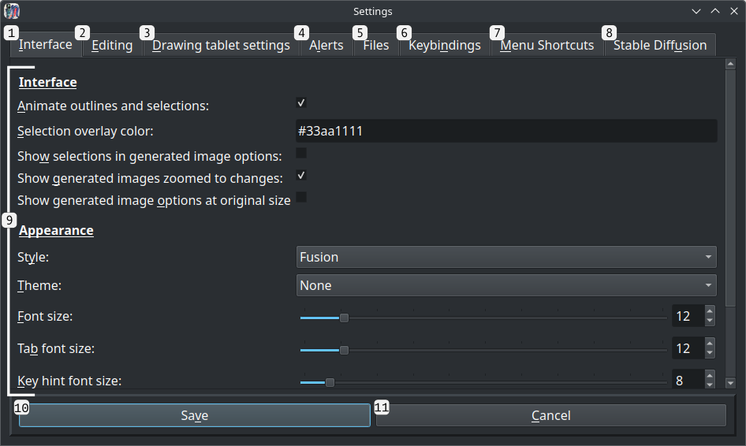
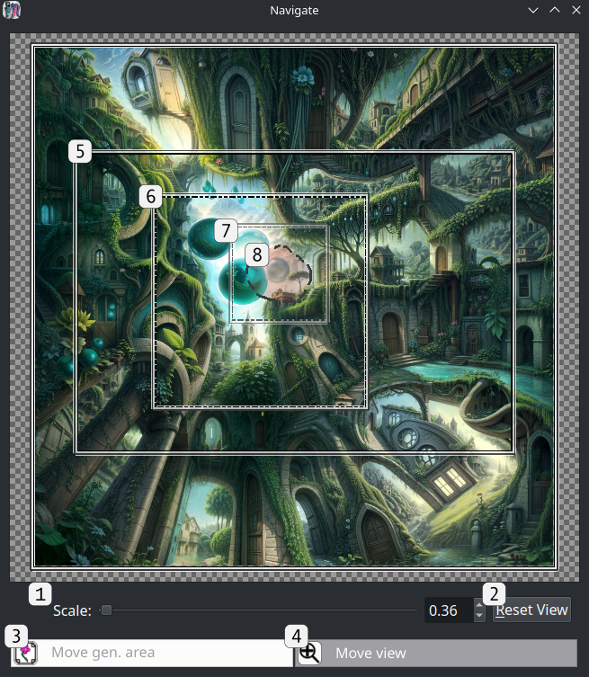
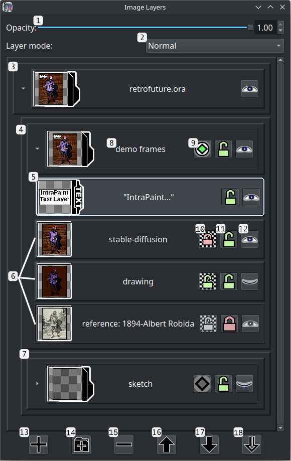

# Main menu options
This guide explains all of IntraPaint's menu options. All menu option shortcuts are configurable

---
## Table of Contents
1. [File menu](#file-menu)
   - [New image](#new-image-ctrln)
       * [New image window](#new-image-window)
   - [Save](#save-ctrls)
   - [Save as](#save-as-ctrlalts)
   - [Load image](#load-image-ctrlo)
   - [Open as layers](#open-as-layers-ctrlshifto)
   - [Reload](#reload-f5)
   - [Quit](#quit-ctrlq)
2. [Edit menu](#edit-menu)
   - [Undo](#undo-ctrlz)
   - [Redo](#redo-ctrlshiftz)
   - [Cut](#cut-ctrlx)
   - [Copy](#copy-ctrlc)
   - [Paste](#paste-ctrlv)
   - [Clear](#clear-delete)
   - [Settings](#settings-f9)
       * [Settings window](#settings-window)
3. [Image menu](#image-menu)
   - [Show navigation window](#show-navigation-window-ctrlaltw)
       * [Navigation window](#navigation-window)
   - [Resize canvas](#resize-canvas-f2)
       * [Resize image canvas window](#resize-image-canvas-window)
   - [Scale image](#scale-image-f3)
       * [Scale image window](#scale-image-window)
   - [Crop image to selection](#crop-image-to-selection-ctrlaltc)
   - [Resize image to content](#resize-image-to-content-ctrlaltr)
   - [Update metadata](#update-metadata-ctrlaltd)
   - [Select image generator](#select-image-generator-f11)
       * [Image generator selection window](#image-generator-selection-window)
   - [Generate](#generate-f4)
4. [Selection menu](#selection-menu)
   - [Select all](#select-all-ctrla)
   - [Deselect all](#deselect-all-ctrld)
   - [Invert selection](#invert-selection-ctrli)
   - [Select layer content](#select-layer-content-ctrlshifta)
   - [Expand selection](#expand-selection-ctrl)
   - [Shrink selection](#shrink-selection-ctrl-)
5. [Layers menu](#layers-menu)
   - [Show layer window](#show-layer-window-f7)
      * [Layer window](#layer-window)
   - [Select](#select)
      * [Select previous layer](#select-previous-layer-ctrlpgup)
      * [Select next layer](#select-next-layer-ctrlpgdown)
   - [Move](#move)
      * [Move layer up](#move-layer-up-ctrlhome)
      * [Move layer down](#move-layer-down-ctrlend)
      * [Move layer to top](#move-layer-to-top-ctrlshifthome)
   - [Transform](#transform)
      * [Mirror layer horizontally](#mirror-layer-horizontally-ctrlshifth)
      * [Mirror layer vertically](#mirror-layer-vertically-ctrlshiftv)
      * [Rotate layer 90° CW](#rotate-layer-90-cw-ctrlshiftr)
      * [Rotate layer 90° CCW](#rotate-layer-90-ccw-ctrlshiftl)
   - [New layer](#new-layer-ctrlshiftn)
   - [New layer group](#new-layer-group-ctrlshiftg)
   - [Copy layer](#copy-layer-ctrlshiftc)
   - [Delete layer](#delete-layer-ctrlshiftd)
   - [Flatten layer](#flatten-layer-ctrlshiftf)
   - [Crop layer to selection](#crop-layer-to-selection-ctrlshifte)
   - [Crop layer to contents](#crop-layer-to-contents-ctrlshiftp)
6. [Filters menu](#filters-menu)
   - [RGBA color balance](#rgba-color-balance-ctrl1)
   - [Brightness/contrast](#brightnesscontrast-ctrl2)
   - [Blur](#blur-ctrl3)
   - [Sharpen](#sharpen-ctrl4)
   - [Posterize](#posterize-ctrl5)
7. [Stable-Diffusion menu](#stable-diffusion-menu)
   - [View saved prompt styles](#view-saved-prompt-styles-ctrlalt1)
   - [View LORA models](#view-lora-models-ctrlalt2)
   - [LCM mode](#lcm-mode-f10)
---

## File menu

### New image (Ctrl+N)

#### New image window

1. **Width and height controls**:
2. **Background color dropdown**:
3. **Custom background color button**:
4. **Create button**
5. **Cancel button**

### Save (Ctrl+S)

### Save as (Ctrl+Alt+S)

### Load image (Ctrl+O)

### Open as layers (Ctrl+Shift+O)

### Reload (F5)

### Quit (Ctrl+Q)

---
## Edit menu

### Undo (Ctrl+Z)

### Redo (Ctrl+Shift+Z)

### Cut (Ctrl+X)

### Copy (Ctrl+C)

### Paste (Ctrl+V)

### Clear (Delete)

### Settings (F9)

#### Settings window

1. **"Interface" tab**:
2. **"Editing" tab**:
3. **"Drawing tablet settings" tab**:
4. **"Alerts" tab**:
5. **"Files" tab**:
6. **"Keybindings" tab**:
7. **"Menu Shortcuts" tab**:
8. **"Connected Generator" tab**:
9. **"Stable-Diffusion" tab**:
10. **Current category settings**:
11. **Save button**:
12. **Cancel button**:

---

## Image menu

### Show navigation window (Ctrl+Alt+W)
Opens another window with a view of the entire edited image. This can be used to adjust the image viewport within the main window, and to move the image generation area.

### Basic controls
The navigation window uses the same basic mouse controls as the main window:

- **Middle-click and drag, or Ctrl + left-click and drag**: Pan image content.
- **Mouse scroll wheel**: Zoom in or zoom out.

Additional controls vary depending on which option is active: "Move gen. area" or "Move view".  If AI image generation is inactive, only the "**Move view"** mode will be available:
 
- **Left-click**: Move the main window viewport so that its upper-left corner is at the clicked spot.
- **Right-click and drag**: Draw a rectangle that covers where the main window viewport should be.  When the mouse button is released, the viewport will update to match the window.

When **"Move gen. area"** is active, mouse controls match the image generation area tool:
 
- **Left-click**: Move the image generation area, without changing its size.
- **Right-click**: Resize the image generation area, without changing its position.

#### Navigation window

1. **Image scale slider**: Set the scale the image is drawn within the navigation window.
2. **"Reset View" button**: Resets the navigation window to the default view, centering image content.
3. **Mode toggle: "Move gen. area"**: Switches to generation area tool mode, where clicking within the navigation window adjusts the image generation area.
4. **Mode toggle: "Move view"**: Switches to move view mode, where clicking within the navigation window adjusts the main window image viewport.
5. **Main window viewport outline**: The solid rectangle outlines the portion of the image currently visible within the main window.
6. **Image generation area outline**: The dotted rectangle shows the area within the image selected for AI image generation.  This won't be shown if AI image generation is inactive.
7. **"Inpaint full resolution" outline**: This inner rectangle shows the reduced area within the image generation area that will be used for inpainting if "inpaint full resolution" is selected.  This won't be visible if nothing is selected, if "inpaint full resolution" is unchecked, or if AI image generation is unavailable.
8. **Selected image content**: All selected areas are also visible within the navigation window.

### Resize canvas (F2)

#### Resize image canvas window

1. **Width and height controls**:
2. **Horizontal and vertical offset**:
3. **Preview - new image bounds**:
4. **Preview - existing image content**:
5. **Center button**:
6. **"Resize image canvas" button**:
7. **Cancel button**:

### Scale image (F3)

#### Scale image window

1. **Upscale method selection**:
2. **New resolution (pixels)**:
3. **New resolution (scale)**:
4. **ControlNet tiled upscaling**:
5. **ControlNet tile downsample rate**:
6. **"Scale image" button**:
7. **Cancel button**:

### Crop image to selection (Ctrl+Alt+C)

### Resize image to content (Ctrl+Alt+R)

### Update metadata (Ctrl+Alt+D)

### Select image generator (F11)
Opens a window where you can enable or disable AI image generation, or select alternate AI image generators.  IntraPaint still provides limited support for the obsolete GLID-3-XL image generator, but in most cases you'll probably want to use the Stable-Diffusion image generator instead.  Support for other AI image generators may become available in the future.

#### Image Generator Selection window

1. The list of available image generation modes. The active mode will be underlined.  Click any option to show more information on the right.
   - 1a. **Stable-Diffusion WebUI API**: The primary AI image generation mode.
   - 1b. **GLID-3-XL image generation**: Runs the outdated GLID-3-XL image generator directly within IntraPaint.  This option is not available when running the pre-bundled version of IntraPaint, and it requires significant additional setup.
   - 1c. **GLID-3-XL image generation server**: Use GLID-3-XL image generation over a network.
   - 1d. **No image generator**: Use IntraPaint without any AI image generation.
2. **Generator description**: A brief overview of the capabilities and limitations of the selected generator.
3. **Setup and installation instructions**: Instructions for installing the selected image generator and getting it working with IntraPaint.
4. **Status window**: Lists any issues detected that would prevent the generator from being used.
5. **"Activate" button**:  Click to try and activate the selected generator.

### Generate (F4)

---

## Selection menu

### Select all (Ctrl+A)

### Deselect all (Ctrl+D)

### Invert selection (Ctrl+I)

### Select layer content (Ctrl+Shift+A)

### Expand selection (Ctrl+=)

### Shrink selection (Ctrl+-)

---

## Layers menu

### Show layer window (F7)

This opens a window you can use to manage image layers.  Layer controls are also available as one of the options on the tool tab under the tool control panel.

#### Layer window

Click and drag any layer to move it within the list.  Right-click a layer to show more options for editing that layer.

1. **Opacity slider**: Controls the opacity of the active layer.
2. **Layer mode**:  Sets the blending/compositing mode of the active layer, controlling how its content is rendered into the image.  See the [W3 Compositing and Blending Standard](https://www.w3.org/TR/compositing-1/) for in-depth descriptions and example images of the available modes.
3. **Main layer group**:  The group that contains all layers in the image.  Unlike other layer groups, this one cannot be locked, deleted, or moved.
4. **Open layer group**: A layer group containing several inner layers. Clicking the arrow icon shows and hides the inner layers. 
5. **Active layer**:  The active layer, a text layer.  Active layer status is indicated by the outline and highlighting.  Only one layer can be active at a time, and most tools and layer menu options are applied to the active layer only.
6. **Image layers**: Several image layers, shown in the order that they're stacked within the image. All drawing and painting tools work by editing an active image layer.
7. **Closed layer group**: Another layer group below all other image content, hidden so that its contents are preserved but not seen.
8. **Layer name**:  Each layer has a name, used for organizational purposes only.  Double-click a layer's name to edit it.
9. **Isolate button**: Available only on layer groups, activating isolation makes it so the blending mode of layers within the group will never blend with layers outside of the group.
10. **Alpha lock button**:  Available only on image layers, alpha locking prevents all changes to layer opacity. When the alpha lock is set, drawing within the layer will only affect non-transparent areas, and the eraser tool will do nothing.
11. **Lock button**: When locked, layers cannot be moved or edited in any way.  When a layer group is locked, the same restriction applies to all layers within it.
12. **Visibility button**: Click to hide the layer within the image, or to reveal it if it was previously hidden.  Most changes to hidden layer content will also be prevented.
13. **New layer button**: Click to create a new layer. If an unlocked layer group is the active layer the new layer will be created at the top of that group, otherwise it will be created above the active layer.
14. **New layer group button**: Click to create a new layer group.  New layer groups are always empty, but existing layers can be dragged into them.
15. **Delete layer button**: Click to delete the active layer.
16. **Move up button**: Click to move the active layer up within the layer stack. This can move layers into and out of unlocked groups.
17. **Move up button**: Click to move the active layer down within the layer stack.
18. **Merge down button**: Click to merge the active layer with the one beneath it.  This will only work when both layers are visible and unlocked.

### Select:

#### Select previous layer (Ctrl+PgUp)

#### Select next layer (Ctrl+PgDown)

### Move:

#### Move layer up (Ctrl+Home)

#### Move layer down (Ctrl+End)

#### Move layer to top (Ctrl+Shift+Home)

### Transform:

#### Mirror layer horizontally (Ctrl+Shift+H)

#### Mirror layer vertically (Ctrl+Shift+V)

#### Rotate layer 90° CW (Ctrl+Shift+R)

#### Rotate layer 90° CCW (Ctrl+Shift+L)

### New layer (Ctrl+Shift+N)

### New layer group (Ctrl+Shift+G)

### Copy layer (Ctrl+Shift+C)

### Delete layer (Ctrl+Shift+D)

### Flatten layer (Ctrl+Shift+F)

### Crop layer to selection (Ctrl+Shift+E)

### Crop layer to contents (Ctrl+Shift+P)

---

## Filters menu

### RGBA color balance (Ctrl+1)

1. **Color component sliders**:
2. **"Change selected areas only" checkbox**:  If checked, the filter will only be applied to [selected](./tool_guide.md#selection-tools) areas in the image.
3. **"Change active layer only" checkbox**:  If checked, the filter will only be applied to the current active layer.
4. **Filter preview**: Shows a preview of the filter with the current settings applied.
5. **Apply button**: Closes the window and applies the filter to the image.
6. **Cancel button**: Closes the window without changing the image.

### Brightness/contrast (Ctrl+2)

1. **Brightness slider**:
2. **Contrast slider**:
3. **"Change selected areas only" checkbox**:  If checked, the filter will only be applied to [selected](./tool_guide.md#selection-tools) areas in the image.
4. **"Change active layer only" checkbox**:  If checked, the filter will only be applied to the current active layer.
5. **Filter preview**: Shows a preview of the filter with the current settings applied.
6. **Apply button**: Closes the window and applies the filter to the image.
7. **Cancel button**: Closes the window without changing the image.

### Blur (Ctrl+3)

1. **Blurring algorithm**:
2. **Radius slider**:
3. **"Change selected areas only" checkbox**:  If checked, the filter will only be applied to [selected](./tool_guide.md#selection-tools) areas in the image.
4. **"Change active layer only" checkbox**:  If checked, the filter will only be applied to the current active layer.
5. **Filter preview**: Shows a preview of the filter with the current settings applied.
6. **Apply button**: Closes the window and applies the filter to the image.
7. **Cancel button**: Closes the window without changing the image.

### Sharpen (Ctrl+4)

1. **Sharpness factor**:
2. **"Change selected areas only" checkbox**:  If checked, the filter will only be applied to [selected](./tool_guide.md#selection-tools) areas in the image.
3. **"Change active layer only" checkbox**:  If checked, the filter will only be applied to the current active layer.
4. **Filter preview**: Shows a preview of the filter with the current settings applied.
5. **Apply button**: Closes the window and applies the filter to the image.
6. **Cancel button**: Closes the window without changing the image.

### Posterize (Ctrl+5)

1. **Color bit count**:
2. **"Change selected areas only" checkbox**:  If checked, the filter will only be applied to [selected](./tool_guide.md#selection-tools) areas in the image.
3. **"Change active layer only" checkbox**:  If checked, the filter will only be applied to the current active layer.
4. **Filter preview**: Shows a preview of the filter with the current settings applied.
5. **Apply button**: Closes the window and applies the filter to the image.
6. **Cancel button**: Closes the window without changing the image.

---

## Stable-Diffusion menu

### View saved prompt styles (Ctrl+Alt+1)

1. **Prompt style list**:
2. **Prompt style name**:
3. **Prompt text**:
4. **Negative prompt text**:
5. **"Add to prompt" button**:
6. **"Replace prompt" button**:
7. **Close button**:

### View LORA models (Ctrl+Alt+2)

1. **LORA model option, not selected**:
2. **Selected LORA model option**:
3. **LORA model option, no preview**:
4. **"Add to prompt"/"Remove from prompt" button:**:
5. **Close button**:

### LCM Mode [F10]
This option is only visible when using Stable-Diffusion, when the LCM LORA model and support for the LCM sampler are detected.  LCM mode dramatically decreases image generation time, and gives more predictable but less creative results. Selecting this option adjusts image generation parameters to match the settings needed by LCM models:

- The image sampling mode is set to LCM
- The activation text for the LCM LORA is inserted into the prompt, if not already there.
- The prompt guidance scale is set to 1.5 (1.5 - 2.0 is the recommended range for LCM).
- The number of image generation steps is set to 8 (5 - 10 is the recommended range for LCM).
