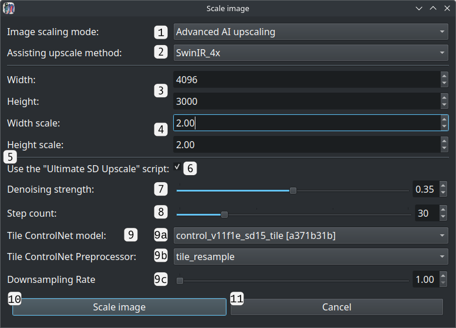
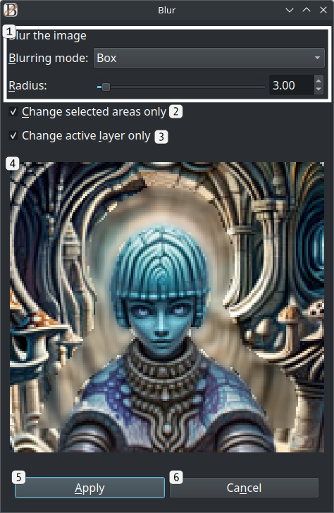

# Main menu options
This guide explains all of IntraPaint's menu options. All menu option shortcuts are configurable

---
## Table of Contents
1. [File menu](#file-menu)
   - [New image](#new-image-ctrln)
       * [New image window](#new-image-window)
   - [Save](#save-ctrls)
   - [Save as](#save-as-ctrlalts)
   - [Load image](#load-image-ctrlo)
   - [Open as layers](#open-as-layers-ctrlshifto)
   - [Reload](#reload-f5)
   - [Quit](#quit-ctrlq)
2. [Edit menu](#edit-menu)
   - [Undo](#undo-ctrlz)
   - [Redo](#redo-ctrlshiftz)
   - [Cut](#cut-ctrlx)
   - [Copy](#copy-ctrlc)
   - [Paste](#paste-ctrlv)
   - [Clear](#clear-delete)
   - [Settings](#settings-f9)
       * [Settings window](#settings-window)
3. [Image menu](#image-menu)
   - [Show navigation window](#show-navigation-window-ctrlaltw)
       * [Navigation window](#navigation-window)
   - [Resize canvas](#resize-canvas-f2)
       * [Resize image canvas window](#resize-image-canvas-window)
   - [Scale image](#scale-image-f3)
       * [Scale image window](#scale-image-window)
   - [Crop image to selection](#crop-image-to-selection-ctrlaltc)
   - [Crop image to generation area](#crop-image-to-generation-area-ctrlaltg)
   - [Resize image to content](#resize-image-to-content-ctrlaltr)
   - [Update metadata](#update-metadata-ctrlaltd)
   - [Select image generator](#select-image-generator-f11)
       * [Image generator selection window](#image-generator-selection-window)
   - [Generate](#generate-f4)
4. [Selection menu](#selection-menu)
   - [Select all](#select-all-ctrla)
   - [Deselect all](#deselect-all-ctrld)
   - [Invert selection](#invert-selection-ctrli)
   - [Select layer content](#select-layer-content-ctrlshifta)
   - [Expand selection](#expand-selection-ctrl)
   - [Shrink selection](#shrink-selection-ctrl-)
5. [Layers menu](#layers-menu)
   - [Show layer window](#show-layer-window-f7)
      * [Layer window](#layer-window)
   - [Select](#select)
      * [Select previous layer](#select-previous-layer-ctrlpgup)
      * [Select next layer](#select-next-layer-ctrlpgdown)
   - [Move](#move)
      * [Move layer up](#move-layer-up-ctrlhome)
      * [Move layer down](#move-layer-down-ctrlend)
      * [Move layer to top](#move-layer-to-top-ctrlshifthome)
   - [Transform](#transform)
      * [Mirror layer horizontally](#mirror-layer-horizontally-ctrlshifth)
      * [Mirror layer vertically](#mirror-layer-vertically-ctrlshiftv)
      * [Rotate layer 90° CW](#rotate-layer-90-cw-ctrlshiftr)
      * [Rotate layer 90° CCW](#rotate-layer-90-ccw-ctrlshiftl)
   - [New layer](#new-layer-ctrlshiftn)
   - [New layer group](#new-layer-group-ctrlshiftg)
   - [Copy layer](#copy-layer-ctrlshiftc)
   - [Delete layer](#delete-layer-ctrlshiftd)
   - [Flatten layer](#flatten-layer-ctrlshiftf)
   - [Merge layer down](#merge-layer-down-ctrlshiftm)
   - [Crop layer to selection](#crop-layer-to-selection-ctrlshifte)
   - [Crop layer to contents](#crop-layer-to-contents-ctrlshiftp)
6. [Filters menu](#filters-menu)
   - [RGBA color balance](#rgba-color-balance-ctrl1)
   - [Brightness/contrast](#brightnesscontrast-ctrl2)
   - [Blur](#blur-ctrl3)
   - [Sharpen](#sharpen-ctrl4)
   - [Posterize](#posterize-ctrl5)
7. [Stable Diffusion menu](#stable-diffusion-menu)
   - [View saved prompt styles](#view-saved-prompt-styles-ctrlalt1)
   - [View LoRA models](#view-lora-models-ctrlalt2)
   - [LCM mode](#lcm-mode-f10)
---

## File menu

### New image (Ctrl+N)

Opens a window where you can create a new image with a single layer, discarding all unsaved old image data.

#### New image window

1. **Width and height controls**: Sets the new image's initial resolution. The default value is configurable, found in [settings](#settings-f9) under the **"Editing"** category as **"Default image size"**.
2. **Background color dropdown**:  The initial color of the new image's starting layer. Options are **white**, **black**, **transparent**, and **custom**.
3. **Custom background color button**:  Only visible when the background color dropdown is set to **custom**, clicking this button will open a color picker where you can select any color.
4. **Create button**:  When clicked, all previous image data is removed, and a new image is opened with the chosen settings.  This can be reversed using [undo](#undo-ctrlz).
5. **Cancel button**  Close the new image window without changing anything.

### Save (Ctrl+S)

If the image was loaded from a file or already saved, choosing this option will immediately update the same file. If the image hasn't been saved before, it will open a file picker dialog, as if **Save as** was selected.

### Save as (Ctrl+Alt+S)

Open a file picker dialog to select where to save the current image and which format to use. IntraPaint supports most common image formats.  The recommended format for saving files you intend to keep editing is **.ora/OpenRaster**. This is the only format that will save individual layers separately.

### Load image (Ctrl+O)

Open a file picker dialog to select an existing image for editing.  Loading a new image will discard the current image, but this can be reversed with [undo](#undo-ctrlz).

### Open as layers (Ctrl+Shift+O)

Open a file picker dialog to load one or more images for editing as new layers.  Unlike "Load image", this option does not clear image layers that were already open.

### Reload (F5)

Reload the current image from its file, discarding all changes made since the last save.  This can be reversed with [undo](#undo-ctrlz).

### Quit (Ctrl+Q)

Exit IntraPaint, discarding unsaved changes.

---
## Edit menu

The main options in the edit menu (undo, redo, cut, copy, paste, clear), all behave differently if text is selected for editing.  If currently editing text, IntraPaint will try and apply the action to the text first.  If it can't, it will instead apply the action to the image as usual.

### Undo (Ctrl+Z)

Reverses the last change made to the image (or active text).  IntraPaint allows most actions to be reversed with undo, with a few notable exceptions:

- Undo will not change saved image files.
- Undo will not affect most changes that affect the UI only, like switching tools or moving tabs.
- Undo will not affect changes to settings.

IntraPaint will try to combine saved actions when possible, merging actions that occur within a 0.2 second interval.  This value is configurable in [settings](#settings-f9) under **Editing/Undo merge interval(seconds)**.  The maximum number of previous actions to save for undo is also configurable, under **Editing/Maximum undo count**.

### Redo (Ctrl+Shift+Z)

Restore an action that was previously reversed using undo.

### Cut (Ctrl+X)

When an unlocked, visible [layer](#show-layer-window-f7) is active, and part of that layer is [selected](./tool_guide.md#selection-tools), choosing cut will replace the selected areas with transparency, and cache the removed image data for [pasting](#paste-ctrlv) until something else gets cut or copied.

When text is selected and focused, this will instead clear the selected text and place it in the system clipboard.

### Copy (Ctrl+C)

When a visible [layer](#show-layer-window-f7) is active, and part of that layer is [selected](./tool_guide.md#selection-tools), choosing copy will cache the selected areas so that they can be duplicated using [paste](#paste-ctrlv).  Copy and cut only act on the active layer, and will not affect other layers.  If you want to copy across all visible layers, select the main layer group (the top item) in the layer panel.

When text is selected and focused, this will instead copy that text into the system clipboard.

### Paste (Ctrl+V)

Creates a new image layer from selected image content.  The new layer will be placed above the current active layer, or at the top of the group if the active layer is an unlocked group.  It can then be moved using the [layer transformation tool](./tool_guide.md#-transform-layer-tool-t), or merged into another layer with the [merge down option](#merge-layer-down-ctrlshiftm).

If a text field is focused and the system clipboard is not empty, this will instead paste that text into the text field.

### Clear (Delete)

Behaves identically to [cut](#cut-ctrlx), except that cut image data can't be pasted, and cut text isn't saved in the system clipboard.

### Settings (F9)

Opens a window where you can edit IntraPaint's saved settings. Hold your mouse over any item in settings to see a tooltip describing what it does. The location where settings files are saved is automatically selected and varies depending on your OS, but you can view that location under the "Files" tab.

#### Settings window

1. **"Interface" tab**:  Contains various settings related to IntraPaint's appearance and the ways it displays data.
2. **"Editing" tab**:  Contains settings related to undo/redo behavior and image sizes.
3. **"Drawing tablet settings" tab**:  Provides controls you can use to adjust the sensitivity of a pressure-sensitive drawing tablet.
4. **"Alerts" tab**:  Enable or disable various warnings that IntraPaint will occasionally show you.  If a popup window has a "don't show this again" or "remember my choice" option, picking that option will change one of the entries in this category.
5. **"Files" tab**:  Sets the directories IntraPaint will search for extra fonts, MyPaint brush files, or (if necessary) MyPaint library files.  This section also shows you where settings are saved as files, although those values can't be changed.
6. **"Keybindings" tab**:  Sets editing control keys, navigation keys, and tool shortcuts. You'll need to type in the key's name to set it, e.g. typing "PgDown" instead of pressing the page down key.  You can bind multiple keys to the same action by separating the key names with commas, e.g. "PgDown,D" to bind both page down and D.
7. **"Menu Shortcuts" tab**:  Sets keyboard shortcuts for all menu options.
8. **"Stable Diffusion" tab**:  Visible only when a Stable Diffusion WebUI generator is active, this tab provides access to infrequently-needed image generation settings. When using the Stable Diffusion WebUI generator, it also provides access to the connected image generation program's settings. See [Stable Diffusion settings](./stable-diffusion.md#stable-diffusion-settings) for details.
9. **Current category settings**:  Settings for the current selected tab, replaced when a new tab is selected. Hold the mouse over the control for any of these (*not* the label) to see a tooltip describing it.
10. **Save button**:  Close the settings window, saving changes made across all tabs.  Most changes will be applied immediately, but you may need to restart IntraPaint before some of them take effect.
11. **Cancel button**:  Close the settings window, discarding all changes.

---

## Image menu

### Show navigation window (Ctrl+Alt+W)
Opens another window with a view of the entire edited image. This can be used to adjust the image viewport within the main window, and to move the image generation area.  The Navigation tab on the tool panel behaves identically to this window.

### Basic controls
The navigation window uses the same basic mouse controls as the main window:

- **Middle-click and drag, or Ctrl + left-click and drag**: Pan image content.
- **Mouse scroll wheel**: Zoom in or zoom out.

Additional controls vary depending on which option is active: "Move gen. area" or "Move view".  If AI image generation is inactive, only the "**Move view"** mode will be available:
 
- **Left-click**: Move the main window viewport so that its upper-left corner is at the clicked spot.
- **Right-click and drag**: Draw a rectangle that covers where the main window viewport should be.  When the mouse button is released, the viewport will update to match the window.

When **"Move gen. area"** is active, mouse controls match the image generation area tool:
 
- **Left-click**: Move the image generation area, without changing its size.
- **Right-click**: Resize the image generation area, without changing its position.

#### Navigation window

1. **Image scale slider**: Set the scale the image is drawn within the navigation window.
2. **"Reset View" button**: Resets the navigation window to the default view, centering image content.
3. **Mode toggle: "Move gen. area"**: Switches to generation area tool mode, where clicking within the navigation window adjusts the image generation area.
4. **Mode toggle: "Move view"**: Switches to move view mode, where clicking within the navigation window adjusts the main window image viewport.
5. **Main window viewport outline**: The solid rectangle outlines the portion of the image currently visible within the main window.
6. **Image generation area outline**: The dotted rectangle shows the area within the image selected for AI image generation.  This won't be shown if AI image generation is inactive.
7. **"Inpaint full resolution" outline**: This inner rectangle shows the reduced area within the image generation area that will be used for inpainting if "inpaint full resolution" is selected.  This won't be visible if nothing is selected, if "inpaint full resolution" is unchecked, or if AI image generation is unavailable.
8. **Selected image content**: All selected areas are also visible within the navigation window.

### Resize canvas (F2)

#### Resize image canvas window

Opens a window that lets you change the image size without scaling image content.

1. **Width and height controls**: Sets the new image resolution.
2. **Horizontal and vertical offset**:  Sets the offset applied to existing image content within the new image bounds.
3. **Layer expansion mode**:  Sets which layers, if any, should be resized to fill the updated image bounds. Regardless of which option is chosen, locked layers and layers in locked groups will never be expanded. Available options:
   - **Expand all unlocked layers**: All unlocked layers are expanded to fill the image bounds.
   - **Only expand full-image layers**: Layers will only be expanded if their initial bounds exactly matched the previous image bounds.
   - **Do not expand layers**: Layers will not be expanded.
4. **"Crop layers to new image bounds" checkbox**: If checked, any layer content outside the new image bounds will be cropped. If any locked layers or layers in locked groups are outside the new image bounds, the image will not change.
5. **Preview image**:  Shows a preview of the image with the new size and offset applied.
    - 5a. **New image bounds**:  This rectangle shows where the new image bounds will be. Once resized, if the image is saved in any format other than .ora, the content outside of this rectangle will not be saved.
    - 5b. **Cropped/excluded image content**:  Original image content that lies outside the new bounds is highlighted.  If "crop layers to new image bounds" is selected, it's highlighted in red to indicate that the those are the areas that will be cropped.
6. **Center button**:  Adjusts the offset to center the new image bounds over the old image bounds.
7. **"Resize image canvas" button**:  Closes the window, resizes the image, and crops and/or expands layers as necessary.
8. **Cancel button**:  Closes the window, making no changes to the image.

### Scale image (F3)

#### Scale image window

Opens a window that lets you resize the image by scaling image content.  If the Stable Diffusion image generator is connected, this will also provide options for AI image upscaling. See the [IntraPaint Stable Diffusion guide](./stable-diffusion.md#ai-upscaling-with-intrapaint) for more details.

Scaling the image behaves differently depending on whether AI upscaling is in use:

- If the image size is decreasing or the image is being scaled while Stable Diffusion is not connected, each layer will be individually scaled with the chosen scaling algorithm.
- If Stable Diffusion is not connected and "None" is chosen, image data will not be resized. Instead, all layers will have a scaling [transformation](./tool_guide.md#-transform-layer-tool-t) applied to make them display at the new size.
- If AI upscaling is in use, the entire merged image will be used for scaling.  The upscaled image will be created as a new layer above all the previous layers.  As long as none of the layers are locked, all existing layers will have scaling transformations applied so that they are shown at the new size.

1. **Upscale method selection**:  Choose between different methods for upscaling the image.
2. **New resolution (pixels)**:  Set the new image size in pixels.  When changed, "Width scale" and "Height scale" will automatically update to match.
3. **New resolution (scale)**:  Set the new image size as a multiple of the original size.  When changed, "Width" and "Height" will automatically update to match.
4. **ControlNet tiled upscaling**:  Only available if the Stable Diffusion generator is active and ControlNet is working.  When checked, use Stable Diffusion with the Tile ControlNet model to upscale the image.
5. **ControlNet tile downsample rate**:  When "ControlNet tiled upscaling" is checked, increase this value to give Stable Diffusion more freedom to alter details while upscaling.
6. **"Scale image" button**:  Closes the scaling window and begins scaling the image.
7. **Cancel button**: Closes the scaling window without making changes.

### Crop image to selection (Ctrl+Alt+C)
Crops the image to the largest rectangle that contains all [selected content](./tool_guide.md#selection-tools).  This will be applied to every layer in the image.  If any locked layers aren't totally within the selected area, this will fail, and an error message will list which layers blocked the change.  Any text layers that need to be cropped will first need to be converted to image layers, and a popup will appear asking to confirm or deny the change.

### Crop image to generation area (Ctrl+Alt+G)
Crops the image to the [image generation area](./tool_guide.md#-image-generation-area-tool-g). Layer cropping, locked layers, and text layers are handled exactly as they are in "Crop image to selection".  Like all functionality related to the image generation area, this option is hidden when there's no AI image generator connected.

### Resize image to content (Ctrl+Alt+R)
Resizes the image to fit all layers. This does not alter layer data.

### Update metadata (Ctrl+Alt+D)
IntraPaint can read and write the following AI image generation parameters in image file metadata:
- Prompt
- Negative prompt
- Generation size
- Sampling method
- Sampling steps
- Guidance scale
- Seed

It does this in a format compatible with the Stable Diffusion WebUI, so IntraPaint can load those values directly into the image generation panel when the image is opened in IntraPaint.  When saving, IntraPaint will ask you if you want to save this metadata to the file, and you have the option to make it always save metadata automatically, or never save automatically or ask again.  If automatic metadata updates are disabled, choosing "update metadata" will manually prepare the metadata update, so it'll be written to the image file on the next save.

### Select image generator (F11)
Opens a window where you can enable or disable AI image generation, or select alternate AI image generators.  IntraPaint still provides limited support for the obsolete GLID-3-XL image generator, but in most cases you'll probably want to use the Stable Diffusion image generator instead.  Support for other AI image generators may become available in the future.

#### Image Generator Selection window

1. The list of available image generation modes. The active mode will be underlined.  Click any option to show more information on the right.
   - 1a. **Stable Diffusion WebUI API**: Provides Stable Diffusion image generation by sending requests to a running copy of the [Stable Diffusion WebUI](https://github.com/AUTOMATIC1111/stable-diffusion-webui?tab=readme-ov-file#stable-diffusion-web-ui).
   - 1b. **Stable Diffusion ComfyUI API**: Provides Stable Diffusion image generation by sending requests to a running copy of [ComfyUI](https://github.com/comfyanonymous/ComfyUI?tab=readme-ov-file#comfyui).
   - 1c. **GLID-3-XL image generation**: Runs the outdated GLID-3-XL image generator directly within IntraPaint.  This option is not available when running the pre-bundled version of IntraPaint, and it requires significant additional setup.
   - 1d. **GLID-3-XL image generation server**: Use GLID-3-XL image generation over a network.
   - 1e. **No image generator**: Use IntraPaint without any AI image generation.
2. **Description tab**: Provides a brief overview of the capabilities and limitations of the selected generator.
3. **Setup Guide tab**: Click this tab to view instructions for installing the selected image generator and getting it to work with IntraPaint.
4. **Status section**: Lists any issues detected that would prevent the generator from being used.
5. **"Activate" button**:  Click to try and activate the selected generator.

### Generate (F4)

Triggers AI image generation, creating or altering image content to insert into the [image generation area](./inpainting_guide.md#generation-area). Clicking this will switch IntraPaint to the [generated image selection view](./controls.md#generated-image-selection-view). This has the same effect as the Generate button on the [Image Generation Panel](./stable-diffusion.md#image-generation-panel).  This option will only be available if [an image generator is configured and active](../README.md#ai-setup-stable-diffusion).

---

## Selection menu

The selection menu controls what image content is selected for editing. See [selection tools](./tool_guide.md#selection-tools) for more information on the way IntraPaint uses image selection.  None of the options in the selection menu alter image content in the selected areas.

### Select all (Ctrl+A)
Selects everything in the entire image across all layers, only excluding completely transparent areas.

### Deselect all (Ctrl+D)
Removes all selections.

### Invert selection (Ctrl+I)
Swaps selected and deselected areas.  Every spot that wasn't selected will be selected, and every spot that was selected will be deselected. 

### Select layer content (Ctrl+Shift+A)
Removes any previous selections, and selects all pixels in the current active layer or layer group that aren't completely transparent.

### Expand selection (Ctrl+=)
Expands all selected areas in all directions by one pixel.

### Shrink selection (Ctrl+-)
Shrinks all selected areas by one pixel.

---

## Layers menu

Like most image editors, IntraPaint represents the image as a set of layers.  Layers are arranged in a stack, with each being drawn above the one below it to create the final image.  Only one layer is active at a time; most tools and layer menu options are applied to the active layer.  The active layer can be changed by clicking any layer in the [layer window](#layer-window), or with the [select previous](#select-previous-layer-ctrlpgup)/[select next](#select-next-layer-ctrlpgdown) layer menu options.

IntraPaint supports three types of layers:

- **Image layers**: These contain any image content, and are the only layers that can be directly altered by drawing, painting, or AI image generation.
- **Text layers**: Each of these contains exactly one block of text. These can only be created using the [text tool](./tool_guide.md#-text-tool-x). Many operations that alter layers will need to convert text layers into image layers before they can be edited. If this is necessary, IntraPaint will always ask for confirmation first.
- **Layer groups**:  These group together several layers. This lets you edit all of them together in some ways. The [layer transformation tool](./tool_guide.md#-transform-layer-tool-t) is the only tool that can edit a layer group. When a layer group is active, [Cut](#cut-ctrlx), [Copy](#copy-ctrlc), and [Clear](#clear-delete) from the Edit menu can be applied to an active layer group.

The entire image itself is treated as a layer group, which can be selected and edited.  This group can't be locked, deleted, moved, copied, or have isolation enabled, but it can otherwise be edited like any other layer group.

### Show layer window (F7)

This opens a window you can use to manage image layers.  Layer controls are also available as one of the options on the tool tab under the [tool control panel](./controls.md#main-view).

#### Layer window

Click and drag any layer to move it within the list.  Right-click a layer to show more options for editing that layer.

1. **Opacity slider**: Controls the opacity of the active layer.
2. **Layer mode**:  Sets the blending/compositing mode of the active layer, controlling how its content is rendered into the image.  See the [W3 Compositing and Blending Standard](https://www.w3.org/TR/compositing-1/) for in-depth descriptions and example images of the available modes.
3. **Main layer group**:  The group that contains all layers in the image.  Unlike other layer groups, this one cannot be locked, deleted, or moved.
4. **Open layer group**: A layer group containing several inner layers. Clicking the arrow icon shows and hides the inner layers. 
5. **Active layer**:  The active layer, a text layer.  Active layer status is indicated by the outline and highlighting.  Only one layer can be active at a time, and most tools and layer menu options are applied to the active layer only.
6. **Image layers**: Several image layers, shown in the order that they're stacked within the image. All drawing and painting tools work by editing an active image layer.
7. **Closed layer group**: Another layer group below all other image content, hidden so that its contents are preserved but not seen.
8. **Layer name**:  Each layer has a name, used for organizational purposes only.  Double-click a layer's name to edit it.
9. **Isolate button**: Available only on layer groups, activating isolation makes it so the blending mode of layers within the group will never blend with layers outside the group.
10. **Alpha lock button**:  Available only on image layers, alpha locking prevents all changes to layer opacity. When the alpha lock is set, drawing within the layer will only affect non-transparent areas, and the eraser tool will do nothing.
11. **Lock button**: When locked, layers cannot be moved or edited in any way.  When a layer group is locked, the same restriction applies to all layers within it.
12. **Visibility button**: Click to hide the layer within the image, or to reveal it if it was previously hidden.  Most changes to hidden layer content will also be prevented.
13. **New layer button**: Click to create a new layer. If an unlocked layer group is the active layer the new layer will be created at the top of that group, otherwise it will be created above the active layer.
14. **New layer group button**: Click to create a new layer group.  New layer groups are always empty, but existing layers can be dragged into them.
15. **Delete layer button**: Click to delete the active layer.
16. **Move up button**: Click to move the active layer up within the layer stack. This can move layers into and out of unlocked groups.
17. **Move up button**: Click to move the active layer down within the layer stack.
18. **Merge down button**: Click to merge the active layer with the one beneath it.  This will only work when both layers are visible and unlocked.

### Select:
Options for changing which layer is currently active.

#### Select previous layer (Ctrl+PgUp)
Selects the layer directly above the current active layer as the new active layer.

- If the current active layer is the top layer in a layer group, this will select the entire group as the active layer.
- If the next layer up is a layer group, this will select the bottom layer within that group.

#### Select next layer (Ctrl+PgDown)
Selects the layer directly below the current active layer as the new active layer.
- If the current active layer is a layer group, this will select the topmost layer within that group. 
- If the current active layer is the last one in a layer group, this will select the first layer below the group.

### Move:
Options for changing the order of layers within the image.

#### Move layer up (Ctrl+Home)
Moves the active layer up within the layer stack.

- If the next layer up is an unlocked layer group, this moves the layer into that group, placing it at the bottom of the group.
- If the active layer is at the top of a layer group, this moves it out of that group, placing it above the group.
- Otherwise, this swaps the layer's position with the one above it.

#### Move layer down (Ctrl+End)
Moves the active layer down within the layer stack.

- If the next layer down is an unlocked layer group, this moves the layer into that group, placing it at the top of the group.
- If the active layer is at the bottom of a layer group, this moves it out of that group, placing it below the group.
- Otherwise, this swaps the layer's position with the one below it.

#### Move layer to top (Ctrl+Shift+Home)
Moves the active layer above all other layers.

### Transform:
Applies basic transformations to the active layer. All of these transformations transform the layer without moving its center.

#### Mirror layer horizontally (Ctrl+Shift+H)
Flips the active layer from left to right.

#### Mirror layer vertically (Ctrl+Shift+V)
Flips the active layer from top to bottom.

#### Rotate layer 90° CW (Ctrl+Shift+R)
Rotates the layer ninety degrees clockwise.

#### Rotate layer 90° CCW (Ctrl+Shift+L)
Rotates the layer ninety degrees counter-clockwise.

### New layer (Ctrl+Shift+N)
Creates a new image layer.  If the active layer is an unlocked layer group, the new layer will be placed within that group at the top. Otherwise, the new layer will be placed directly above the active layer. New image layers will always start with the same size and position as the main image bounds.

### New layer group (Ctrl+Shift+G)
Creates a new layer group.  If the active layer is an unlocked layer group, the new group will be placed within that group at the top. Otherwise, the new group will be placed directly above the active layer.

### Copy layer (Ctrl+Shift+C)
Creates a new copy of the current active layer, placing it above the active layer.

### Delete layer (Ctrl+Shift+D)
Deletes the active layer, selecting the next layer below it as the new active layer.

### Flatten layer (Ctrl+Shift+F)
Attempts to simplify the active layer as much as possible without changing the overall appearance of the image.  This makes the following changes:
- If a layer group is active, all layers within that group will be merged into a single image layer.
- If a text layer is active, it will be converted into an image layer.
- If the layer is scaled or rotated, the transformation will be applied directly to layer image data, resetting the layer's scale to 1.0 and rotation to zero degrees.
- If the layer's opacity is not at 1.0, the image's color values will be directly adjusted to the layer's opacity, and the layer opacity is set to 1.0.
- If the layer uses any layer mode other than "normal", the effects of that mode will be rendered directly into the layer's image data, and the layer mode will switch to "normal".

If none of these changes are relevant for the current active layer, the "flatten layer" option will be disabled.

### Merge layer down (Ctrl+Shift+M)
Attempts to merge a layer with the one beneath it.  This will only be allowed when both layers are unlocked and visible, both are within the same group, and neither layer is also a group.

### Crop layer to selection (Ctrl+Shift+E)
Finds the smallest rectangle that contains all selected content within the active layer's bounds, and crops the layer to fit that rectangle.  This will fail if nothing is selected within the layer bounds.

### Crop layer to contents (Ctrl+Shift+P)
Crops the layer to the smallest rectangle within the layer that only excludes completely transparent pixels.  This will fail if the entire layer is completely transparent.

---

## Filters menu

The Filters menu lets you apply various changes to image content. When selected, filter menu options will open the filter window:

1. **Filter-specific label and controls**: These controls will vary depending on the selected filter. Each filter menu options controls are described in its section in this guide.
2. **"Change selected areas only" checkbox**:  If checked, the filter will only be applied to [selected](./tool_guide.md#selection-tools) areas in the image.
3. **"Change active layer only" checkbox**:  If checked, the filter will only be applied to the current active layer.
4. **Filter preview**: Shows a preview of the filter with the current settings applied.
5. **Apply button**: Closes the window and applies the filter to the image.
6. **Cancel button**: Closes the window without changing the image.

All filters are available in both the filter menu and the [filter brush tool](./tool_guide.md#-filter-brush-tool-i).

### RGBA color balance (Ctrl+1)

This filter lets you multiply the intensity of each color component. It includes sliders for red, green, blue, and alpha (transparency) values, each starting at 1.0. These can be increased to strengthen their component, or decreased to weaken it.

### Brightness/contrast (Ctrl+2)

This filter provides control over image brightness and contrast. Brightness and contrast values are also multipliers, when set to 1.0 they have no effect.

### Blur (Ctrl+3)

This filter blurs image content.  The blur filter provides the following controls:

1. **"Blurring mode" dropdown**: Selects between three blurring methods: **Box**, **Gaussian**, and **Simple**. Each produces slightly different results, visible in the filter preview window.
2. **Radius slider**:  In Box and Gaussian modes only, this slider controls the strength of the blurring operation.

### Sharpen (Ctrl+4)

This filter enhances noise and edges, reducing blurring.  It has only one control, a **factor** spinbox. Increasing the sharpness factor will increase how significant its changes are.

### Posterize (Ctrl+5)

This filter simplifies image colors, reducing the color complexity of the image.  Its only control is the **bit count** slider, which controls the range of color values allowed within the filtered areas.  At eight the image is unchanged, and colors become increasingly limited as it decreases.

---

## Stable Diffusion menu

This menu is only available when a Stable Diffusion image generator is active.  Each of these options will only be provided if IntraPaint detects that the image generator supports it.

### View saved prompt styles (Ctrl+Alt+1)

This option opens a window where you can access prompt presets saved with the Stable Diffusion WebUI's [prompt style feature](https://github.com/AUTOMATIC1111/stable-diffusion-webui/wiki/Features#styles).  If you haven't saved any prompt presets within the WebUI or you're using the ComfyUI generator, this option won't be visible.

I'd like to provide support for adding and editing styles directly within IntraPaint, but the WebUI API does not currently support style editing. I'll probably eventually either have IntraPaint save new custom styles to a file, or let it directly edit the WebUI's styles.csv file if it can access it.

1. **Prompt style list**:  Shows the list of all saved style presets, with the selected one highlighted.
2. **Prompt style name**:  Shows the name of the selected prompt preset. 
3. **Prompt text**:  The image generation prompt stored in the selected preset.
4. **Negative prompt text**:  The negative image generation prompt stored in the selected preset.
5. **"Add to prompt" button**:  If clicked, the selected preset's prompt and negative prompt are added to the end of the prompt and negative prompt sections in the [image generation panel](./stable-diffusion.md#image-generation-panel).
6. **"Replace prompt" button**:  If clicked, the selected preset's prompt and negative prompt completely replace the contents of the prompt and negative prompt sections in the [image generation panel](./stable-diffusion.md#image-generation-panel).
7. **Close button**:  Closes the window.

### View LoRA models (Ctrl+Alt+2)

This option opens a window where you can view and select between LoRA models. LoRA models provide extensions to Stable Diffusion models, usually to introduce new concepts or styles not found in the original training data.  LoRA model files need to be copied to the **models/Lora** directory within the Stable Diffusion WebUI or the **models/loras** directory within ComfyUI before IntraPaint can use them.  This menu option will only appear if IntraPaint detects at least one available LoRA model.

LoRA models are activated by adding text to the prompt in the **\<lora:LORA_NAME:LORA_STRENGTH>** format. LORA_NAME needs to be replaced by the name of the LoRA model's file without the extension, and LORA_STRENGTH should be replaced with a multiplier controlling how strongly the LoRA will be applied, usually defaulting to 1.0.

1. **LoRA model option, not selected**:  Click any option in the list to select it.
2. **Selected LoRA model option**:  Once selected, the "add to prompt"/"remove from prompt" button will use that LoRA.
3. **LoRA model option, no preview**:  The LoRA preview images can be set within the Stable Diffusion WebUI's LoRA interface, and IntraPaint will load them when the LoRA selection window is opened.  Any LoRA without a preview will use this placeholder image.
4. **"Add to prompt"/"Remove from prompt" button:**:  If the LORA is not already enabled, clicking this button will add it to the prompt field in the [image generation panel](./stable-diffusion.md#image-generation-panel).  If the selected LoRA has already been added to the prompt, clicking this button will remove it.
5. **Close button**:  Close the LoRA window.

### LCM Mode [F10]
This option is only visible when using Stable Diffusion, when the LCM LoRA model and support for the LCM sampler are detected.  LCM mode dramatically decreases image generation time, and gives more predictable but less creative results. Selecting this option adjusts image generation parameters to match the settings needed by LCM models:

- The image sampling mode is set to LCM
- The activation text for the LCM LoRA is inserted into the prompt, if not already there.
- The prompt guidance scale is set to 1.5 (1.5 - 2.0 is the recommended range for LCM).
- The number of image generation steps is set to 8 (5 - 10 is the recommended range for LCM).
