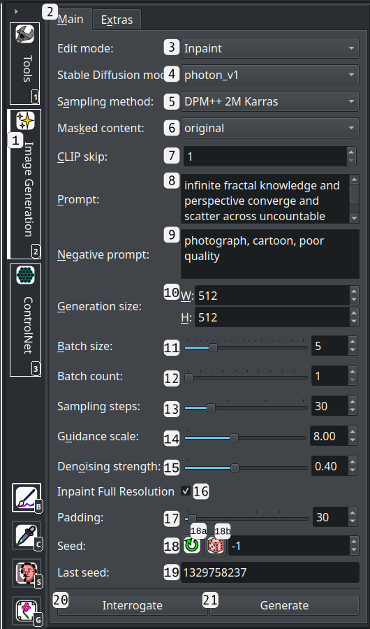

# Stable Diffusion Image Generation Controls

This guide covers the controls IntraPaint provides for AI image generation.  To access these controls, first install and configure Stable Diffusion following instructions [here](../README.md#ai-setup-stable-diffusion), and activate it in the [generator selection window](./menu_options.md#image-generator-selection-window).  

When setting up Stable Diffusion, you have the option to choose between using [ComfyUI](https://github.com/comfyanonymous/ComfyUI?tab=readme-ov-file#comfyui), the [Stable Diffusion WebUI](https://github.com/AUTOMATIC1111/stable-diffusion-webui?tab=readme-ov-file#stable-diffusion-web-ui), or [WebUI Forge](https://github.com/lllyasviel/stable-diffusion-webui-forge?tab=readme-ov-file#stable-diffusion-webui-forge) to handle IntraPaint's AI image generation requests. In most cases

---
## Table of Contents
1. [Image Generation Panel](#image-generation-panel)
2. [ControlNet Panel](#controlnet-panel)
3. [Settings and AI model installation](#settings-and-ai-model-installation)
   - [Stable Diffusion settings](#stable-diffusion-settings)
   - [Connected generator settings](#connected-generator-settings)
   - [Installing new AI model files](#installing-new-ai-model-files)
4. [Prompt control formatting](#prompt-control-formatting)
5. [Denoising strength comparisons](#denoising-strength-comparisons)
6. [Sampling methods](#sampling-methods)
---

## Image Generation Panel
This panel is the main place where you'll control image generation.

1. **Image generation tab**: Show or hide the generate panel, or move it to any of the window tab bars.  When inactive or minimized, a smaller generate button will be added to the toolbar.
2. **Main/Extras inner tabs**: The WebUI and ComfyUI Stable Diffusion image generators each provide a few bonus features that the other lacks. Controls for these features are found within the "Extras" tab.
3. **"Edit mode" dropdown**: Switch between the three main image generation modes:
   - **Inpaint**: Only selected content in the image generation area is changed.
   - **Image to Image**: The entire image generation area is changed, but previous image content affects the new image.
   - **Text to Image**: Previous image content is ignored, a new image is generated using only prompt data and other settings.
4. **"Stable Diffusion model" dropdown**: Selects which Stable Diffusion model file will be used for image generation.  If you're using the WebUI generator, changing this value will immediately load the new model, while ComfyUI will wait to load the model until the next time you start image generation.
5. **"Sampling method" dropdown**: Selects between different mathematical approaches to dividing the image generation process into steps.  The differences between these can be subtle, see [sampling methods](#sampling-methods) below for more details.
6. **"Masked content" dropdown** (WebUI generator only): Controls how selected areas are processed when inpainting, usually best left unchanged. Available options:
    - **original**: Make no changes to inpainting content before generating. This is the best option in most circumstances.
    - **fill**:  Fill the inpainting selection with a solid color before generating. This is sometimes useful when trying to completely remove elements, but is usually best done manually with the brush tool.
    - **latent noise**:  Fill the inpainting selection with random noise before generating.  When used with denoising strength set around 0.7-0.8, this can be useful for filling in empty space around an existing image.
    - **latent nothing**:  Completely zeroes out the inpainting content before generating.
7. **CLIP skip**: Sets how many final image generation steps are taken without the guidance of the CLIP image recognition module. Increasing this number can sometimes improve generated image aesthetics, but it will also reduce adherence to the prompt.  In most cases this is best left at 1, but some models recommend setting it to 2.
8. **Prompt**: Describe in plain text exactly what kind of imagery the model should generate. Prompts can also use various control formats to affect image generation, see [prompt control formatting](#prompt-control-formatting) below for details.
9. **Negative Prompt**: Describe in plain text exactly what kind of imagery the model should *not* generate. All prompt control formats also work on the negative prompt.
10. **Generation size**: The resolution of generated images.  Most Stable Diffusion models can be somewhat flexible with this, but usually will perform best at specific resolutions. See also: [generation resolution tips](./inpainting_guide.md#generation-resolution)
11. **Batch size**:  The number of images to generate at once.  Generating multiple images at the same time can be faster, but requires more VRAM.
12. **Batch count**: The number of image batches to generate in sequence before switching to the selection view. This doesn't increase VRAM usage like batch size does, but it provides no speed benefits compared to generating batches individually.
13. **Sampling steps**: Controls how many steps the generator takes to create images. Increasing step count makes image generation take longer, but often provides better results.  Benefits of increasing step count are usually fairly low above 30 steps. Certain specialty models (e.g. LCM and Turbo) can produce good results at far fewer steps.
14. **Guidance scale**: Controls how strongly the generator will follow the prompt. Low values produce more random imagery, while high values de-prioritize image composition to focus more on exactly matching the AI model's understanding of your prompt.  Values in the 6-12 range usually produce the best results.
15. **Denoising strength**: In "Inpaint" and "Image to Image" modes, this controls exactly how much of the source image the AI generator will include in its output. See [denoising strength comparisons](#denoising-strength-comparisons) below for examples.
16. **"Inpaint Full Resolution" checkbox**:  When inpainting, crop to selected content within the generated area, increasing detail quality at the cost of situational awareness. Refer to the [inpainting guide](./inpainting_guide.md) for more details about using this effectively.
17. **"Inpaint Full Resolution" padding slider**:  When "inpaint full resolution" is checked, this controls how much extra padding space is left around selected content when cropping for inpainting. This allows you to finely balance the trade-offs between detail quality and situational awareness.
18. **"Seed" input**: A number used to control randomness during image generation.  If all other factors are unchanged, using the same seed value should produce the same images each time. If set to -1, a different random seed will be used each time you generate images.
     - **18a. "Reuse last seed" button**:  Replaces the seed with the one in the "Last seed" box.
     - **18b. "Randomize seed" button**: Sets the seed value to -1, so that a random value will be used for each image generation.
19. **Last seed value**: Shows the seed used the last time the generate button was pressed.
20. **Interrogate button** (WebUI generator ornly): Use AI image analysis to automatically generate a description of the section of the image in the image generation area.  The new description will replace the current prompt.
21. **Generate button**: Click to trigger AI image generation, creating or altering image content to insert into the [image generation area](./inpainting_guide.md#generation-area). Clicking this will switch IntraPaint to the [generated image selection view](./controls.md#generated-image-selection-view).

---

### Image Generation Panel "Extras" Tab: WebUI generator
These options, found under the "Extras" tab, will only be available if you're using the Stable Diffusion WebUI image generator.

1. **"Variation seed" input**:  A number used to control the randomized variations between image in the same batch when the "Variation strength" control is used. If set to -1, a random seed will be used each time 
     - **18a. "Reuse last seed" button**:  Replaces the variation seed with the one in the "Last variation seed" box.
     - **18b. "Randomize seed" button**: Sets the variation seed value to -1, so that a random value will be used for each image generation.
2. **Last variation seed value**: Shows the variation seed used the last time the generate button was pressed.
3. **"Variation strength" slider**:  Controls how similar that images in the same batch should be.  The higher the value, the more significant that differences will be.  At 0.0, it's disabled, and variations between images will be completely random.
4. **"Resize seed from alternate resolution" checkbox**: Even if prompt, seed, and all other settings are unchanged, altering the image generation resolution can completely change the results of image generation.  This option counters that effect, so that you can completely regenerate an image at a different resolution and still expect the final image to be very similar. 
5. **"Resize seed from alternate resolution" size setting**: Sets what resolution the "Resize seed from alternate resolution" setting should target.  If you're trying to recreate a generated image at a new size, you'll want to set this to the original image generation size.
6. **"Tiling" checkbox**: If checked, Stable Diffusion will attempt to generate images that can be seamlessly repeated in a grid. This is mostly useful for generating texture files and tiling wallpapers.
7. **"Restore faces" checkbox**: If checked, apply an extra face restoration model to generated images. This option is rarely useful, most recent Stable Diffusion models already produce better results than dedicated face restoration models.
8. **Generate button**: A copy of the image generation button from the "Main" tab, included for convenience. All generate buttons have identical behavior.

---

### Image Generation Panel "Extras" Tab: ComfyUI generator
These options, found under the "Extras" tab, will only be available if you're using the Stable Diffusion ComfyUI image generator.

1. **"Model config" dropdown**: Some Stable Diffusion models come with config files, used to control exactly how the model is loaded and applied.  This dropdown lets you select which of those config files (if any) get applied during image generation.  If set to "auto", any config file with the exact same name as the Stable Diffusion model will be used. If no such config file exists, the model is loaded without a config file.
2. **"Load checkpoint as inpainting model" checkbox**: Some Stable Diffusion models have extra layers for improving inpainting results.  To fully take advantage of this, the models need to be loaded in a specific way.  The WebUI generator can automatically detect when this is necessary, but the ComfyUI generator cannot.  Checking this option will make ComfyUI load the selected Stable Diffusion model as an inpainting model.
3. **"Use tiled VAE image encoding" checkbox**:  If checked, the encoding and decoding steps of the image generation process will divide up the task into multiple image tiles instead of attempting to process the entire image at once.  This has the potential to significantly decrease memory requirements for generating very large images, but may slightly impact the final results.
4. **"VAE tile size" slider**: If "Use tiled VAE image encoding" is checked, this option controls the width and height in pixels of each tile in the tiled encoding/decoding process.
5. **"Clear Memory" button**: This button sends a request to ComfyUI to free up memory and unload cached models.  This might be useful if you're seeing worse performance after switching between multiple models, but it will probably make the next set of generated images load slightly slower.
6. **Generate button**: A copy of the image generation button from the "Main" tab, included for convenience. All generate buttons have identical behavior.

## ControlNet Panel

[ControlNet](https://github.com/lllyasviel/ControlNet) is an add-on for Stable Diffusion that lets you restrict image generation in useful ways, usually by forcing it to not change parts of a source image.  The first three examples under [this section of the README](../README.md#why-combine-ai-and-traditional-tools) all use the ControlNet sketch module to preserve initial image composition.

If the ControlNet tab isn't visible or isn't working properly, refer to [this section of the FAQ](../README.md#q-where-are-the-controlnet-options).

ControlNet works with two components: a **preprocessor**, and an AI **model**. The preprocessor identifies the elements that need to be preserved, and the model forces Stable Diffusion to preserve those elements.  Not all preprocessors and models are compatible, but it's usually obvious from their names which ones are meant to be used together.
The wide variety of ControlNet preprocessors and models available can be challenging to sort through, but I've found [this guide](https://education.civitai.com/civitai-guide-to-controlnet/#what-do-the-models-do) to be extremely helpful for sorting through them all.

1. **ControlNet tab**: Show or hide the generate panel, or move it to any of the window tab bars.
2. **ControlNet unit tabs**: Up to three different ControlNet units can be used at once. These tabs let you switch between the three and configure them independently.
3. **"Enable ControlNet Unit" checkbox**: Enable or disable the current ControlNet unit.
4. **"Low VRAM" checkbox** (WebUI generator only): Systems with limited VRAM might fail to generate images with ControlNet active. Selecting this option will fix some of these issues, but may also slow down image generation.
5. **"Pixel Perfect" checkbox** (WebUI generator only): Enables hidden automatic size adjustments to improve ControlNet results. In most cases, it's probably best to just keep this checked.
6. **"Generation Area as Control" checkbox**: Most ControlNet modules need an initial image to function. If this box is checked, the contents of the image generation area will be used.
7. **"Set Control Image" button**: This button lets you select a separate image file to use as the control image.
8. **Control image file path**: Shows the path of the selected control image, if any.
9. **"Control Type" dropdown**:  An optional dropdown that lets you limit preprocessor and model dropdowns to a few useful presets.
10. **"Preprocessor" dropdown**: Selects the pre-processing module used to prepare the control image for use.
11. **"Control Model" dropdown**: Selects the control model used to guide image generation.
12. **"Preview Preprocessor" button**: Applies the preprocessor to the control image, and displays the results at the bottom of this panel. Useful for confirming that a preprocessor is actually isolating the image elements that you want to preserve.
13. **"Starting Control Step" slider**: Sets the step in the image generation process where ControlNet is activated, as a fraction of the total step count.  The default is 0.0, which starts ControlNet before the first.
14. **"Ending Control Step" slider**: Sets the step in the image generation process where ControlNet is deactivated, as a fraction of the total step count.  The default is 1.0, which starts the process at the first step.
15. **"Strength" slider**: Controls how strictly the model will guide image generation. 1.0 is the default value, lower values decrease the effect of ControlNet.
16. **"Control mode" dropdown** (WebUI generator only): An extra control provided to select whether image generation should prioritize ControlNet, prioritize following your prompt, or try to balance both. This might not be available for some control models.  In most cases, adjusting the strength slider will do a better job of accomplishing the same thing.
17. **"Resize mode" dropdown** (WebUI generator only):  If the aspect ratio of your control image doesn't match the generation area, this dropdown will let you select how the control image should be adjusted to match the generation area.
18. **Possible extra model/module controls**: Some preprocessors provide extra options that you can adjust to control how they work.  If you select one of those preprocessors, those controls will appear here.
19. **Preprocessor preview image**: When you click the "Preview Preprocessor" button, this is where the preview will be shown. Selecting a different preprocessor will clear the preview.

---

## Settings and AI model installation

### Stable Diffusion settings

When a Stable Diffusion image generator is active, extra options will be available in the [settings window](./menu_options.md#settings-f9).

1. **Stable Diffusion tab**: Click this tab in the settings window to access these options.
2. **"Stable Diffusion WebUI image generator" section**:  This section will only be visible if you're using the Stable Diffusion WebUI image generator.  Instead of being saved with IntraPaint application files, these settings are read directly from the WebUI, and any changes made to them are send back to the WebUI on save.
   - 2a. **Stable Diffusion Model**: Select an installed Stable Diffusion model file to use for image generation.
   - 2b. **Only keep one model on GPU/TPU**: If checked, the Stable Diffusion WebUI will fully unload any previously selected model from the GPU before loading a new one.  Unchecking this allows for faster model swapping, but it is very likely to cause out-of-memory errors on most GPUs.
   - 2c.  **Max checkpoints loaded**: Sets how many recent Stable Diffusion models are held in RAM at one time.  Keeping models in RAM allows for faster model swapping, but not quite as fast as keeping them on the GPU.
   - 2d. **Stable Diffusion VAE model**: Sets the secondary model that Stable Diffusion uses for encoding and decoding latent image data. These models are not as influential as the primary model files, but they can have significant impact on color balance and detail quality.
   - 2e. **Stable Diffusion VAE models cached**: Number of VAE models to keep loaded in RAM at one time.
   - 2f. **CLIP skip**: Sets how many final image generation steps are taken without the guidance of the CLIP image recognition module.  In most cases this is best left at 1, but some models recommend setting it to 2.
3. **"Stable Diffusion" section**:  Settings in this section are handled directly by IntraPaint, and don't need to be sent back to the connected generator.
   - 3a. **Image interrogation model**: Enter the image recognition model that the Stable Diffusion WebUI will use when the "Interrogate" button is pressed.  Any option other than "clip" will probably need to be configured separately within the WebUI. As the ComfyUI generator does not support image interrogation, this option won't do anything under that generator.
   - 3b. **ControlNet tiled upscaling model**: Enter the ControlNet model that should be used for [AI tiled upscaling](#ai-upscaling-with-intrapaint). These models need to be downloaded and added manually. See the [Stable Diffusion]
4. **Mask blur**: Radius of pixel blurring to use around edited areas when inpainting.
5. **"Restore faces" checkbox**: If checked, apply an extra face restoration model to generated images. This option is rarely useful, most recent Stable Diffusion models already produce better results than dedicated face restoration models.
6. **"Tiling" checkbox**: If checked, Stable Diffusion will attempt to generate images that can be seamlessly repeated in a grid. This is mostly useful for generating texture files and tiling wallpapers.
7. **Save button**: Once clicked, settings will be immediately saved to the local config file, and they will be applied on the next image generation operation. 

### Connected generator settings

These settings are sent directly to the connected Stable Diffusion WebUI when saved.  They will only be visible if the Stable Diffusion WebUI image generator is active.

1. **Connected generator tab**: Click this tab in the settings window to access these options.
2. 
3. 
4.
5. 
6. 
7. 

### Installing new AI model files
1. Download Stable Diffusion models, usually found on platforms like [HuggingFace](https://huggingface.co/) and [Civitai](https://civitai.com/). Model files should have the **.safetensors** extension.
2. The location where model files should go depend
2. Locate the directory where the Stable Diffusion WebUI was installed. If you used the [recommended process with Stability Matrix](../README.md#ai-setup-stable-diffusion), you'll find it in the StabilityMatrix folder under **Data/Packages/stable-diffusion-webui-forge**.
3. Copy the model files into the **models/Stable-diffusion** within the WebUI directory.
4. Restart the WebUI, or open the control page at http://localhost:7860 and click the refresh button next to the model list. If you open the control page, you can select the new model directly from that page and skip the next step.
5. Restart IntraPaint, or use the ["Select Image generator" window](./menu_options.md#select-image-generator-f11) to disconnect from the Stable Diffusion WebUI, and then reconnect. You can now select the new model file in the settings under the connected generator tab.

---
## Prompt control formatting:
Prompt text can be formatted in various ways to control its behavior. These controls are provided by the [Stable Diffusion WebUI](https://github.com/AUTOMATIC1111/stable-diffusion-webui/wiki/Features) and can be altered by various webui extensions.

| Control             | Example                                             | Description                                                                                                                                                |
|---------------------|-----------------------------------------------------|------------------------------------------------------------------------------------------------------------------------------------------------------------|
| Boost attention     | `red and (blue)`                                    | `blue` is treated as 1.1x more important                                                                                                                   |
| Decrease attention  | `cat and [dog]`                                     | `dog` is treated as 1.1x less important                                                                                                                    |
| Precise attention   | `(field:2.0) of (flowers:0.5)`                      | `field` is prioritized 4x more than `flowers`                                                                                                              |
| Literal characters  | `special characters \(\)\[\]`                       | Bracket characters are taken literally, and don't affect attention                                                                                         |
| Prompt editing      | `blue sky, [painting:photograph:8]`                 | After eight steps, the prompt switches from `painting` to `photograph`                                                                                     |
| Alternating prompts | `a friendly [dog\|cat]`                             | Switch between `dog` and `cat` after each image generation step                                                                                            |
| Composable prompts  | `photograph of a house:0.5 AND charcoal sketch:1.0` | Sections split by AND are treated as individual prompts, to be applied simultaneously. The numbers at the end control how much that prompt is prioritized. |

## Denoising strength comparisons
The examples below were created by applying increasing denoising strengths to a small elliptical area within an AI-generated image using inpainting mode. All other parameters remain the same for each option.

| Strength       | Example                                                                    | Description                                                                                                                                                                                                                                                                                                                                                                  |
|----------------|----------------------------------------------------------------------------|------------------------------------------------------------------------------------------------------------------------------------------------------------------------------------------------------------------------------------------------------------------------------------------------------------------------------------------------------------------------------|
| 0.0 (unedited) |    | At zero denoising strength, inpainting and image to image do nothing at all.                                                                                                                                                                                                                                                                                                 |
| 0.1            |  | Only the tiniest changes are visible. Because the image is inpainted at a higher resolution than it was originally generated at, even this strength shows slight improvements in details.                                                                                                                                                                                    |
| 0.2            |  | Changes increase in strength, but are still minimal. Some details are improved, but others actually look slightly worse, as the generator has enough leeway to emphasize them but not enough to fix them. This is the lowest strength I regularly use, mostly when editing areas where I want only very slight corrections                                                   |
| 0.3            |  | The original image was generated with the base Stable Diffusion 1.5 model, but the inpainting is using the fine-tuned [CyberRealistic model](https://huggingface.co/cyberdelia/CyberRealistic/tree/main).  The difference in realism between the two models starts to become apparent at this step.                                                                          |
| 0.4            |  | The most significant errors have been corrected, but overall composition is still mostly the same. This is the strength I usually for refining sketches and rough details.                                                                                                                                                                                                   |
| 0.5            |  | Original image content and new image content are roughly equal in weight. The broad details are still the same, but individual elements start to move from their former places.                                                                                                                                                                                              |
| 0.6            |  | New content starts to outweigh old content. This strength is good for fixing significant errors like malformed limbs.                                                                                                                                                                                                                                                        |
| 0.7            |  | Content sharply diverges from the original. The need to follow the prompt (some variant of "bonsai, cabinet of curiosities in the ancient archives") now outweighs the need to make changes fit in with the old image content.                                                                                                                                               |
| 0.8            |  | Original image content is no longer relevant enough to keep the edges coherent, and we start to see a distinct border around the inpainting area.  This strength is still useful sometimes, but usually requires extra work to blend in the content. This usually involves the [smudge tool](./tool_guide.md#-smudge-tool-m), lower strength inpainting operations, or both. |
| 0.9            |  | A tiny increase in detail over the last step, but errors at the edges of the inpainting selection become even more pronounced.                                                                                                                                                                                                                                               |
| 1.0            |  | Details become strikingly different, original image content is completely lost. The shape of the inpainting selection and the area outside the selection still have some influence on the image, but not much.                                                                                                                                                               |

## Sampling methods
The sampling method controls how the image diffusion process is divided into smaller steps to produce the final image. Each of these will tend towards slightly different results, but the differences are usually minor. Here's a brief glossary:
- Euler: The simplest sampling process, usually a good default.
- UniPC (Unified Predictor-Corrector): A more efficient sampling method that can produce decent images in 5-10 steps.
- Ancestral (A) samplers: Any sampler ending in "A" adds extra randomness to the process.
- Karras samplers: Use gradually decreasing amounts of randomness, potentially improving image quality.
- LCM: Very fast image generation (5-10 steps), but requires either an LCM LoRA or an LCM model.
- DPM (Diffusion probabilistic model solver): Solver variants released in 2022.
- Heun: A slower but more precise variant of Euler.
- LMS (Linear Multi-Step), PLMS (Pseudo Linear Multi-Step), and DDIM (Denoising Diffusion Implicit Model): Older methods, not commonly used.
- Turbo: Extremely fast image generation (1 step), but requires an SDXL Turbo model.

### AI upscaling with IntraPaint:
For an overview of the basic image scaling interface, see the [menu option guide's image scaling section](./menu_options.md#scale-image-window).

#### Prerequisites for effective upscaling:
1. For the absolute best results, you'll need ControlNet support and the ControlNet tile model.  See [this section](../README.md#q-where-are-the-controlnet-options) if the ControlNet tab and upscaling options aren't showing up.
2. The default installation of ControlNet only includes a version of the tile model that supports Stable Diffusion 1.5, so make sure you're not using an SDXL model.  If you do want to use SDXL, you'll need to find and install an SDXL control model within the Stable Diffusion WebUI.  Once you've done that, you'll also need to go to the Stable Diffusion tab in IntraPaint's settings, and update the "ControlNet tiled upscaling model" option with the new model's name. 
3. If you've installed the [ultimate-upscale-for-automatic1111 extension](https://github.com/Coyote-A/ultimate-upscale-for-automatic1111), or [ComfyUI UltimateSDUpscale custom nodes](https://github.com/ssitu/ComfyUI_UltimateSDUpscale?tab=readme-ov-file), IntraPaint will use them to improve tiled upscaling.
   * If you're using the Stable Diffusion WebUI image generator, you can open http://localhost:7680 in a web browser, and from there follow [these instructions](https://github.com/Coyote-A/ultimate-upscale-for-automatic1111/wiki/How-to) to install the extension.
   * If you're using the Stable Diffusion ComfyUI image generator, you can use [ComfyUI Manager](https://github.com/ltdrdata/ComfyUI-Manager?tab=readme-ov-file#comfyui-manager) to install the custom nodes, or use git to [clone the ComfyUI_UltimateSDUpscale repository in the ComfyUI/custom_nodes/ directory](https://github.com/ssitu/ComfyUI_UltimateSDUpscale?tab=readme-ov-file#installation).

#### Steps for getting the best results:
1. When using ControlNet tiled upscaling, the settings you enter into the image generation panel affect the results. Make sure to select appropriate values:
   * **Prompt**: Should accurately describe your entire image, ideally without being too focused on specific details.
   * **Generation Size**: Set this to the resolution your model works best at, *not* the resolution of the final image.
   * **Denoising Strength**: Keep this value relatively low, certainly no higher than 0.5. If you didn't install the ultimate upscale extension, you may need to reduce it even more.
2. Select an initial upscaler from the "Upscale Method" dropdown that works well with the type of image you're adjusting, as this gets used as an initial step even when ControlNet upscaling is active.  I've found SwinIR_4x to be a good choice in most cases.
3. Make sure the "ControlNet tiled upscaling" checkbox is both visible and checked. If it isn't, only the basic upscaling method will be used.

