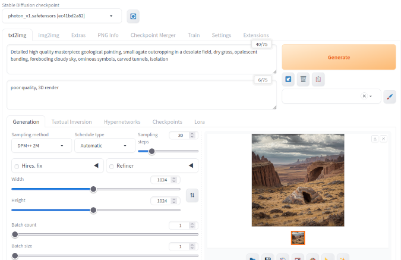
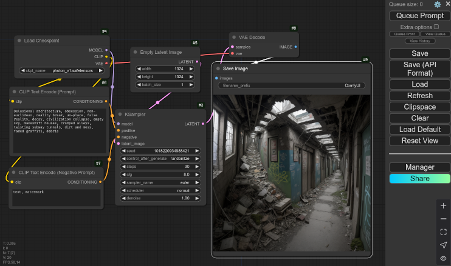
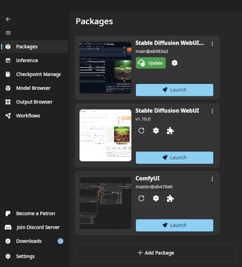
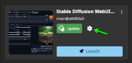
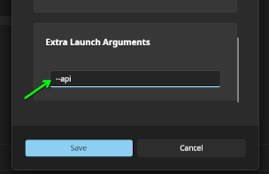

# Stable Diffusion AI Image Generator Setup

Since the field of AI image generation is developing extremely quickly, IntraPaint was designed so that its image
generation capabilities could easily be updated as new tools become available.  Instead of directly handling image
generation itself, IntraPaint includes several **image generator** modules that let it offload image generation tasks
to another program running in the background.  You will need to install one of those programs yourself before you can
use IntraPaint's AI features.  Fortunately, this is a fairly simple process, and you have several convenient options
available.

**If you just want to get it running as quickly as possible, skip to the
[Stability Matrix setup section](#option-1-stability-matrix)**, and pick "Stable Diffusion WebUI reForge" when it gives
a choice between Stable Diffusion packages.

---
## Table of Contents
1. [Stable Diffusion generator options compared](#stable-diffusion-generator-options-compared)
    - [Stable Diffusion WebUI](#stable-diffusion-webui)
    - [ComfyUI](#comfyui)
2. [Stable Diffusion model files](#stable-diffusion-model-files)
3. [Installation and setup](#installation-and-setup)
    - [Option 1: Stability Matrix](#option-1-stability-matrix)
    - [Option 2: WebUI Forge package install](#option-2-webui-forge-package-install)
    - [Option 3: ComfyUI package install](#option-3-comfyui-package-install)
    - [Option 4: Manual setup with git, Python, and Anaconda](#option-4-manual-setup-with-git-python-and-anaconda)
4. [Extra feature setup](#extra-feature-setup)
    - [ControlNet](#controlnet)
    - [Upscaling models and the Ultimate SD Upscaler](#upscaling-mdoels-and-the-ultimate-sd-upscaler)
       * [WebUI/WebUI Forge installation](#webuiwebui-forge-installation)
       * [ComfyUI installation](#comfyui-installation)

---

## Stable Diffusion generator options compared:

There are two popular programs available for running Stable Diffusion that IntraPaint can use for image generation:
the Stable Diffusion WebUI, and ComfyUI. When used within IntraPaint, the differences between them are minor. In
IntraPaint the ComfyUI generator tends to be slightly faster, but automatic image description generation with the 
"Interrogate" button doesn't work with ComfyUI. Refer to the [Stable Diffusion control guide](./stable-diffusion.md#image-generation-panel)
for the full list of generator-specific features.

Each of these programs also comes with its own interface, which can be accessed through a web browser. These interfaces
are less suited for a digital art workflow than IntraPaint, but are occasionally worth using for tasks like bulk 
image generation or loading extensions.

---

### Stable Diffusion WebUI
The Stable Diffusion WebUI is one of the first interfaces created for using Stable Diffusion to see widespread use. 
Several independent versions of the WebUI exist, with varying goals.  IntraPaint supports the [original Stable Diffusion WebUI
(A1111)](https://github.com/AUTOMATIC1111/stable-diffusion-webui?tab=readme-ov-file#stable-diffusion-web-ui),
[WebUI Forge](https://github.com/lllyasviel/stable-diffusion-webui-forge?tab=readme-ov-file#stable-diffusion-webui-forge),
and [WebUI reForge](https://github.com/Panchovix/stable-diffusion-webui-reForge?tab=readme-ov-file#stable-diffusion-webui-forgereforge).
Currently, **WebUI reForge is the recommended version** for use with IntraPaint. 

|  |
|:-----------------------------------------------------------------------------------------:|
|                      The original Stable Diffusion WebUI interface.                       |

A brief comparison of the three WebUI options:
- **The original (A1111) Stable Diffusion WebUI** is much less efficient than the alternatives, and performs poorly on older graphics cards.  It has the most powerful ControlNet capabilities, but it's also the only one where you need to manually install ControlNet as an extension.
- **Stable Diffusion WebUI Forge** comes with vastly improved performance compared to the original WebUI, but it also comes with a lot of experimental features that break extension support. IntraPaint cannot use ControlNet through WebUI Forge unless you downgrade it to an older version.
- **Stable Diffusion WebUI reForge** includes all of the performance enhancements from WebUI Forge, without any of the experimental features that break compatibility.

---

### ComfyUI

[ComfyUI](https://github.com/comfyanonymous/ComfyUI?tab=readme-ov-file#comfyui) is a popular Stable Diffusion interface
with complex and powerful node-based controls.

|  |
|:----------------------------------------------------------------------------:|
|                            The ComfyUI interface.                            |

 Its speed and efficiency are at least as good as WebUI Forge and reForge, if not slightly better. It is much more 
flexible than any of the WebUI options, but the learning curve is also much steeper.

---

## Stable Diffusion model files

To use Stable Diffusion, you'll need at least one Stable Diffusion model file.  These files (also called checkpoints),
contain the data structures that Stable Diffusion uses to create images.  A huge variety of fine-tuned models are
available on sites like [CivitAI](https://civitai.com/) and [Hugging Face](https://huggingface.co/), each with its own
strengths and weaknesses. ee [AI model selection](./inpainting_guide.md#ai-model-selection) for more information about
model types and selecting image generation models.

If you want to use IntraPaint's [ControlNet Panel](./stable-diffusion.md#controlnet-panel), you will also need to
download ControlNet model files. Each ControlNet model provides a new way to control image generation. The official
ControlNet models for use with Stable Diffusion 1.5 model variants can be downloaded from
[this page on Hugging Face](https://huggingface.co/comfyanonymous/ControlNet-v1-1_fp16_safetensors/tree/main). More
options, including ones with support for Stable Diffusion XL, are linked on the Stable Diffusion WebUI ControlNet
extension [GitHub wiki](https://github.com/Mikubill/sd-webui-controlnet/wiki/Model-download#official-controlnet-11-models).

## Installation and setup

There are a few options available for setting up Stable Diffusion beyond just selecting WebUI or ComfyUI. In most cases
you will probably want to use Stability Matrix.

### Option 1: Stability Matrix

Stability Matrix is an extremely useful tool that automates the Stable Diffusion installation process. Both ComfyUI and
all three supported WebUI versions can be easily installed through Stability Matrix.

|  |
|:--------------------------------------------------------------------------------:|
|                       The main Stability Matrix interface.                       |

1. First, download the appropriate version of Stability Matrix for your system:
   * [Windows 10, 11](https://github.com/LykosAI/StabilityMatrix/releases/latest/download/StabilityMatrix-win-x64.zip)
   * [macOS, Apple Silicon](https://github.com/LykosAI/StabilityMatrix/releases/latest/download/StabilityMatrix-macos-arm64.dmg)
   * [Linux AppImage](https://github.com/LykosAI/StabilityMatrix/releases/latest/download/StabilityMatrix-linux-x64.zip)
   * [Arch Linux AUR](https://aur.archlinux.org/packages/stabilitymatrix)
2. Extract and launch the downloaded file. On the first launch it will ask you to select a data directory, and ask you to select a package to install.  If you aren't sure which to pick, **Stable Diffusion WebUI reForge** is the recommended option, but **Stable Diffusion WebUI**, **Stable Diffusion WebUI Forge**, and **ComfyUI** will all also work with IntraPaint.
3. If you've already downloaded Stable Diffusion or ControlNet models, go to the **Checkpoint Manager** tab on the left. Click the **⋯** menu button on the upper right, and choose **"Models Folder"**, and it will open the folder you need in the system file manager.  Copy Stable Diffusion models into the **"StableDiffusion"** subfolder.
4. Next add any ControlNet models you've downloaded. Although the folder from the last step does contain a ControlNet section, it doesn't seem to properly share ControlNet models from that folder with Stable Diffusion. The location where you should actually put ControlNet models within the Stability Matrix data folder depends on which package you chose:
   * reForge: `Packages/Stable Diffusion WebUI reForge/models/ControlNet`
   * Forge: `Packages/Stable Diffusion WebUI Forge/models/ControlNet`
   * Original WebUI: `Packages/Stable Diffusion WebUI/models/ControlNet`
   * ComfyUI: `Packages/ComfyUI/models/controlnet`
5. For **WebUI packages only**, you'll need to enable API access. Skip this step if you installed ComfyUI.   Click the settings button next to the WebUI package.      Scroll to the bottom of the list, add `--api` to the **Extra Launch Arguments** section, and click save.   
6. Click the **Launch** button under the Stable Diffusion package you installed. A log screen will open up, showing the status of the package as it starts up.  This might take a couple minutes the first time it runs, as it finishes the last few parts of the setup process.
7. Once the **"Open Web UI"** button appears at the top of the window, Stable Diffusion is ready to use. If you launch IntraPaint on the same computer, it will automatically connect to Stable Diffusion.  If IntraPaint is already running, you can also use the [image generator selection window](./menu_options.md#image-generator-selection-window) to activate the appropriate Stable Diffusion image generator.

### Option 2: WebUI Forge package install

Stable Diffusion WebUI Forge provides a one-click Windows installation package you can use to easily install the WebUI.
If you use one of the older versions, this option supports all WebUI features, including ControlNet. This method won't
work outside of Windows and requires a bit more file management, but it's still a good option if you don't need the
extra features in Stability Matrix.

1. Download the last stable package version [here](https://github.com/lllyasviel/stable-diffusion-webui-forge/releases/download/previous/webui_forge_cu121_torch21_f0017.7z). There are several other options linked on the [WebUI Forge README](https://github.com/lllyasviel/stable-diffusion-webui-forge?tab=readme-ov-file#installing-forge),  but newer versions may cause compatibility issues.
2. Extract the downloaded package into a new folder. If you're not using Windows 11, you may need to install [7-Zip](https://www.7-zip.org) to extract the compressed files.
3. Within the new WebUI-Forge folder, open the `webui\webui-user.bat` file in a text editor. Find the `set COMMANDLINE_ARGS=` line near the top of the file, and change it to `set COMMANDLINE_ARGS=--api`.  Save and close the file. This step is needed to make the WebUI acceptimage generation requests from IntraPaint.
4. If you haven't already found at least one Stable Diffusion model file, do that now. Copy it into the WebUI-Forge folder under `webui\models\Stable-diffusion`.
5. If you want to use ControlNet, put downloaded ControlNet models in the `webui\models\ControlNet` folder now.
6. Launch the `run.bat` file in the WebUI-Forge folder to start Stable Diffusion.  A terminal window will open and print startup information as the WebUI initializes.
7. Once you see `Running on local URL:  http://0.0.0.0:7860` in the terminal window, Stable Diffusion is ready to use.  Restart IntraPaint, or activate the "Stable Diffusion WebUI API" generator in the [image generator selection window](./menu_options.md#image-generator-selection-window) to start using IntraPaint's AI image generation features.

### Option 3: ComfyUI package install

ComfyUI also provides a pre-packaged Windows version you can download and run, if you'd rather not use Stability Matrix or the WebUI.

1. Download **ComfyUI_windows_portable_nvidia.7z**  from the most recent version listed on the [ComfyUI GitHub release page](https://github.com/comfyanonymous/ComfyUI/releases).
2. Extract the downloaded package into a new folder. If you're not using Windows 11, you may need to install [7-Zip](https://www.7-zip.org) to extract the compressed files.
3. If you haven't already found at least one Stable Diffusion model file, do that now. Copy it into the ComfyUI folder under `ComfyUI\models\checkpoints`.
4. If you want to use ControlNet, put downloaded ControlNet models in the `ComfyUI\models\controlnet` folder now.
5. Launch the **run_nvidia_gpu.bat** file in the ComfyUI folder to start Stable Diffusion. A terminal window will open and print startup information as Comfy initializes.
6. Once you see `To see the GUI go to: http://127.0.0.1:8188` in the terminal window, Stable Diffusion is ready to use. Restart IntraPaint, or activate the "Stable Diffusion ComfyUI API" generator in the [image generator selection window](./menu_options.md#image-generator-selection-window) to start using IntraPaint's AI image generation features.

### Option 4: Manual setup with git, Python, and Anaconda

This method requires a lot more technical knowledge than the previous ones, but it also provides the most flexibility
and requires the least amount of storage space. This is only recommended if you've set up a Python virtual environment
and debugged Python dependency issues before.

Because this option isn't recommended, IntraPaint won't provide a full guide, but here's some resources that should help:
- [AUTOMATIC1111/stable-diffusion-webui: install on Windows using Anaconda](https://github.com/AUTOMATIC1111/stable-diffusion-webui/wiki/Install-and-Run-on-NVidia-GPUs#alternative-installation-on-windows-using-conda)
- [Using Git to switch between WebUI versions](https://github.com/continue-revolution/sd-webui-animatediff/blob/forge/master/docs/how-to-use.md#you-have-a1111-and-you-know-git)
- [ComfyUI Manual installation](https://github.com/comfyanonymous/ComfyUI?tab=readme-ov-file#manual-install-windows-linux)

---

## Extra feature setup
A few features supported by IntraPaint require a bit more setup, depending on which approach you used to install Stable Diffusion.

### ControlNet

ControlNet features in IntraPaint will only activate if IntraPaint detects installed ControlNet models.  If you followed the instructions above, that should already be done.  If you're using the original Stable Diffusion WebUI, you'll also need to follow a few extra steps to install the ControlNet extension.

1. Start the Stable Diffusion WebUI. On the same computer running the WebUI, open a web browser and navigate to (http://127.0.0.1:7860/) to access the web interface.
2. Click the **"Extensions"** tab near the top of the window. Within the Extensions tab, click the **"Available"** tab on the next row down, and click the "Load from" button. A long list of extensions should load.
3. In the search box just above the extension list, enter "sd-webui-controlnet". An extension with that name should be listed, linking to (https://github.com/Mikubill/sd-webui-controlnet).  Click the "Install" button next to that option, and wait for it to finish processing. This may take a few minutes.
4. Once it finishes, restart the Stable Diffusion WebUI. When it starts up again, the ControlNet extension should be available.

### Upscaling models and the Ultimate SD Upscaler

All Stable Diffusion image generators support AI upscaling through basic upscaling models.  All Stable Diffusion WebUI versions provide several preset options, which will automatically be downloaded the first time they're used. ComfyUI does not do this, so you'll need to download models yourself and place them in the `ComfyUI/models/upscale_models` directory.  [This Hugging Face Page](https://huggingface.co/jaideepsingh/upscale_models) links several of the more popular options. When available, IntraPaint will include these options in the [scåle image window](./menu_options.md#scale-image-window).

IntraPaint also supports the [Ultimate SD Upscale script](https://github.com/Coyote-A/ultimate-upscale-for-automatic1111) through both the WebUI and ComfyUI generators.  This option uses Stable-Diffusion itself, optionally combined with a secondary upscaler and the ControlNet tile model, for extremely high quality AI upscaling.
To use this option, you'll need to install the upscale script as an extension in the WebUI or ComfyUI.

#### WebUI/WebUI Forge/WebUI reForge installation

The setup process is identical for all versions of the WebUI:

1. Start the Stable Diffusion WebUI. On the same computer running the WebUI, open a web browser and navigate to (http://127.0.0.1:7860/) to access the web interface.
2. Click the **"Extensions"** tab near the top of the window. Within the Extensions tab, click the **"Available"** tab on the next row down, and click the "Load from" button. A long list of extensions should load.
3. In the search box just above the extension list, enter "Ultimate SD Upscale". An extension with that name should be listed, linking to (https://github.com/Coyote-A/ultimate-upscale-for-automatic1111.git).  Click the "Install" button next to that option, and wait for it to finish processing.
4. Once it finishes, restart the Stable Diffusion WebUI.  TODO: CLEAN UP UPSCALE INTERFACE-FINISH EXPLAINING HERE

#### ComfyUI installation

1. To install ComfyUI extensions, you'll first want to install the [ComfyUI Manager](https://github.com/ltdrdata/ComfyUI-Manager).
   * If you installed ComfyUI using Stability Matrix, click the "Extension" button (with the puzzle piece icon) within ComfyUI's entry on the packages tab. Search for "ComfyUI-Manager", select it from the list, and click the "Install" button at the bottom.
   * If you didn't use Stability Matrix, [follow the installation instructions on the ComfyUI-Manager GitHub page](https://github.com/ltdrdata/ComfyUI-Manager?tab=readme-ov-file#installation).
2. Once you restart ComfyUI, you should now see a "Manager" button near the bottom right. Click it, and the **ComfyUI Manager Menu** will open.
3. In the manager menu, click **"Custom Nodes Manager"**, and a list of extensions should open.
4. In the search box at the top, enter "UltimateSDUpscale", and the list should filter down to only one option. Click the "Install" button next to it and wait.
5. Once the button text changes to "Restart Required", the installation is finished.  Restart ComfyUI.  TODO: CLEAN UP UPSCALE INTERFACE-FINISH EXPLAINING HERE