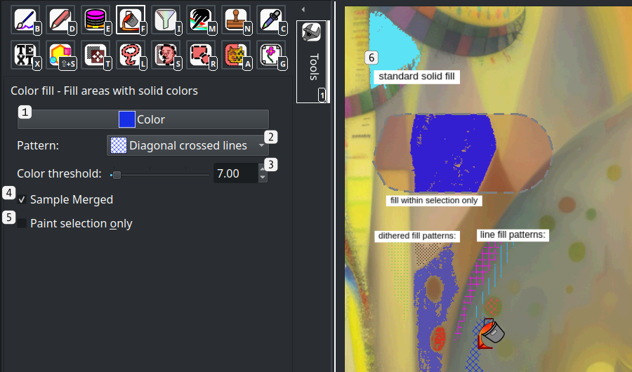
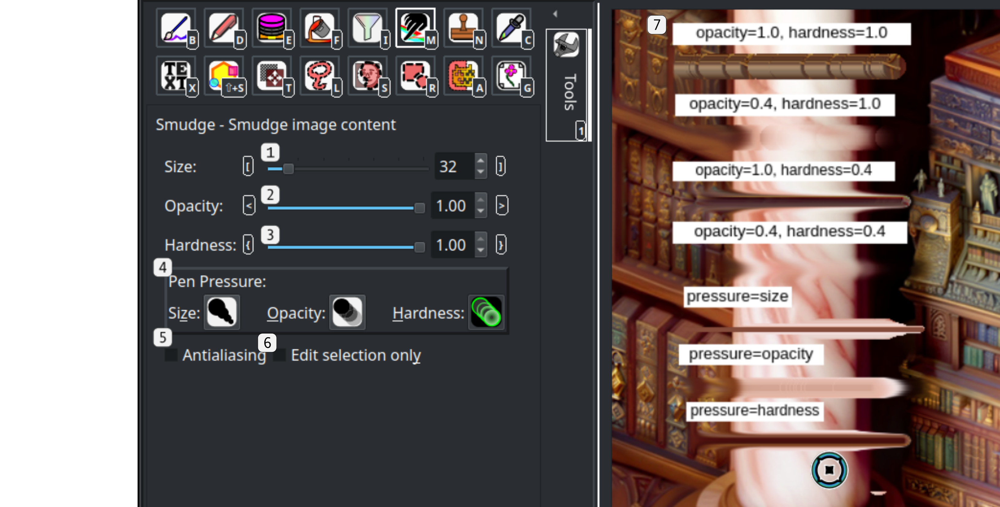
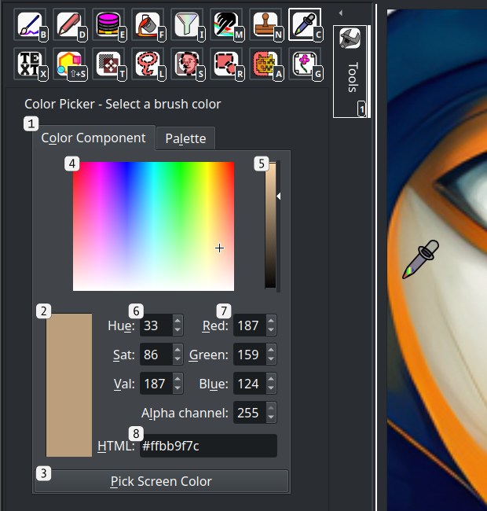
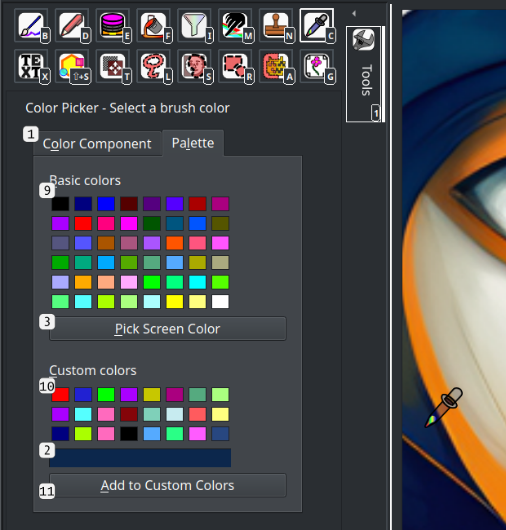
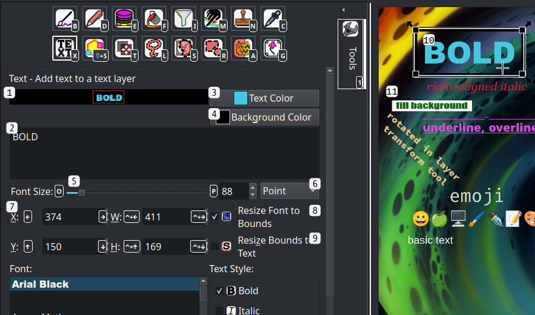
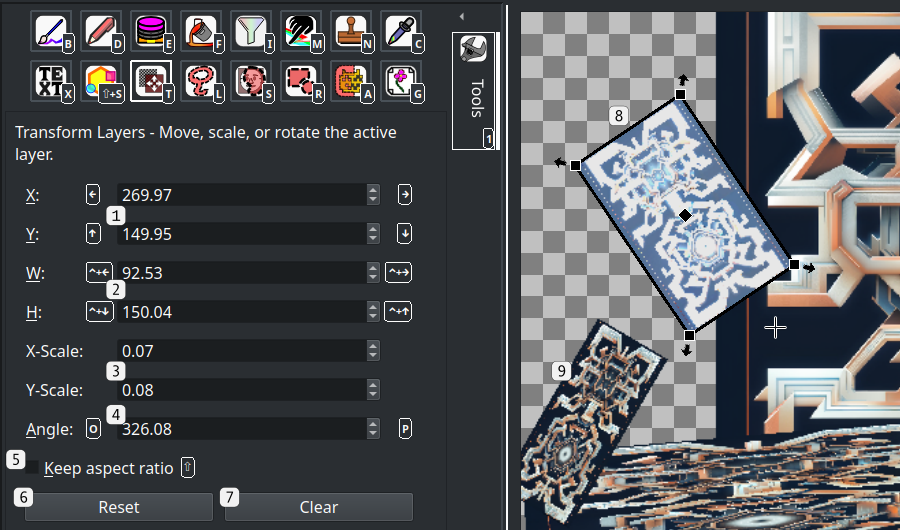
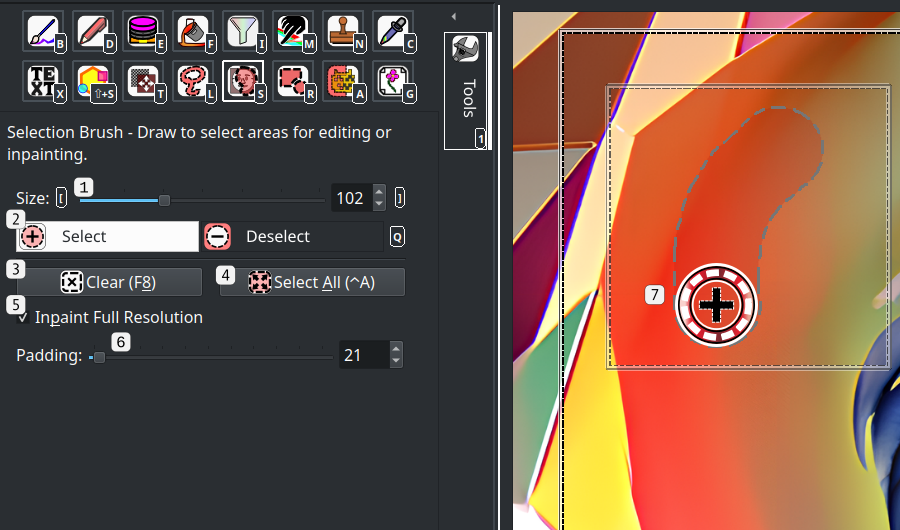
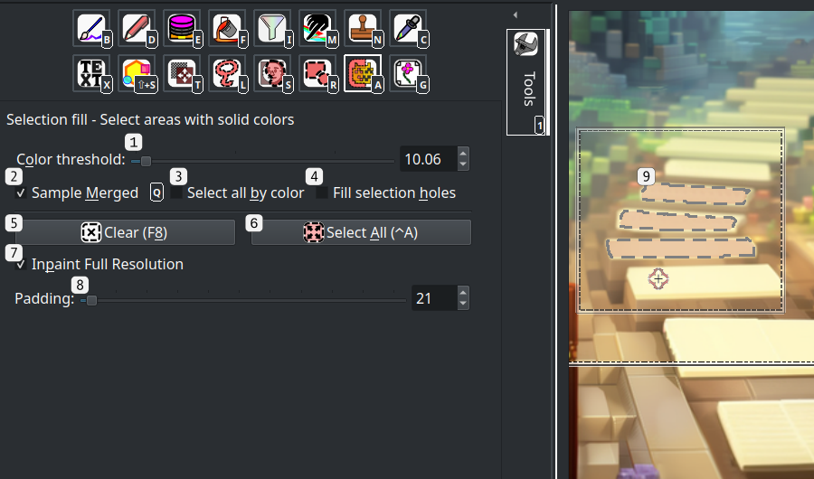
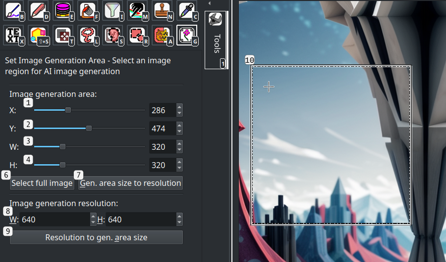
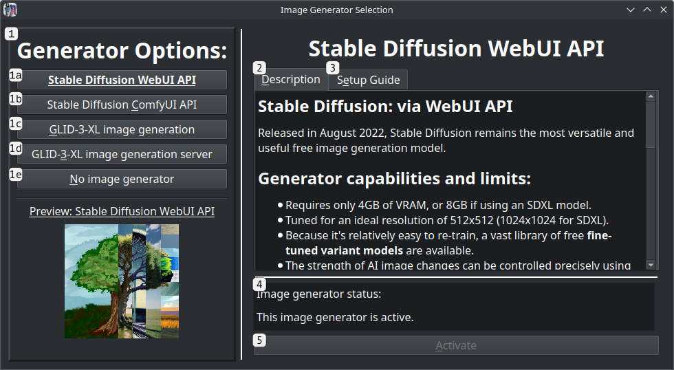

# IntraPaint Tools

This guide covers the editing tools found under the "Tools" panel, and the extra options found under the "Tools" menu. All hotkeys can be changed in settings (F9) under the keybindings tab.

---
## Table of Contents
1. [Image editing tools](#image-editing-tools)
   - [Brush tool](#-brush-tool-b)
   - [Draw tool](#-draw-tool-d)
   - [Eraser tool](#-eraser-tool-e)
   - [Fill tool](#-fill-tool-f)
   - [Filter brush tool](#-filter-tool-i)
   - [Smudge tool](#-smudge-tool-m)
   - [Clone stamp tool](#-clone-stamp-tool-n)
   - [Color picker tool](#-color-picker-tool-c)
   - [Text tool](#-text-tool-x)
2. [Selection Tools](#selection-tools)
   - [Free selection tool](#-free-selection-tool-l)
   - [Selection brush tool](#-selection-brush-tool-s)
   - [Rectangle/Ellipse selection tool](#-rectangleellipse-selection-r)
   - [Selection fill tool](#-selection-fill-tool-a)
3. [Image generation area tool](#-image-generation-area-tool-g)
4. [Tool menu options](#tool-menu-options)
   - [Show layer window](#show-layer-window-f7)
   - [Show navigation window](#show-navigation-window-ctrlaltw)
   - [Select image generator](#select-image-generator-f11)
   - [LCM mode](#lcm-mode-f10)

---

## Shared controls
All tools share the same set of basic controls for adjusting the image viewport.
- **Middle-click and drag, or Ctrl + left-click and drag**: Pan image content.
- **Mouse scroll wheel, Page Up, or Page Down**: Zoom in or zoom out.
- **"Z" key**: Zoom in on the image generation area, or reset the zoom level.
- **Hold shift**: Speed up key or mouse wheel inputs.
- **Escape, while any input has keyboard focus**: Return keyboard focus to the image.

The following controls are shared by most tools, but certain tools will override them:
- **Arrow keys**: Move the image generation area. This is ignored if Stable-Diffusion AI image generation is inactive.
- **Ctrl + arrow keys**: Pan image content.

Each tool also has a key assigned to it that will activate that tool, active whenever you're not entering text.  These keys are configurable in settings under "Keybindings", and are shown in the bottom right corner of each tool icon.

---
## Image editing tools

###  Brush tool (B)
Draw, paint, blur, smudge, or erase within the image using the [MyPaint](https://mypaint.app/) brush engine. This tool provides a wide variety of brushes, emulating various traditional art tools.  IntraPaint's brush options are from the public-domain [MyPaint brush project](https://github.com/mypaint/mypaint-brushes).

#### Basic controls
- **Left-click**: Draw within the image.
- **Right-click**: Draw with one-pixel brush width.
- **Hold shift and left-click**: Draw a line from the last place you clicked.
- **Hold Alt while drawing**: Force the brush to follow a fixed angle.
- **"\[", "]", or mouse scroll wheel left/right**:  Change the brush size. **Hold shift** to change size faster.
- **Hold Ctrl**: temporarily switch to the color picker tool.
- **Hold Shift**: Increase speed when changing brush size using keyboard keys.

#### User interface

1. **Brush size slider**: Actual brush stroke width may exceed this size, depending on brush type and tablet pen pressure.
2. **Brush color button**:  Opens a color dialog to change brush color.
3. **"Paint selection only" checkbox**:  When checked, the brush will only make changes within [selected](#selection-tools) content.
4. **Brush category tabs**: Switch between different MyPaint brush categories. 
   - The first category, **Favorites** is customizable.
   - Any .myb brush files added to the custom brush directory (defined in settings under **Files/Added MyPaint brush directory**) will appear in a new category at the end of the list.
5. **Brush icons**: Click to select a new brush, right-click to add or remove the brush from the Favorites category.
6. A preview of a few of the available brushes.  Links to full previews of all brush sets are here:
   - [classic](../examples/brushes_classic.png)
   - [deevad](../examples/brushes_deevad.png)
   - [ramon](../examples/brushes_ramon.png)
   - [experimental](../examples/brushes_experimental.png)
   - [tanda](../examples/brushes_tanda.png)

---
###  Draw tool (D)
A basic brush tool with easily adjustable properties.

#### Basic controls
- **Left-click**: Draw within the image.
- **Right-click**: Draw with one-pixel brush width.
- **Hold shift and left-click**: Draw a line from the last place you clicked.
- **Hold Alt while drawing**: Force the brush to follow a fixed angle.
- **"\[", "]", or mouse scroll wheel left/right**:  Change the brush size.
- **"<" and ">" keys**: Change the brush opacity.
- **"{" and "}"keys**: Change the brush hardness.
- **Hold Shift**: Increase speed when changing size, opacity, or hardness using keyboard keys.
- **Hold Ctrl**: Temporarily switch to the color picker tool.

#### User interface

1. **Brush size slider**: Sets the exact brush width.
2. **Brush opacity slider**: Sets the exact brush opacity, between 0.0 (fully transparent) and 1.0 (fully opaque).
3. **Brush hardness slider**: Sets the brush edge hardness. At 1.0 brush edges are completely solid, at 0.0 brush edges fade evenly from the center.
4. **Brush color button**:  Opens a color dialog to change brush color.
5. **Brush pattern dropdown**: Choose between a few basic brush fill patterns.
6. **Tablet pen pressure controls**:  These controls are only visible after IntraPaint first detects a connected drawing tablet.  Pen pressure can be connected to any combination of size, opacity, and hardness, to scale those values down as pressure decreases.
7. **"Draw in selection only" checkbox**:  When checked, the brush will only make changes within [selected](#selection-tools) content.
8. Examples of available brush settings.

---
###  Eraser tool (E)
Erase image content.

#### Basic controls
- **Left-click**: Erase within the image.
- **Right-click**: Erase with one-pixel brush width.
- **Hold shift and left-click**: Erase a line from the last place you clicked.
- **Hold Alt while drawing**: Force the eraser to follow a fixed angle.
- **"\[", "]", or mouse scroll wheel left/right**:  Change the eraser size.
- **"<" and ">" keys**: Change the eraser opacity.
- **"{" and "}"keys**: Change the eraser hardness.
- **Hold Shift**: Increase speed when changing size, opacity, or hardness using keyboard keys.

#### User interface

1. **Eraser size slider**: Sets the exact eraser width.
2. **Eraser opacity slider**: Sets the exact eraser opacity. At 1.0 the eraser completely clears image content.
3. **Eraser hardness slider**: Sets the brush edge hardness. At 1.0 eraser edges are completely solid, at 0.0 eraser edges fade evenly from the center.
4. **Tablet pen pressure controls**:  These controls are only visible after IntraPaint first detects a connected drawing tablet.  Pen pressure can be connected to any combination of size, opacity, and hardness, to scale those values down as pressure decreases.
5. **"Erase in selection only" checkbox**:  When checked, the eraser will only make changes within [selected](#selection-tools) content. 
6. Examples of available brush settings.

---
###  Fill tool (F)
Fill connected image areas with solid colors or basic patterns.

#### Basic controls
- **Left-click**: Fill connected areas with colors matching the clicked spot with the selected color.
- **Hold Ctrl**: Temporarily switch to the color picker tool.

#### User interface

1. **Brush color button**:  Opens a color dialog to change brush color.
2. **Fill pattern dropdown**: Choose between a few basic fill patterns.
3. **Color threshold slider**: Controls how closely colors must match when filling connected areas.  At 0.0, only connected areas with the exact same color will be filled.  The accepted color range expands as the threshold value increases.
4. **"Sample merged" checkbox**:  When checked, the fill tool will use all image layers to determine where to fill.  When unchecked, content outside the active layer will be ignored.
5. **"Paint selection only" checkbox**:  When checked, the fill tool will only make changes within [selected](#selection-tools) content.
6. Examples of different fill patterns and behaviors.

---
###  Filter Brush tool (I)
Apply any image filter to the image using brush strokes.

#### Basic controls
- **Left-click**: Draw within the image.
- **Right-click**: Draw with one-pixel brush width.
- **Hold shift and left-click**: Draw a line from the last place you clicked.
- **Hold Alt while drawing**: Force the brush to follow a fixed angle.
- **"\[", "]", or mouse scroll wheel left/right**:  Change the brush size.
- **"<" and ">" keys**: Change the brush opacity.
- **"{" and "}"keys**: Change the brush hardness.
- **Hold Shift**: Increase speed when changing size, opacity, or hardness using keyboard keys.

#### User interface

1. **Filter selection dropdown**: Choose between any of the available filters.  These are the current options:
   - **RGBA color filter**: Increase or decrease the strength of the red, green, blue and/or alpha color channels across filtered content.
   - **Brightness/contrast filter**: Increase or decrease image brightness and/or contrast.
   - **Blur filter**: Blur image content.
   - **Sharpen filter**: Strengthen edges within image content.
   - **Posterize filter**: Reduce color depth within the image.
2. **Filter-specific options**: These change based on the selected filter.  Hold the mouse over any control to see a description of what it does. 
3. **Brush size slider**: Sets the exact brush width.
4. **Brush opacity slider**: Sets the exact brush opacity, between 0.0 (fully transparent) and 1.0 (fully opaque).
5. **Brush hardness slider**: Sets the brush edge hardness. At 1.0 brush edges are completely solid, at 0.0 brush edges fade evenly from the center.
6. **Tablet pen pressure controls**:  These controls are only visible after IntraPaint first detects a connected drawing tablet.  Pen pressure can be connected to any combination of size, opacity, and hardness, to scale those values down as pressure decreases.
7. **"Filter selection only" checkbox**:  When checked, the brush will only make changes within [selected](#selection-tools) content.
8. Examples of available filters.

---
###  Smudge tool (M)
Smudge image content to adjust the placement of image elements and smooth away unwanted details.

#### Basic controls
- **Left-click and drag**: Smudge image content.
- **Right-click and drag**: Smudge with one-pixel brush width.
- **Hold shift and left-click**: Smudge a line from the last place you clicked.
- **Hold Alt while drawing**: Force the cursor to follow a fixed angle.
- **"\[", "]", or mouse scroll wheel left/right**:  Change the cursor size.
- **"<" and ">" keys**: Adjust smudge tool opacity.
- **"{" and "}"keys**: Adjust smudge tool hardness.
- **Hold Shift**: Increase speed when changing size, opacity, or hardness.

#### User interface

1. **Size slider**: Sets the cursor size, adjusting how large of an area gets smudged.
2. **Opacity slider**: Sets the smudging strength, between 0.0 (image content doesn't move at all) and 1.0 (image content continues moving no matter how far you drag).
3. **Hardness slider**: Sets the brush edge hardness. At 1.0 brush edges are completely solid, at 0.0 brush edges fade evenly from the center.
4. **Tablet pen pressure controls**:  These controls are only visible after IntraPaint first detects a connected drawing tablet.  Pen pressure can be connected to any combination of size, opacity, and hardness, to scale those values down as pressure decreases.
5. **"Edit selection only" checkbox**:  When checked, the smudge tool will only make changes within [selected](#selection-tools) content.
6. Examples showing how opacity and hardness impact smudging.

---
###  Clone stamp tool (N)
Copy image content from one area to another using a brush.

#### Basic controls
- **Right-click**: Select a sample point within the image. The sample point will remain stationary until you start drawing or pick a new point.
- **Left-click**: Draw into the image, copying content from the sample point.  Once you start drawing, the sample point will begin moving with the cursor.
- **Hold shift and left-click**: Draw a line from the last place you clicked.
- **Hold Alt while drawing**: Force the brush to follow a fixed angle.
- **"\[", "]", or mouse scroll wheel left/right**:  Change the brush size.
- **"<" and ">" keys**: Change the brush opacity.
- **"{" and "}"keys**: Change the brush hardness.
- **Hold Shift**: Increase speed when changing size, opacity, or hardness using keyboard keys.

#### User interface

1. **Offset inputs**: Controls the exact offset from the cursor to the copy sampling point.
2. **Brush size slider**: Sets the exact brush width.
3. **Brush opacity slider**: Sets the exact brush opacity, between 0.0 (fully transparent) and 1.0 (fully opaque).
4. **Brush hardness slider**: Sets the brush edge hardness. At 1.0 brush edges are completely solid, at 0.0 brush edges fade evenly from the center.
5. **Tablet pen pressure controls**:  These controls are only visible after IntraPaint first detects a connected drawing tablet.  Pen pressure can be connected to any combination of size, opacity, and hardness, to scale those values down as pressure decreases.
6. **"Update selection only" checkbox**:  When checked, the clone stamp tool will only make changes within [selected](#selection-tools) content.
7. **Sampling source point marker**:  Shows the area where image content will be copied from.
8. This example shows how image content gets copied from the sample area to the cursor as individual brush strokes.

---
###  Color Picker tool (C)

Selects the color used by the brush, draw, and fill tools.  **Left-click** any spot within the image to copy the color at that spot.

#### User interface: Color component tab

Depending on tool panel size, this tab's top and bottom halves might be split into two panels: **Spectrum** and **Color Component**.

#### User interface: Palette tab

Depending on tool panel size, this tab's top and bottom halves might be split into two panels: **Basic colors** and **Custom Colors**.

1. **Color control tabs**: switch between different sets of color controls.
2. **Current color**: The currently selected color.  When the custom palette grid is visible, this can be dragged into any of the custom color squares.
3. **"Pick Screen Color" button**:  Enters a mode where you can select a color from anywhere on the screen, not just within the image. When active, left-click to select a color, or press escape to cancel.
4. **Color hue/saturation field**:  Click any spot here to set current color hue and saturation values.
5. **Color value slider**: Sets the current selected colors value/lightness.
6. **HSV fields**: Directly view and update the selected color's hue, saturation, and value measurements.
7. **Color channel fields**: Directly view and update individual color channel strengths for the current color.
8. **HTML color code**: View and update the selected color's ARGB hexadecimal color code.
9. **Basic color palette**: Click any of these pre-selected color options to change the active color.  These can also be dragged to any square in the "Custom colors" section to update that saved color.
10. **Custom color palette**: Saves a set of customized user-selected colors. These will be preserved even when you close and re-open IntraPaint.
11. **"Add to Custom Colors" button**: Replaces one of the custom colors with the current selected color, starting with the first duplicate color in the grid.  If there are no duplicate colors in the grid, it will start by replacing the first color, and move through the list each time the button is pressed.

---
###  Text tool (X)
Create and edit text within the image.  Each piece of text remains within its own layer, and can be edited with the text tool until explicitly converted to an image layer. Saving and re-opening the image, even in the layered .ora format, converts all text layers to image layers.

#### Basic controls
- **Left-click and drag within the active text layer**:  Move the layer within the image.
- **Left-click and drag active text layer corners**:  Resize the text layer, unless "Resize Bounds to Text" is checked.
- **Left-click and drag outsize of an active text layer**:  Create a new text layer.
- **Left-click an inactive text layer**: Switch to the clicked text layer.
- **Arrow keys**: move the active text layer.
- **Ctrl + arrow keys**: resize the active text layer.
- **"O", "P"**: Increase or decrease the text size, unless "Resize Font to Bounds" is checked.

#### User interface, first page:

1. **Text preview image**: A preview of the text and settings currently entered into the text tool controls.
2. **Text input field**:  Type into this section to set the created text.
3. **Text color**: Sets the color used when drawing text.
4. **Background color**: Sets the color drawn behind the text, only used outside the preview when the "Fill Background" checkbox is checked.
5. **Text size slider**: Set the size of the drawn text, unless "Resize Font to Bounds" is checked.
6. **Text size format**: Controls whether the text size slider sets text size as a font point size or a pixel size.
7. **Text layer placement**: Controls the coordinates and size of the active text layer within the image.
8. **"Resize Font to Bounds" checkbox**: When checked, the font size will continually change to ensure that the text fits within the available space.  Selecting this disables the size slider and unchecks "Resize Bounds to Text".
9. **"Resize Bounds to Text" checkbox**: When checked, the active text layer size will continually change to ensure that the text fints within the available space.  Selecting this disables the width and height inputs and unchecks "Resize Font to Bounds".
10. The active text layer.
11. Various inactive text layers

#### User interface, continued:

12. **Font list**: Choose between any font installed on your computer. IntraPaint will also load additional fonts from a configurable folder. View or update the location of the custom font folder in the settings under **"Files/Added font directory"**.
13. **Text style checkboxes**: Choose between various font styling options. Not all fonts will support all of these options.
14. **Text alignment dropdown**: Choose how text will be horizontally aligned within the text layer.
15. **Stretch field**: Controls how widely the text is rendered, as a percentage of the default width.

---
###  Shape tool (Shift+S)
Draws geometric shapes within the image.

#### Basic controls
- **Left-click and drag**: Draw a shape into the image.
- **Hold Ctrl**: Restricts new shapes to a 1:1 aspect ratio.

#### User interface

1. **Shape Type dropdown**: Selects the type of shape to draw. Options are ellipse, rectangle, polygon, and star.
2. **Vertex count slider**: Sets the number of outer points that new shapes will have. This is only visible when the shape type is polygon or star.
3. **Inner radius fraction**: Sets how far inner points extend outwards from the shape's center, as a fraction of the outer point radius.  This is only visible when the shape type is star.
4. **Fill color button**: Click to open a color dialog to set the fill color used when drawing new shapes.
5. **Line color button**: Click to open a color dialog to set the outline color used when drawing new shapes.
6. **Fill pattern dropdown**: Select between basic patterns that can be used when filling new shapes.
7. **Line style dropdown**: Select between drawing solid outlines, and drawing various types of dashed/dotted lines.
8. **Line width slider**: Controls the outline width when drawing new shapes. Set to zero to disable outline drawing.
9. **Line join style dropdown**: Controls how shape outline connections are drawn.
10. **Custom dash pattern**: Only visible when the line style dropdown is set to "Custom pattern".  Patterns use the format "dash_length space_length ", repeated as many times as desired, where dash_length and space_length are both round numbers.

---
###  Transform layer tool (T)
Move, scale, or rotate image layers or layer groups. Transformations are lossless when editing, or when saving in the .ora file format.

#### Basic controls
- **Left-click and drag within the active layer**: Move the layer within the image.
- **Double-click the active layer**: Switch between scaling and rotation modes.
- **Left-click and drag layer corners**: Either scale or rotate the layer, depending on whether you're in scaling mode or rotation mode.
- **Left-click and drag the center origin point**: Adjusts the point within the layer that the layer will rotate around.
- **Arrow keys**: Move the layer within the image.
- **Ctrl + arrow keys**: Resize the layer.
- **"O", "P" keys**: Rotate the layer counter-clockwise or clockwise.
- **Hold Shift**: When resizing the layer using the corner points, keep the layer's aspect ratio the same. Also increases speed when changing layer scale, position, or rotation using keyboard keys.

#### User interface

1. **X and Y position inputs**: Sets the position of the layer within the image, after applying scale and rotation.
2. **Width and height inputs**: Sets the layer's width and height in pixels, as measured before layer rotation is applied.
3. **X-Scale and Y-Scale inputs**: Also sets the width and height, but as multiples of the initial width and height instead of as absolute measurements.
4. **Angle input**: Sets the layer's angle of rotation.
5. **"Keep aspect ratio" checkbox**: If checked, width and height will be adjusted to ensure that the layer's aspect ratio remains unchanged.
6. **Reset button**:  Reset the layer transformation to whatever it was whenever the transformation tool was selected or the active layer changed, whichever was most recent.
7. **Clear button**:  Remove all transformations from the layer. This moves the layer to the top-left corner of the image, sets the rotation angle to zero, and resets the layer's size to the actual resolution of its image content.
8. The active layer, currently being transformed.
9. An inactive transformed layer.  To change which layer is transformed, use the layer panel or layer menu to set it as the active layer.

---
## Selection tools:
Selected content is marked with an animated outline and a transparent red overlay.  Outline animation and selection color can be changed in the Settings (F9) under the interface tab.

### Selection properties:
- In the **Edit menu**, the **cut, copy, paste, and clear** options act on selected content.
- The **Selection menu** provides tools for editing the selection bounds.
- The [brush](#-brush-tool-b), [draw](#-draw-tool-d), [eraser](#-eraser-tool-e), [fill](#-fill-tool-f), [filter brush](#-filter-brush-tool-i), [smudge](#-smudge-tool-m) and [clone stamp](#-clone-stamp-tool-n) can all be set to only make changes within selected areas.
- All image filters can be restricted to only act on selected content.
- When the image generation mode is set to "Inpaint" (the default), image generation will only affect selected areas.
---
###  Free selection tool (L)
Select areas by outlining them.

#### Basic controls:
- **Left-click**: Add a new point to the new selection outline.
- **Return key, or click the first point**: Close the outline and select image content within it, as long as there are at least two other points in the outline.
- **Click and drag any other point**: Points within the outline can be adjusted until the selection is closed.
- **Escape key**: Cancel the selection, removing any pending selection points.
- **"Q" key**: Toggle between selection and deselection.

#### User interface

1. **Select/Deselect toggle**: Switch between selecting image content and deselecting content.
2. **Clear button**: Remove all selections.
3. **Select All button**: Select all image content.
4. **"Inpaint Full Resolution" checkbox**: Only visible when the Stable-Diffusion AI image generator is active.  When checked, the image generation area scales down to remove unselected content. See the [inpainting guide](./inpainting_guide.md) for more details.
5. **"Inpaint Full Resolution padding" slider**: Only visible when the Stable-Diffusion AI image generator is active and "Inpaint Full Resolution" is checked.  Controls how much extra padding space is included around selected content when inpainting.
6. An in-progress selection.
7. Previously selected content. The rectangle around this area shows the cropped bounds used for inpainting selected content when "Inpaint Full Resolution" is checked.

---
###  Selection brush tool (S)
Select content by drawing over it in the image, similar to the brush tool.  If using a pressure sensitive drawing tablet, the brush size will scale down with pen pressure.

#### Basic controls
- **Left-click**: Select content within the image.
- **Right-click**: Select content with one-pixel brush width.
- **Hold shift and left-click**: Select a line from the last place you clicked.
- **Hold Alt while drawing**: Force the brush to follow a fixed angle.
- **"\[", "]", or mouse scroll wheel left/right**:  Change the brush size. **Hold shift** to change size faster.
- **Hold Shift**: Increase speed when changing brush size using keyboard keys.
- **"Q" key**: Toggle between selection and deselection.

#### User interface

1. **Brush size slider**: Change the size of the selection brush.
2. **Select/Deselect toggle**: Switch between selecting image content and deselecting content.
3. **Clear button**: Remove all selections.
4. **Select All button**: Select all image content.
5. **"Inpaint Full Resolution" checkbox**: Only visible when the Stable-Diffusion AI image generator is active.  When checked, the image generation area scales down to remove unselected content. See the [inpainting guide](./inpainting_guide.md) for more details.
6. **"Inpaint Full Resolution padding" slider**: Only visible when the Stable-Diffusion AI image generator is active and "Inpaint Full Resolution" is checked.  Controls how much extra padding space is included around selected content when inpainting.
7. Selected content. The rectangle around this area shows the cropped bounds used for inpainting selected content when "Inpaint Full Resolution" is checked.

---
###  Rectangle/ellipse selection (R)
Select or deselect rectangular or elliptical regions in the image.

#### Basic controls
- **Left-click and drag**: select a region within the image.
- **Right-click and drag**: deselect a region within the image.
- **"Q" key**: Toggle between rectangle and ellipse selection.
- **Hold Ctrl**: Restricts new selections to a 1:1 aspect ratio.

#### User interface

1. **Rectangle/ellipse toggle: Switch between selecting/deselecting rectangular and elliptical regions.
2. **Clear button**: Remove all selections.
3. **Select All button**: Select all image content.
4. **"Inpaint Full Resolution" checkbox**: Only visible when the Stable-Diffusion AI image generator is active.  When checked, the image generation area scales down to remove unselected content. See the [inpainting guide](./inpainting_guide.md) for more details.
5. **"Inpaint Full Resolution padding" slider**: Only visible when the Stable-Diffusion AI image generator is active and "Inpaint Full Resolution" is checked.  Controls how much extra padding space is included around selected content when inpainting.
6. Selected content. The rectangle around this area shows the cropped bounds used for inpainting selected content when "Inpaint Full Resolution" is checked.

---
###  Selection fill tool (A)
Select content based on connected regions and color similarity.

#### Basic controls
- **Left-click**: Select connected areas with colors that match the clicked spot.
- **Right-click**: Deselect connected areas with colors that match the clicked spot.

#### User interface

1. **Color threshold slider**: Controls how closely colors must match when filling connected areas.  At 0.0, only connected areas with the exact same color will be selected.  The accepted color range expands as the threshold value increases.
2. **"Sample merged" checkbox**:  When checked, the fill selection tool will use all image layers to determine where to select.  When unchecked, content outside the active layer will be ignored.
3. **"Select all by color" checkbox**:  When checked, color boundaries will be ignored, and the fill selection tool will instead select every point in the image where the color matches the clicked point.  Enabling this will un-check "Fill selection holes".
4. **"Fill selection holes" checkbox**: When checked, the fill selection tool will ignore image content entirely, and select/deselect based on existing selection content only. Useful for selecting a hole within an existing selection, or deselecting a connected block of image content.  Enabling this will un-check "Select all by color".
5. **"Inpaint Full Resolution" checkbox**: Only visible when the Stable-Diffusion AI image generator is active.  When checked, the image generation area scales down to remove unselected content. See the [inpainting guide](./inpainting_guide.md) for more details.
6. **"Inpaint Full Resolution padding" slider**: Only visible when the Stable-Diffusion AI image generator is active and "Inpaint Full Resolution" is checked.  Controls how much extra padding space is included around selected content when inpainting.
7. Selected content. The rectangle around this area shows the cropped bounds used for inpainting selected content when "Inpaint Full Resolution" is checked.

---
##  Image Generation Area tool (G)

Controls the area of the image in use for AI image generation. AI generators are restricted to certain resolutions, but this tool lets you use them with images of any size.  When you click "Generate", the AI generator will only act on the area selected by this tool, and only content within this area will influence generated imagery.  See the [inpainting guide](./inpainting_guide.md) for more details.

### Basic controls
- **Left-click**: Move the image generation area, without changing its size.
- **Right-click**: Resize the image generation area, without changing its position.
- **Arrow keys**: Move the image generation area.
- **Hold Shift**: Increase speed when moving the image generation area using keyboard keys.

### User interface

1. **X-coordinate slider**: Sets the position of the generation area's left edge within the image.
2. **Y-coordinate slider**: Sets the position of the generation area's top edge within the image.
3. **Width slider**: Sets the generation area's width, measured in pixels.
4. **Height slider**: Sets the generation area's height, measured in pixels.
5. **"Select full image" button**: Move and resize the image generation area so that it covers the entire image.
6. **"Gen. area size to resolution" button**: Resizes the image generation area, so that its size exactly matches the AI image generation resolution.
7. **"Image generation resolution" inputs**: Sets the resolution used for AI image generation.
8. **"Resolution to gen. area size" button**: Update the AI image generation resolution so that it matches the size of the generation area.
---

## Tool menu options:
The Tool menu provides a few extra options for controlling IntraPaint, most as secondary windows.

---
### Show layer window (F7)

This opens a window you can use to manage image layers.  Layer controls are also available as one of the options on the tool tab under the tool control panel.

### User interface

Click and drag any layer to move it within the list.  Right-click a layer to show more options for editing that layer.

1. **Opacity slider**: Controls the opacity of the active layer.
2. **Layer mode**:  Sets the blending/compositing mode of the active layer, controlling how its content is rendered into the image.  See the [W3 Compositing and Blending Standard](https://www.w3.org/TR/compositing-1/) for in-depth descriptions and example images of the available modes.
3. **Main layer group**:  The group that contains all layers in the image.  Unlike other layer groups, this one cannot be locked, deleted, or moved.
4. **Open layer group**: A layer group containing several inner layers. Clicking the arrow icon shows and hides the inner layers. 
5. **Active layer**:  The active layer, a text layer.  Active layer status is indicated by the outline and highlighting.  Only one layer can be active at a time, and most tools and layer menu options are applied to the active layer only.
6. **Image layers**: Several image layers, shown in the order that they're stacked within the image. All drawing and painting tools work by editing an active image layer.
7. **Closed layer group**: Another layer group below all other image content, hidden so that its contents are preserved but not seen.
8. **Layer name**:  Each layer has a name, used for organizational purposes only.  Double-click a layer's name to edit it.
9. **Isolate button**: Available only on layer groups, activating isolation makes it so the blending mode of layers within the group will never blend with layers outside of the group.
10. **Alpha lock button**:  Available only on image layers, alpha locking prevents all changes to layer opacity. When the alpha lock is set, drawing within the layer will only affect non-transparent areas, and erasers will change image content to black instead of erasing it.
11. **Lock button**: When locked, layers cannot be moved or edited in any way.  When a layer group is locked, the same restriction applies to all layers within it.
12. **Visibility button**: Click to hide the layer within the image, or to reveal it if it was previously hidden.  Most changes to hidden layer content will also be prevented.
13. **New layer button**: Click to create a new layer. If an unlocked layer group is the active layer the new layer will be created at the top of that group, otherwise it will be created above the active layer.
14. **New layer group button**: Click to create a new layer group.  New layer groups are always empty, but existing layers can be dragged into them.
15. **Delete layer button**: Click to delete the active layer.
16. **Move up button**: Click to move the active layer up within the layer stack. This can move layers into and out of unlocked groups.
17. **Move up button**: Click to move the active layer down within the layer stack.
18. **Merge down button**: Click to merge the active layer with the one beneath it.  This will only work when both layers are visible and unlocked.

---
### Show navigation window (Ctrl+Alt+W)
Opens another window with a view of the entire edited image. This can be used to adjust the image viewport within the main window, and to move the image generation area.

### Basic controls
The navigation window uses the same basic mouse controls as the main window:

- **Middle-click and drag, or Ctrl + left-click and drag**: Pan image content.
- **Mouse scroll wheel**: Zoom in or zoom out.

Additional controls vary depending on which option is active: "Move gen. area" or "Move view".  If AI image generation is inactive, only the "**Move view"** mode will be available:
 
- **Left-click**: Move the main window viewport so that its upper-left corner is at the clicked spot.
- **Right-click and drag**: Draw a rectangle that covers where the main window viewport should be.  When the mouse button is released, the viewport will update to match the window.

When **"Move gen. area"** is active, mouse controls match the image generation area tool:
 
- **Left-click**: Move the image generation area, without changing its size.
- **Right-click**: Resize the image generation area, without changing its position.

### User interface

1. **Image scale slider**: Set the scale the image is drawn within the navigation window.
2. **"Reset View" button**: Resets the navigation window to the default view, centering image content.
3. **Mode toggle: "Move gen. area"**: Switches to generation area tool mode, where clicking within the navigation window adjusts the image generation area.
4. **Mode toggle: "Move view"**: Switches to move view mode, where clicking within the navigation window adjusts the main window image viewport.
5. **Main window viewport outline**: The solid rectangle outlines the portion of the image currently visible within the main window.
6. **Image generation area outline**: The dotted rectangle shows the area within the image selected for AI image generation.  This won't be shown if AI image generation is inactive.
7. **"Inpaint full resolution" outline**: This inner rectangle shows the reduced area within the image generation area that will be used for inpainting if "inpaint full resolution" is selected.  This won't be visible if nothing is selected, if "inpaint full resolution" is unchecked, or if AI image generation is unavailable.
8. **Selected image content**: All selected areas are also visible within the navigation window.

---
### Select image generator (F11)
Opens a window where you can enable or disable AI image generation, or select alternate AI image generators.  IntraPaint still provides limited support for the obsolete GLID-3-XL image generator, but in most cases you'll probably want to use the Stable-Diffusion image generator instead.  Support for other AI image generators may become available in the future.

### User interface

1. The list of available image generation modes. The active mode will be underlined.  Click any option to show more information on the right.
   - 1a. **Stable-Diffusion WebUI API**: The primary AI image generation mode.
   - 1b. **GLID-3-XL image generation**: Runs the outdated GLID-3-XL image generator directly within IntraPaint.  This option is not available when running the pre-bundled version of IntraPaint, and it requires significant additional setup.
   - 1c. **GLID-3-XL image generation server**: Use GLID-3-XL image generation over a network.
   - 1d. **No image generator**: Use IntraPaint without any AI image generation.
2. **Generator description**: A brief overview of the capabilities and limitations of the selected generator.
3. **Setup and installation instructions**: Instructions for installing the selected image generator and getting it working with IntraPaint.
4. **Status window**: Lists any issues detected that would prevent the generator from being used.
5. **"Activate" button**:  Click to try and activate the selected generator.

---
### LCM Mode [F10]
This option is only visible when using Stable-Diffusion, when the LCM LORA model and support for the LCM sampler are detected.  LCM mode dramatically decreases image generation time, and gives more predictable but less creative results. Selecting this option adjusts image generation parameters to match the settings needed by LCM models:

- The image sampling mode is set to LCM
- The activation text for the LCM LORA is inserted into the prompt, if not already there.
- The prompt guidance scale is set to 1.5 (1.5 - 2.0 is the recommended range for LCM).
- The number of image generation steps is set to 8 (5 - 10 is the recommended range for LCM).