# IntraPaint Tools

---
## Table of Contents
1. [Image editing tools](#image-editing-tools)
   - [Brush tool](#-brush-tool-b)
   - [Draw tool](#-draw-tool-d)
   - [Eraser tool](#-eraser-tool-e)
   - [Fill tool](#-fill-tool-f)
   - [Filter brush tool](#-filter-tool-i)
   - [Smudge tool](#-smudge-tool-m)
   - [Clone stamp tool](#-clone-stamp-tool-n)
   - [Color picker tool](#-color-picker-tool-c)
   - [Text tool](#-text-tool-x)
2. [Selection Tools](#selection-tools)
   - 
3. [Image generation area tool](#-image-generation-area-tool-g)
---

This guide covers the editing tools found under the "Tools" panel, and the extra options found under the "Tools" menu. All hotkeys can be changed in settings (F9) under the keybindings tab.

## Image editing tools

---

##  Brush tool (B)
Draw, paint, blur, smudge, or erase within the image using the [MyPaint](https://mypaint.app/) brush engine. This tool provides a wide variety of brushes, emulating various traditional art tools.  IntraPaint's brush options are from the public-domain [MyPaint brush project](https://github.com/mypaint/mypaint-brushes).

### Basic controls
- **Left-click**: Draw within the image.
- **Right-click**: Draw with one-pixel brush width.
- **Hold shift and left-click**: Draw a line from the last place you clicked.
- **Hold Alt while drawing**: Force the brush to follow a fixed angle.
- **"\[", "]", or mouse scroll wheel left/right**:  Change the brush size. **Hold shift** to change size faster.
- **Hold Ctrl**: temporarily switch to the color picker tool.

### User interface

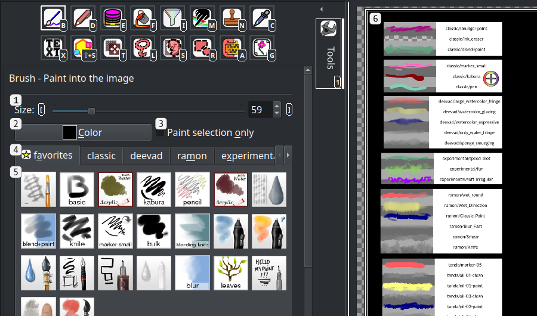

1. **Brush size slider**: Actual brush stroke width may exceed this size, depending on brush type and tablet pen pressure.
2. **Brush color button**:  Opens a color dialog to change brush color.
3. **"Paint selection only" checkbox**:  When checked, the brush will only make changes within [selected](#selection-tools) content.
4. **Brush category tabs**: Switch between different MyPaint brush categories. 
   - The first category, **Favorites** is customizable.
   - Any .myb brush files added to the custom brush directory (defined in settings under **Files/Added MyPaint brush directory**) will appear in a new category at the end of the list.
5. **Brush icons**: Click to select a new brush, right-click to add or remove the brush from the Favorites category.
6. A preview of a few of the available brushes.

---

##  Draw tool (D)
A basic brush tool with easily adjustable properties.

### Basic controls
- **Left-click**: Draw within the image.
- **Right-click**: Draw with one-pixel brush width.
- **Hold shift and left-click**: Draw a line from the last place you clicked.
- **Hold Alt while drawing**: Force the brush to follow a fixed angle.
- **"\[", "]", or mouse scroll wheel left/right**:  Change the brush size.
- **"<" and ">" keys**: Change the brush opacity.
- **"{" and "}"keys**: Change the brush hardness.
- **Hold Shift**: Increase speed when changing size, opacity, or hardness.
- **Hold Ctrl**: Temporarily switch to the color picker tool.

### User interface

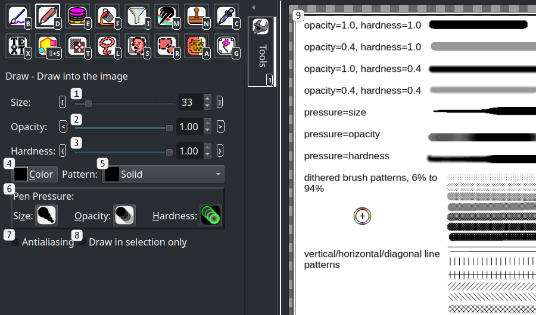

1. **Brush size slider**: Sets the exact brush width.
2. **Brush opacity slider**: Sets the exact brush opacity, between 0.0 (fully transparent) and 1.0 (fully opaque).
3. **Brush hardness slider**: Sets the brush edge hardness. At 1.0 brush edges are completely solid, at 0.0 brush edges fade evenly from the center.
4. **Brush color button**:  Opens a color dialog to change brush color.
5. **Brush pattern dropdown**: Choose between a few basic brush fill patterns.
6. **Tablet pen pressure controls**:  These controls are only visible after IntraPaint first detects a connected drawing tablet.  Pen pressure can be connected to any combination of size, opacity, and hardness, to scale those values down as pressure decreases.
7. **"Draw in selection only" checkbox**:  When checked, the brush will only make changes within [selected](#selection-tools) content.

##  Eraser tool (E)
Erase image content.

### Basic controls
- **Left-click**: Erase within the image.
- **Right-click**: Erase with one-pixel brush width.
- **Hold shift and left-click**: Erase a line from the last place you clicked.
- **Hold Alt while drawing**: Force the eraser to follow a fixed angle.
- **"\[", "]", or mouse scroll wheel left/right**:  Change the eraser size.
- **"<" and ">" keys**: Change the eraser opacity.
- **"{" and "}"keys**: Change the eraser hardness.
- **Hold Shift**: Increase speed when changing size, opacity, or hardness.

### User interface

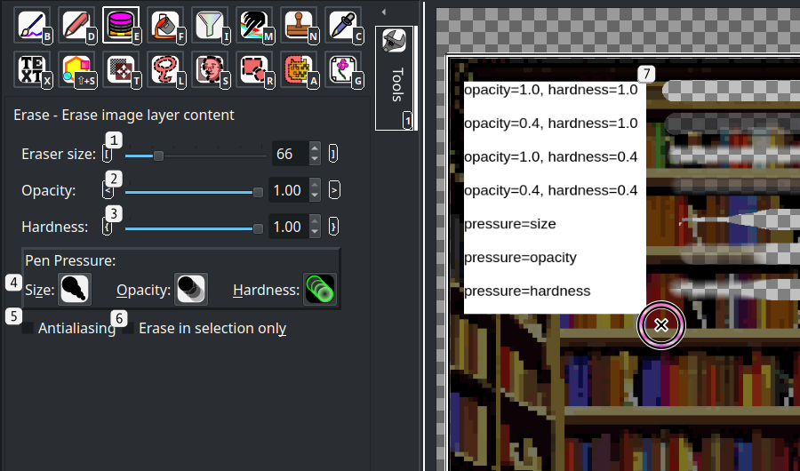

1. **Eraser size slider**: Sets the exact eraser width.
2. **Eraser opacity slider**: Sets the exact eraser opacity. At 1.0 the eraser completely clears image content.
3. **Eraser hardness slider**: Sets the brush edge hardness. At 1.0 brush edges are completely solid, at 0.0 brush edges fade evenly from the center.

6. **Tablet pen pressure controls**:  These controls are only visible after IntraPaint first detects a connected drawing tablet.  Pen pressure can be connected to any combination of size, opacity, and hardness, to scale those values down as pressure decreases.
7. **"Draw in selection only" checkbox**:  When checked, the brush will only make changes within [selected](#selection-tools) content.

##  Fill tool (F)
Fill connected image areas with solid colors.

- Color threshold slider on the tool control panel controls how precisely the tool acts. At 0, only connected areas with exactly the same color as the clicked point will be filled. The higher the value, the more color variation allowed.
- If "sample merged" is unchecked, the tool will only act based on the active image layer's contents.  When checked, all visible layers will affect what area is filled.
- Hold Control to temporarily switch to the color picker tool.

### Basic controls

### User interface

 

##  Filter tool (I)

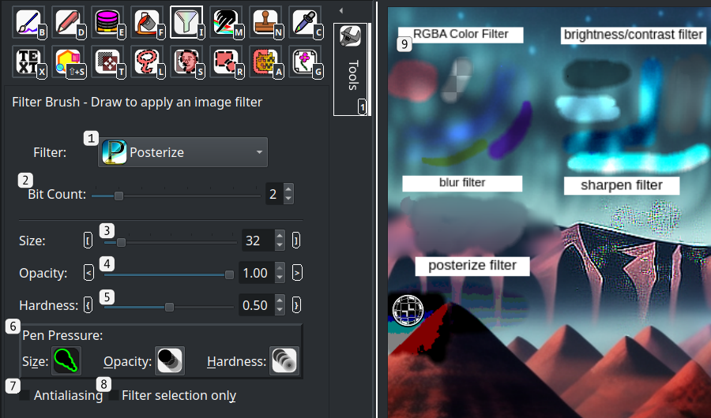

### Basic controls

### User interface

 

##  Smudge tool (M)

### Basic controls

### User interface

 

##  Clone stamp tool (N)

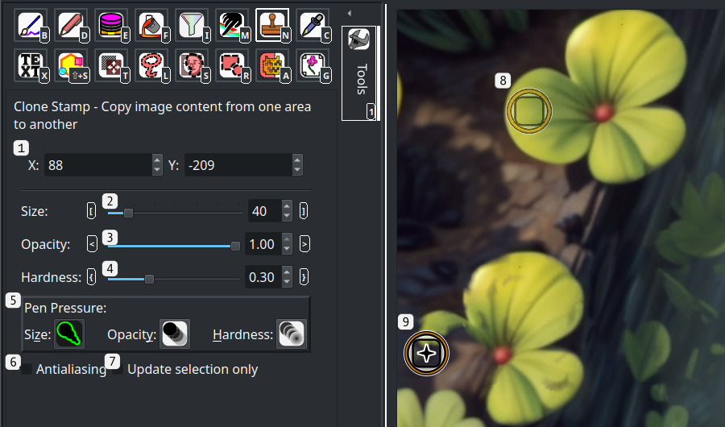

### Basic controls

### User interface

 

## 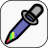 Color Picker tool (C)

### Basic controls
Selects the color used by the brush and fill tools.
- Click any point in the image to select a color from the image.
- The tool control panel contains two tabs, "Color Component" and "Palette".
- The Color Component tab provides options to select color precisely based on red/green/blue/alpha components, or by hue/saturation/value components.
- The Palette tab lets you select from a predefined list of basic colors, or save the current color to the selected palette.
- "Select screen color" button under the palette tab will let you pick a color from anywhere on screen, including within other applications.

 

 

 

 

##  Text tool (X)

### Basic controls

### User interface

 

 

## 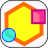 Shape tool (Shift+S)

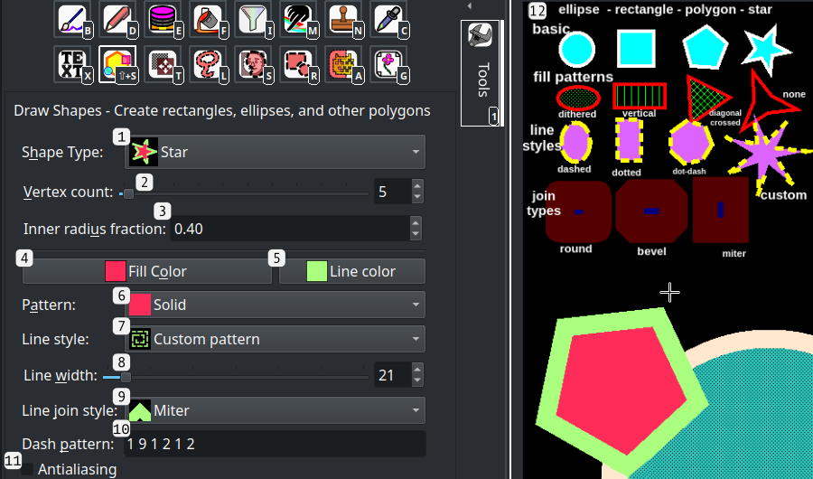

### Basic controls

### User interface

 

##  Transform layer tool (T)
Move, scale, or rotate image layers or layer groups. Transformations are lossless when editing, or when saving in the .ora file format.
- Click and drag the layer to move it within the image, double-click the layer to switch between scaling or rotation modes.
- Click and drag the handle in the middle of the layer to control the center of rotation/scaling.
- Click and drag corners to scale or rotate the layer, depending on mode.
- Directly set layer transformation parameters in the tool panel.
- Use the "Clear" button in the tool panel to remove all transformations.
- Use the "Reset" button in the tool panel to reset layer transformations to their previous state.

### Basic controls

### User interface

 

# Selection tools:
Selected content is marked with an animated outline and a transparent red overlay.  Outline animation and selection color can be changed in the Settings (F9) under the interface tab.
- In the edit menu, cut/copy/paste act on selected content.
- Selection menu provides tools for editing the selection bounds (invert, select all, select none, grow/shrink).
- All image filters can be restricted to only act on selected content.
- Brush and Fill tools can be restricted to only change selected content, but don't do so by default.
- When the generation mode is set to "Inpaint" (the default), image generation will only affect selected areas.

##  Free selection tool (L)

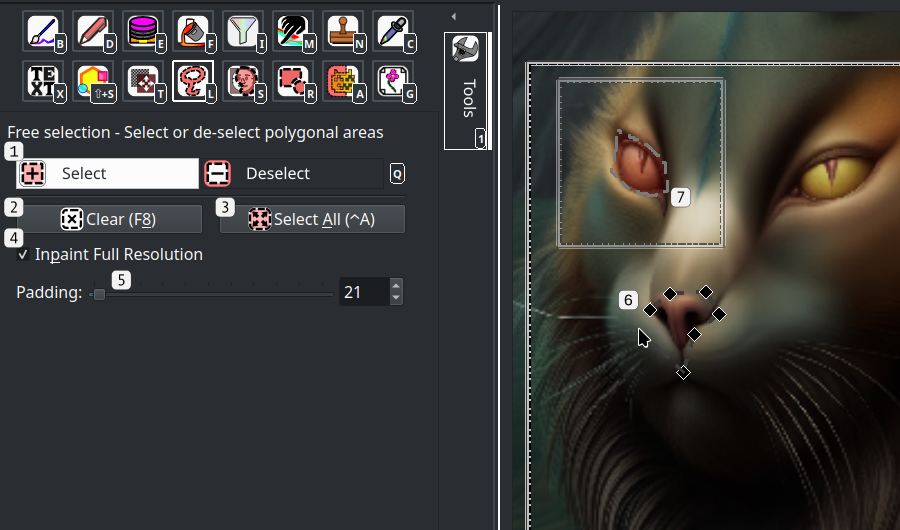

### Basic controls

### User interface

 

##  Selection brush tool (S)
Select content by drawing over it in the image, similar to the brush tool.
- Edit brush size in the brush control panel, or using `[` and `]` keys . When using a drawing tablet, pen pressure also affects brush size.
- Switch between draw/erase in the tool panel to either add to the selection or remove from it.
- If you right-click and draw, the brush will use a fixed brush size of 1 pixel, useful for selecting very small details or controlling the full resolution inpainting bounds. See generation area guide for more details.
- Shift-click selects or clears a straight line between the place you click and the previous place you clicked.
- Holding Alt while drawing forces the selection to follow a straight line.

### Basic controls

### User interface

 

##  Selection fill tool (A)
Select content based on similar color regions, like the fill tool.
- Left click selects, right click clears selection/
- Color threshold slider on the tool control panel controls how precisely selection works. At 0, only connected areas with exactly the same color as the clicked point will be selected/de-selected. The higher the value, the more color variation allowed.
- If "sample merged" is unchecked, the tool will only act based on the active image layer's contents.  When checked, all visible layers will affect the selection.
- If "Fill selection holes" is checked, the tool will ignore image content entirely, and only act based on what's already selected. Useful for filling gaps in the selection or clearing connected selection areas.

### Basic controls

### User interface

 

##  Rectangle/ellipse selection (R)
Select rectangle or ellipse regions in the image.
- Left click and drag to select, right click and drag to clear.
- Hold control to force selections to stick to a fixed aspect ratio.

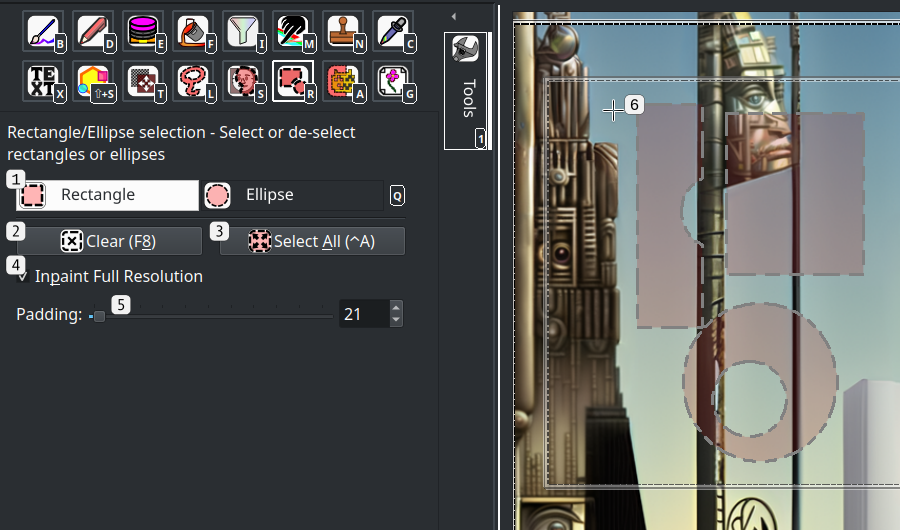

### Basic controls

### User interface

 

## 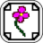 Image Generation Area tool (G)
Controls the area of the image in use for AI image generation. AI generators are restricted to certain resolutions, but this tool lets you use them with images of any size.  When you click "Generate", the AI generator will only act on the area selected by this tool, and only content within this area will influence generated imagery.
- Set the image generation area position and size directly in the tool control panel.  For best results, make sure that the selected area is no larger than the image generation resolution, and that the aspect ratio of the generation area matches the aspect ratio of the generation resolution.
- Left-click the image to move the generation area without changing its size.
- Right-click the image to resize the generation area without changing its position.
- Hold control to force aspect ratio when resizing.

### Basic controls

### User interface

 

- # Tool menu options:
- Show layer window: Opens the layer panel in a new window.
- Show image window: Opens a new window that shows only the edited image and selection, and lets you move the image generation area.
- Select image generator: Opens a window you can use to review alternate AI image generators, and switch between them if they've been set up correctly.
- LCM mode: This option is only visible when using stable-diffusion when you've downloaded the LCM lora model and have the LCM sampler.  LCM mode dramatically decreases image generation time, and gives more predictable but less creative results. Selecting this option adjusts various image generation parameters to the particular settings needed by LCM models.